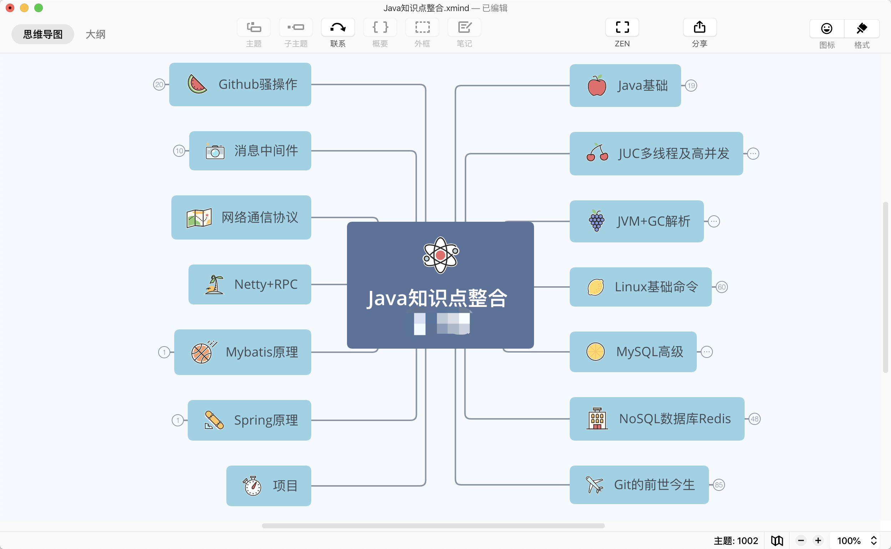

> ## 写在前面：
>
> > 1. 提示：文档中所有的图片链接均来自本项目中pictures目录下，访问时候会有延迟加载不出的情况，所以最好采用DL的方式访问。目前没有找到比较好的图片服务器，知道的小伙伴可以推荐一下。
> > 2. 初衷：使用Mac后，原本mmap格式思维导图不能很好的兼容（主要是穷，顺便吐槽一句Xmind对大文件支持真的不友好），便产生了将笔记搬到GItHub的想法，方便以后查找备份。当然，如果能帮助到一些人是最好不过的。
> > 3. 介绍：JavaInterview只是根据个人经验以及参考网络整理而成的一份Java知识点整合，固然不可能完全正确，欢迎大家指正。
> > 4. 注：笔记中涉及到的图片文件，除非确切知道出处的会标注，其他均默认来源网络（即使我偶尔原创的图片也如此）。
> > 5. 关于转载：非商用注明来源即可。
> > 6. 待补充

- 网络通信协议（网络知识相对薄弱，后期补充）
- Java基础
  - [基础](https://github.com/nanhuaijin/JavaInterview/blob/master/docs/basis/Java基础.md)
  - [集合](https://github.com/nanhuaijin/JavaInterview/blob/master/docs/basis/Java集合.md)
  - [新特性](https://github.com/nanhuaijin/JavaInterview/blob/master/docs/basis/Java8新特性.md)
- [JUC多线程及高并发](https://github.com/nanhuaijin/JavaInterview/blob/master/docs/juc/JUC高并发.md)
- [JVM虚拟机及垃圾回收](https://github.com/nanhuaijin/JavaInterview/blob/master/docs/jvm/JVM.md)
- MySql数据库
- NoSql数据库
  - [Redis相关知识点及面试题](https://github.com/nanhuaijin/JavaInterview/blob/master/docs/nosql/redis/Redis.md)
- MQ消息中间件
- Web服务器
  - [Tomcat]()
  - [Nginx的简单应用](https://github.com/nanhuaijin/JavaInterview/blob/master/docs/web/Nginx.md)
- Linux基本命令
- Git前世今生
- GitHub小拓展
- 框架相关
  - [Mybatis入门使用](https://github.com/nanhuaijin/JavaInterview/blob/master/docs/frame/Mybatis基础.md)
  - [Mybatis相关面试题以及难点](https://github.com/nanhuaijin/JavaInterview/blob/master/docs/frame/Mybatis面试.md)
  - [Spring入门使用](https://github.com/nanhuaijin/JavaInterview/blob/master/docs/frame/Spring基础.md)
  - [Spring相关面试题及难点](https://github.com/nanhuaijin/JavaInterview/blob/master/docs/frame/Spring面试.md)
- 第三方API使用

