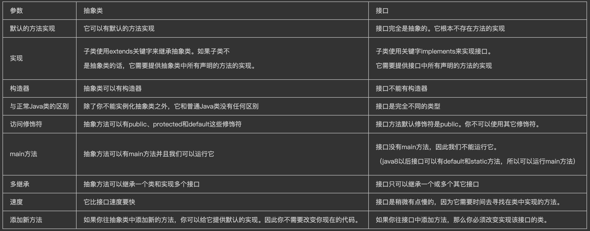

# 1.Java入门基础知识集

## 1.1如何理解Java面向对象

面向对象是利于语音对现实事务进行抽象定义，主要有三大特征：

1. 封装：通常认为封装是把数据和操作数据的方法绑定起来，对数据的访问只能通过已定义的接口。
2. 继承：继承是从已有类得到继承信息创建新类的过程
3. 多态性：多态性是指允许不同子类型的对象对同一消息作出不同的响应。

## 1.2Java两大数据类型

> 参考链接：https://blog.csdn.net/chenliguan/article/details/53888018

### 1.2.1分类

1. 基本数据类型

   | 类型    | 存储空间 | 取值范围                         | 备注                                                     |
   | ------- | -------- | -------------------------------- | -------------------------------------------------------- |
   | byte    | 1字节    | -2^7 ~ 2^7-1，即-128 ~ 127       |                                                          |
   | short   | 2字节    | -2^15 ~ 2^15-1，即-32768 ~ 32767 |                                                          |
   | int     | 4字节    | -2^31 ~ 2^31-1，约21亿           |                                                          |
   | long    | 8字节    | -2^63 ~ 2^63-1                   | 一般末尾需要加L                                          |
   | double  | 8字节    | 1.797693e+308~ 4.9000000e-324    | e+38表示是乘以10的38次方，<br />e-45表示乘以10的负45次方 |
   | float   | 4字节    | 3.402823e+38 ~ 1.401298e-45      | 一般末尾需要加F                                          |
   | char    | 2字节    | 0-65535                          |                                                          |
   | boolean | 1字节    | true \| false                    |                                                          |

2. 引用数据类型：类、数组等。

### 1.2.2封装类

为了编程的方便还是引入了基本数据类型，但是为了能够将这些基本数据类型当成对象操作，Java为每 一个基本数据类型都引入了对应的包装类型（wrapper class），从Java 5开始引入了自动装箱/拆箱机制，使得二者可以自动相互转换。

eg：需求需要记录每个学生的成绩，如果使用基本数据类型，那么0这个分数到底表示该生考了0分还是没参加考试呢？为此需要再定义一个字段来表示参没参考，而如果使用包装类型，就可以直接用null表示。

> 基本数据类型: boolean，char，byte，short，int，long，float，double
>
> 封装类类型：Boolean，Character，Byte，Short，Integer，Long，Float，Double

## 1.3int和Integer的区别

- Integer是int的包装类；int是基本数据类型；
- Integer变量必须实例化后才能使用；int变量不需要；
- Integer实际是对象的引用，指向此new的Integer对象；int是直接存储数据值 ；
- Integer的默认值是null；int的默认值是0。

### 1.3.1比较

- 在-128~127之内：静态常量池中cache数组是static final类型，cache数组对象会被存储于静态常量池中。cache数组里面的元素却不是static final类型，而是cache[k] = new Integer(j++)，那么这些元素是存储于堆中，只是cache数组对象存储的是指向了堆中的Integer对象（引用地址）
- 在-128~127 之外：新建一个 Integer对象，并返回。

```java
public static Integer valueOf(int i) {
        assert IntegerCache.high >= 127;
        if (i >= IntegerCache.low && i <= IntegerCache.high) {
          return IntegerCache.cache[i + (-IntegerCache.low)];
        }
        return new Integer(i);
}
```

- 自动装箱/拆箱是Java5才有的特性。
  - 自动装箱：将基本数据类型重新转化为对象
  - 自动拆箱：将对象重新转化为基本数据类型

```java
Integer a = new Integer(100);
Integer b = new Integer(100);
int c = 100;
Integer d = new Integer(150);
int e = 150;
Integer f = 100;
Integer g = 100;
Integer h = 128;
Integer i = 128;

System.out.println(a == b); //false
System.out.println(a == c); //自动拆箱为int进行比较 true
System.out.println(d == e); //自动拆箱为int进行比较  true
System.out.println(f == g); //true 常量池
System.out.println(h == i); //false 
```

## 1.4char型变量能不能存储一个汉字，为什么？

char是按照字符存储的，不管英文还是中文，固定占用占用2个字节，用来储存Unicode字符，范围在0-65535。

> unicode编码字符集中包含了汉字，所以，char型变量中当然可以存储汉字啦。不过，如果某个特殊的汉字没有被包含在unicode编码字符集中，那么，这个char型变量中就不能存储这个特殊汉字。

## 1.5final、finally、finalize的区别

1. final是关键字、修饰符，声明属性表示属性不可变，声明方法表示方法不可覆盖重写，声明类表示不可继承。因此，一个类不能同时被声明为abstract抽象类的和final的类。
2. finally是Java一种异常处理机制，finally结构使代码总会执行，而不管无异常发生。常与try连用，作为文件流连接、数据库连接的关闭。
3. finalize是Object类中的方法，这个方法在GC启动，该对象被回收时调用。一般情况下，不会显示调用finalize方法。

## 1.6重写和重载的区别

1. 重写（Override）是发生在父类和子类之间的，**方法名、参数列表必须相同**，返回类型**小于等于**父类的返回值类型（即子类的返回类型是父类返回类型的子类），访问修饰符一定要**大于等于**父类的访问修饰符（public>protected>default>private），抛出异常也必须**小于等于**父类的异常。
2. 重载（Overload）是一个类中多态的表现，它要求**参数列表不同（参数类型、参数个数或者参数顺序不同）**，返回类型可以相同也可以不同，**所以无法通过返回值是否相同来判断重载**。

## 1.7接口和抽象类的区别



> 图片来源：https://www.cnblogs.com/jmyyyy/p/10960271.html
>
> 补充：我们可以通过**匿名内部类**的方式访问接口中的方法，所以我觉得接口是可以new的。

# 2.String类

## 2.1==和equals的区别

1. ==对于基本类型比较值是否相等，比较引用类型是判断内存地址是否相同
2. equals是属于Object类的方法，如果没有被重写，默认也是==。如果重写了Object的hashCode方法和equals方法，则按照重写的规则判断。

> 注意：我们常用的String类也是重写过equals方法的，所以是比较值是否相等。

## 2.1StringBuilder和StringBuffer区别

- StringBuilder是线程不安全的，较StringBuffer有10-15%的性能提升。
- StringBuffer底层都是采用的同步方法Synchronized修饰的。

