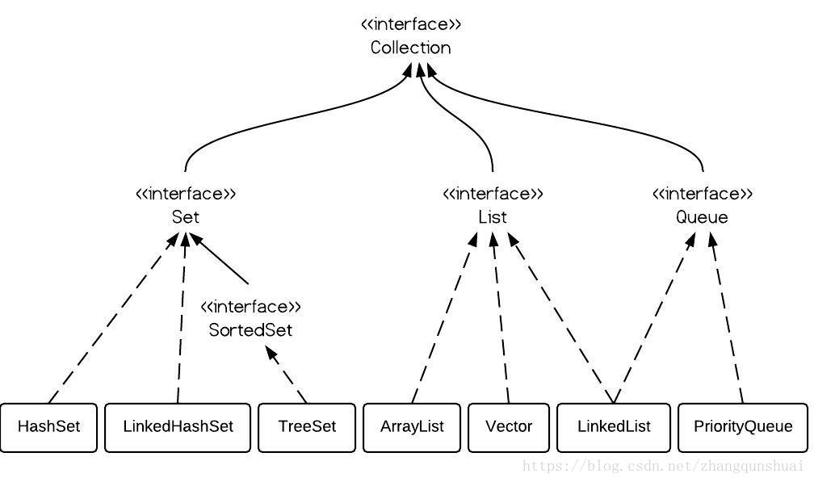
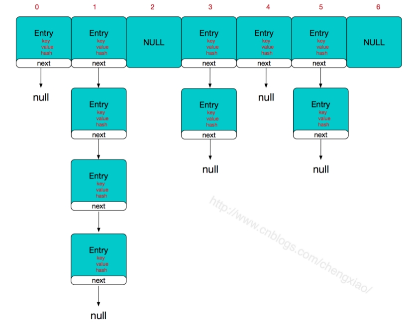
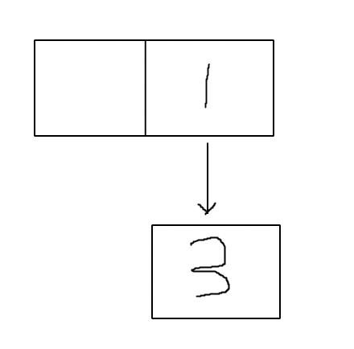
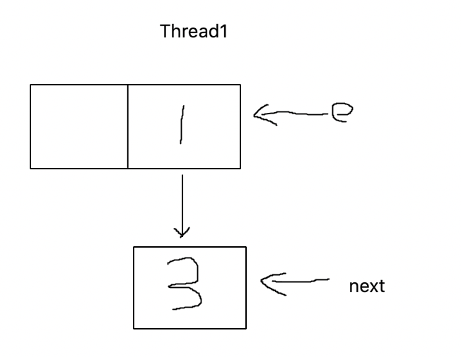
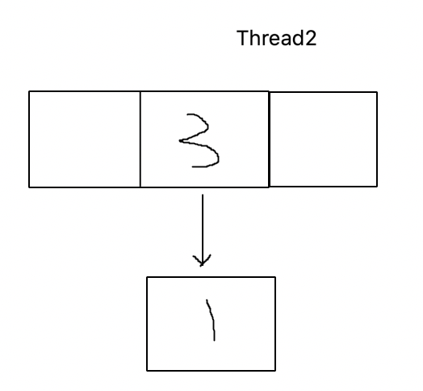
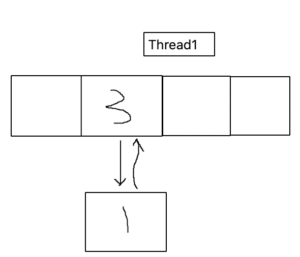

## 1.Java集合类继承关系图



## 2.HashMap和HashTable



### 2.1解决Hash冲突的三种方式

- 开放寻址法：所有的元素都存放在哈希表中，如果存在冲突就通过再寻址的方法（探查序列），寻找下一处地址，直到找到空的地址为止。
  - 某大佬通俗点说：如果你想上厕所，但是拉开厕所门之后发现有位同学正在使劲，那怎么办？你会很自然的拉下一间门，直到找到空的位置为止。一般来说，你不会按照顺序一个一个地拉厕所门，而是会去拉你认为有可能没有被占用的单间的门，这可以通过闻味道，听声音来辨别，这就是寻址查找算法。如果找遍了厕所还是没有位置怎么办？这就需要扩容，至于什么时候扩容怎么扩容具体问题具体分析，还会涉及负载因子等术语。
- 拉链法：相同Hash值的元素，存入相同位置的链表中。
- 再哈希法：发生冲突之后，再次哈希。

### 2.2HashMap

- HashMap在1.8的时候做了一个很大的改动，底层实现由数组中存放Entry<K, V>(实现了Map.Entry<K, V>)节点 + 链表变成了数组中存放**Node<K, V>(实现了Map.Entry<K, V>)节点 + 链表 + 红黑树**。

- HashMap初始长度是**16**，一倍扩容，到达阈值0.75触发扩容。在指定大小创建时，HashMap会自动扩容到2的指数次。当数组长度超过64，链表长度超过8，才会把底层的链表变成红黑树，小于6变回链表。

- JDK1.7中HashMap扩容Resize的时候，链表采用的**头插法**。导致在多线程的环境下，会出现闭环。JDK1.8的时候对这点做了优化，采用的是**尾插法**，但是HashMap在多线程下依旧是**不安全的**。

  ​	1.如图所示HashMap，存在两个key，1和3，假设再增加一个元素会触发扩容



​		2.此时线程1和线程2都执行put()操作，都触发扩容，并且线程1执行transfer()中的**Entry<K,V> next = e.next**后被挂起，此时e指向1，next指向3



​		3.线程2开始执行，并且在新的数组中1和3还会发生哈希冲突，由于使用的是头插法那么线程2完成扩容后最终数组如图



​		4.回到线程1，e指向1，next指向3，当执行到**e.next = newTable[i]**，便会出现循环链表



​		5.之后我们通过get(1)和get(3)不会出现问题，但是get(5)，就会一直在链表中向下寻找，由于链表闭环，导致死循环。

> 具体详情参考：[HashMap头插法为什么会出现死循环](https://blog.csdn.net/littlehaes/article/details/105241194)

```java
	//jdk1.7 HashMap
	void resize(int newCapacity) {
        Entry[] oldTable = table;
        int oldCapacity = oldTable.length;
        if (oldCapacity == MAXIMUM_CAPACITY) {
            threshold = Integer.MAX_VALUE;
            return;
        }

        Entry[] newTable = new Entry[newCapacity];
        transfer(newTable, initHashSeedAsNeeded(newCapacity));
        table = newTable;
        threshold = (int)Math.min(newCapacity * loadFactor, MAXIMUM_CAPACITY + 1);
    }

    /**
     * Transfers all entries from current table to newTable.
     */
    void transfer(Entry[] newTable, boolean rehash) {
        int newCapacity = newTable.length;
        for (Entry<K,V> e : table) {
            while(null != e) {
                Entry<K,V> next = e.next;//这行代码是导致问题的关键代码。
                if (rehash) {
                    e.hash = null == e.key ? 0 : hash(e.key);
                }
                int i = indexFor(e.hash, newCapacity);
                e.next = newTable[i];
                newTable[i] = e;
                e = next;
            }
        }
    }
```

### 2.3HashTable

- 如果存储null值和null键，可以通过编译期，但是运行会报NPE异常。
- 是线程安全的。

```java
public synchronized V put(K key, V value) {
        // Make sure the value is not null
        if (value == null) {
            throw new NullPointerException();
        }

        // Makes sure the key is not already in the hashtable.
        Entry<?,?> tab[] = table;
        int hash = key.hashCode();
        int index = (hash & 0x7FFFFFFF) % tab.length;
        @SuppressWarnings("unchecked")
        Entry<K,V> entry = (Entry<K,V>)tab[index];
        for(; entry != null ; entry = entry.next) {
            if ((entry.hash == hash) && entry.key.equals(key)) {
                V old = entry.value;
                entry.value = value;
                return old;
            }
        }

        addEntry(hash, key, value, index);
        return null;
    }
```

## 3.ArrayList、LinkedList和Vector的区别

### 3.1ArrayList和LinkedList区别

- 是否保证线程安全：二者都是线程不安全的
- 底层结构：
  - ArrayList底层是Object数组，初始创建的时候是**空数组**，只有在第一次添加数据的时候才会扩容至10，以后1.5被扩容，即15，22。底层是先**Arrays.copyOf()**原数组，再进行add操作
  - LinkedList底层是双向链表
- 时间复杂度：
  - ArrayList在执行add()方法的时候其实是数组复制的过程，默认是向末尾添加一个元素，时间复杂度是O(1)，但是指定位置的时候，复杂度就是O(n-1)
  - LinkedList添加元素的时候是解开链表前后关系插入元素，时间复杂度近似于O(1)
  - 所以ArrayList在随机访问上速度快于LinkedList，但是在频繁新增删除的时候，LinkedList明显优于ArrayList
- 内存空间占用：
  - ArrayList的空间浪费主要是由于扩容机制导致，末尾会存留一部分剩余空间。
  - LinkedList的空间浪费主要是需要保存前后指针。

### 3.2ArrayList和Vector区别

- Vector类的所有方法都是同步的，是线程安全的，但是如果只有一个线程，会耗费大量的时间。
