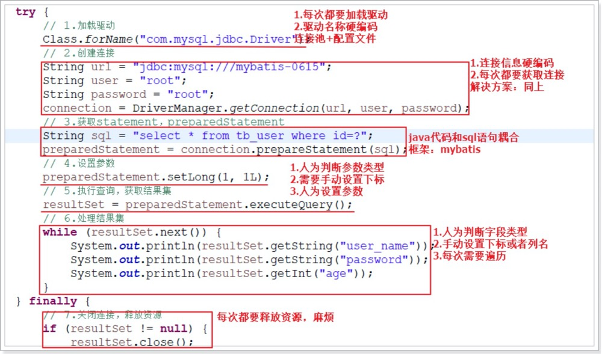
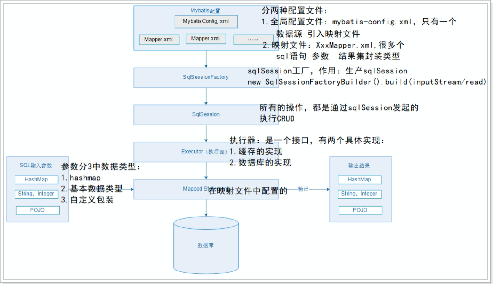
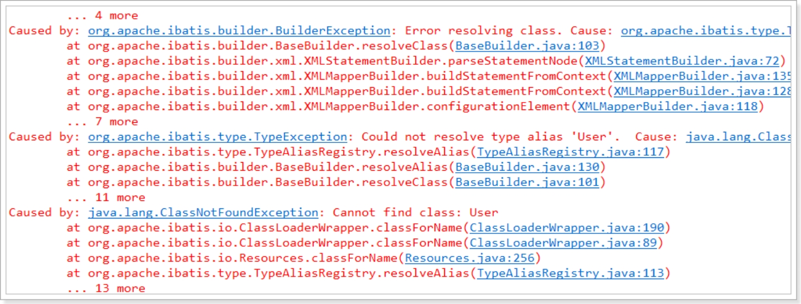
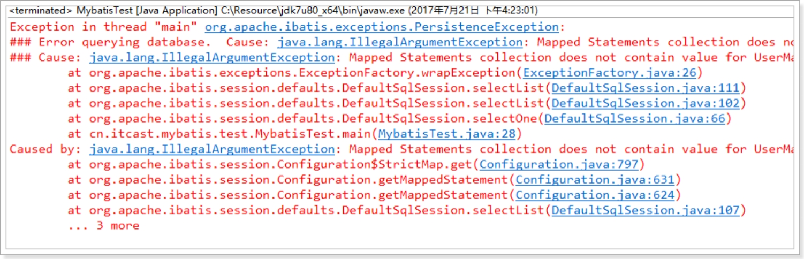
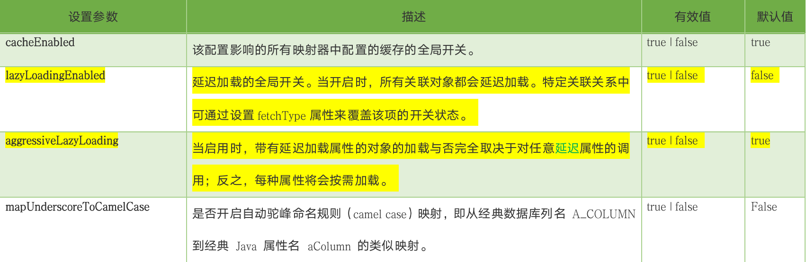

# 1.JDBC回顾

## 1.1代码演示

```java
public class JdbcTest {

    public static void main(String[] args) throws ClassNotFoundException, SQLException {

        Connection connection = null;
        PreparedStatement prepareStatement = null;
        ResultSet resultSet = null;
        try {
            // 1.加载驱动
            Class.forName("com.mysql.jdbc.Driver");
            // 2.获取连接
            String url = "jdbc:mysql://127.0.0.1:3306/mybatis";
            String user = "root";
            String password = "root";
            connection = DriverManager.getConnection(url, user, password);

            // 3.获取statement，preparedStatement
            String sql = "select * from user where id = ?";
            prepareStatement = connection.prepareStatement(sql);

            // 4.设置参数
            prepareStatement.setLong(1, 1l);
            // 5.执行查询，获取结果集
            resultSet = prepareStatement.executeQuery();

            // 6.解析结果集
            while (resultSet.next()) {
                System.out.println(resultSet.getString("user_name"));
                System.out.println(resultSet.getString("password"));
                System.out.println(resultSet.getInt("age"));
            }
        } finally {
            // 7.关闭连接，释放资源
            if (resultSet != null) {
                resultSet.close();
            }
            if (prepareStatement != null) {
                prepareStatement.close();
            }
            if (connection != null) {
                connection.close();
            }
        }
    }

}
```

## 1.2JDBC所带来的问题



# 2.Mybatis介绍

## 2.1[官网](https://mybatis.org/mybatis-3/zh/index.html)

## 2.2简介

1. 原是apache的一个开源项目iBatis，2010年6月这个项目由apache software foundation 迁移到了google code，随着开发团队转投Google Code旗下，ibatis3.x正式更名为Mybatis ，代码于2013年11月迁移到Github。
2. 相对Hibernate和ApacheOJB等“一站式”ORM（Object Relational Mapping）解决方案而言，ibatis 是一种“半自动化”的ORM实现。
3. 无论 Hibernate还是Apache OJB，都对数据库结构提供了较为完整的封装，提供了从POJO到数据库表的全套映射机制。程序员往往只需定义好了POJO 到数据库表的映射关系，即可通过 Hibernate或者OJB 提供的方法完成持久层操作。程序员甚至不需要对 SQL 的熟练掌握，Hibernate/OJB 会根据制定的存储逻辑，自动生成对应的 SQL 并调用 JDBC 接口加以执行。

## 2.3特点

1） 支持自定义SQL、存储过程、及高级映射

2） 实现自动对SQL的参数设置

3） 实现自动对结果集进行解析和封装

4） 通过XML或者注解进行配置和映射，大大减少代码量

5） 数据源的连接信息通过配置文件进行配置

> 可以发现，MyBatis是对JDBC进行了简单的封装，帮助用户进行SQL参数的自动设置，以及结果集与Java对象的自动映射。与Hibernate相比，配置更加简单、灵活、执行效率高。但是正因为此，所以没有实现完全自动化，需要手写SQL，这是优点也是缺点。
>
>  因此，对性能要求较高的电商类项目，一般会使用MyBatis，而对与业务逻辑复杂，不太在乎执行效率的传统行业，一般会使用Hibernate

## 2.4Mybatis整体架构



-  配置文件
  - 全局配置文件：mybatis-config.xml  ---》 hibernate.cfg.xml，作用：配置数据源，引入映射文件
  - 映射文件：XxMapper.xml ----》 xx.hbm.xml，作用：配置sql语句、参数、结果集封装类型等
- SqlSessionFactory
  - 相当于Hibernate的SessionFactory，作用：获取SqlSession
  - 通过newSqlSessionFactoryBuilder().build(inputStream)来构建，inputStream：读取配置文件的IO流
- SqlSession
  - 相当于Hibernate的Session，作用：执行CRUD操作
- Executor
  - 执行器，SqlSession通过调用它来完成具体的CRUD
  - 它是一个接口，提供了两种实现：缓存的实现、数据库的实现
-  Mapped Statement
  - 在映射文件里面配置，包含3部分内容：
  - 具体的sql，sql执行所需的参数类型，sql执行结果的封装类型
  - 参数类型和结果集封装类型包括3种：HashMap、基本数据类型、pojo

# 3.快速入门

## 3.1创建项目引入依赖等

## 3.2mybatis-config.xml配置文件

```xml
<?xml version="1.0" encoding="UTF-8" ?>
<!DOCTYPE mapper PUBLIC "-//mybatis.org//DTD Mapper 3.0//EN" "http://mybatis.org/dtd/mybatis-3-mapper.dtd" >
<configuration>
	<!-- 环境：说明可以配置多个，default:指定生效的环境 -->
	<environments default="development">
		<!-- id:环境的唯一标识 -->
		<environment id="development">
			<!-- 事务管理器，type：类型 -->
			<transactionManager type="JDBC" />
			<!-- 数据源：type-池类型的数据源 -->
			<dataSource type="POOLED">
				<property name="driver" value="com.mysql.jdbc.Driver" />
				<property name="url" value="jdbc:mysql://127.0.0.1:3306/mybatis" />
				<property name="username" value="root" />
				<property name="password" value="root" />
			</dataSource>
		</environment>
	</environments>
	<!-- 映射文件 -->
	<mappers>
		<mapper resource="UserMapper.xml" />
	</mappers>
</configuration>
```

## 3.3UserMapper.xml映射文件，参考官方文档

```xml
<?xml version="1.0" encoding="UTF-8" ?>
<!DOCTYPE mapper
  PUBLIC "-//mybatis.org//DTD Mapper 3.0//EN"
  "http://mybatis.org/dtd/mybatis-3-mapper.dtd">
<!-- namespace(命名空间)：映射文件的唯一标识 -->
<mapper namespace="UserMapper">

  <!-- 表中字段与实体类字段一一对应关系 -->
  <resultMap id="BaseResultMap" type="com.breeze.pojo.User" >
    <id column="id" property="id" jdbcType="INTEGER" />
    <result column="user_name" property="userName" jdbcType="VARCHAR" />
    <result column="password" property="password" jdbcType="VARCHAR" />
  </resultMap>
  
	<!-- 查询的statement，id：在同一个命名空间下的唯一标识，
			 resultType：sql语句的结果集封装类型，注意需要是全路径，否则会报错 
			 注意：这里会导致userName赋值为空情况，方法一使用resultMap 方法二使用as自定义查询字段名
	-->
	<select id="queryUserById" resultType="com.breeze.pojo.User">
		select * from user where id = #{id}
	</select>
</mapper>
```

## 3.4MybatisTest.java内容

```java
public static void main(String[] args) throws IOException {
		
		SqlSession sqlSession = null;
		try {
			// 指定mybatis的全局配置文件 这里路径需要注意
			String resource = "mybatis-config.xml";
			// 读取mybatis-config.xml配置文件
			InputStream inputStream = Resources.getResourceAsStream(resource);
			// 构建sqlSessionFactory
			SqlSessionFactory sqlSessionFactory = new SqlSessionFactoryBuilder().build(inputStream);
			// 获取sqlSession回话
			sqlSession = sqlSessionFactory.openSession();
			// 执行查询操作，获取结果集。参数：1-命名空间（namespace）+“.”+statementId,2-sql的占位符参数
			User user = sqlSession.selectOne("UserMapper.queryUserById", 1L);
			System.out.println(user);
		} finally {
			// 关闭连接
			if (sqlSession != null) {
				sqlSession.close();
			}
		}
	}
```

## 3.5典型错误

- resultType="com.breeze.pojo.User"没有填写全路径



- Mybatis配置文件中，缺少mappers标签



## 3.6使用步骤总结

1) 配置mybatis-config.xml 全局的配置文件 (1.数据源，2.外部的mapper) 及映射文件（配置statement）

2) 基于创建SqlSessionFactory

3) 通过SqlSessionFactory创建SqlSession对象

4) 通过SqlSession操作数据库 CRUD

5) 调用sqlSession.commit()提交事务（增删改时，需要调用该方法提交事务）

6) 调用sqlSession.close()关闭会话

# 4.动态代理Mapper实现类

## 4.1思考

因为在Mapper实现类中对SqlSession的使用方式非常相似，为了简化开发，mybatis提供了接口的动态代理

## 4.2Mapper接口的动态代理实现，需要满足的条件

1. **映射文件中的命名空间与Mapper接口的全路径一致**
2. **映射文件中的statementId与Mapper接口的方法名保持一致**
3. 映射文件中的statement的ResultType必须和mapper接口方法的返回类型一致（即使不采用动态代理，也要一致）
4. 映射文件中的statement的parameterType必须和mapper接口方法的参数类型一致（不一定，该参数可省略）

## 4.3修改后的UserMapper文件

**名称空间必须改成UserMapper接口的全路径，StatementId必须和接口方法名一致，结果集的封装类型已经和方法的返回类型一致**

```xml
<?xml version="1.0" encoding="UTF-8" ?>
<!DOCTYPE mapper
  PUBLIC "-//mybatis.org//DTD Mapper 3.0//EN"
  "http://mybatis.org/dtd/mybatis-3-mapper.dtd">
<!-- namespace(命名空间)：映射文件的唯一标识 -->
<mapper namespace="com.breeze.mapper.UserMapper">

  <!-- 表中字段与实体类字段一一对应关系 -->
  <resultMap id="BaseResultMap" type="com.breeze.pojo.User" >
    <id column="id" property="id" jdbcType="INTEGER" />
    <result column="user_name" property="userName" jdbcType="VARCHAR" />
    <result column="password" property="password" jdbcType="VARCHAR" />
  </resultMap>
  
	<!-- 查询的statement，id：在同一个命名空间下的唯一标识，
			 resultType：sql语句的结果集封装类型，注意需要是全路径，否则会报错 
			 注意：这里会导致userName赋值为空情况，方法一使用resultMap 方法二使用as自定义查询字段名
	-->
	<select id="queryUserById" resultType="com.breeze.pojo.User">
		select * from user where id = #{id}
	</select>
</mapper>
```

## 4.4修改后的查询

```java
public class UserMapperTest {
	
	private UserMapper userMapper;

	@Before
	public void setUp() throws Exception {
		// 读取mybatis的全局配置文件
		InputStream inputStream = Resources.getResourceAsStream("mybatis-config.xml");
		// 构建sqlSessionFactory
		SqlSessionFactory sqlSessionFactory = new SqlSessionFactoryBuilder().build(inputStream);
		// 获取sqlSession会话
		SqlSession sqlSession = sqlSessionFactory.openSession();

		// 初始化userMapper
		this.userMapper = sqlSession.getMapper(UserMapper.class);
	}

	@Test
	public void testQueryUserAll() {
		User user = this.userMapper.queryUserById();
	}

}
```

# 5.使用properties文件优化Mybatis配置

## 5.1jdbc.properties资源文件内容

```properties
driver=com.mysql.jdbc.Driver
url=jdbc:mysql://127.0.0.1:3306/mybatis
username=root
password=root
```

## 5.2在mybatis-config.xml中引入jdbc.properties资源文件

```xml
<?xml version="1.0" encoding="UTF-8" ?>
<!DOCTYPE configuration
  PUBLIC "-//mybatis.org//DTD Config 3.0//EN"
  "http://mybatis.org/dtd/mybatis-3-config.dtd">
<configuration>
	<!-- 引入外部资源文件，resource：相对路径，url：绝对路径 -->
	<properties resource="jdbc.properties" />
	<!-- 环境：说明可以配置多个，default:指定生效的环境 -->
	<environments default="development">
		<!-- id:环境的唯一标识 -->
		<environment id="development">
			<!-- 事务管理器，type：类型 -->
			<transactionManager type="JDBC" />
			<!-- 数据源：type-池类型的数据源 -->
			<dataSource type="POOLED">
				<property name="driver" value="${driver}" />
				<property name="url" value="${url}" />
				<property name="username" value="${username}" />
				<property name="password" value="${password}" />
			</dataSource>
		</environment>
	</environments>
	<!-- 映射文件 -->
	<mappers>
		<mapper resource="UserMapper.xml" />
	</mappers>
</configuration>
```

# 6.settings设置

## 6.1settings参数有很多，这里列举四种



## 6.2无法填充对应的字段信息

1. 方法一：在sql语句中使用别名
2. 方法二：使用resultMap
3. 方法三：开启驼峰匹配，即在mybatis-config.xml中添加配置

```xml
	<settings>
		<!-- 开启驼峰匹配：经典的数据库列名（多个单词下划线连接）映射到经典的java属性名（多个单词驼峰连接） -->
		<setting name="mapUnderscoreToCamelCase" value="true"/>
	</settings>
```

# 7.typeAliases用法

## 7.1方式一typeAlias

```xml
	<typeAliases>
		<!-- 类型别名：type-pojo类的全路径，alias-别名名称（可随便写，推荐和类名一致） -->
		<typeAlias type="com.atguigu.mybatis.pojo.User" alias="user" />
	</typeAliases>
```

## 7.2方式二开启包扫描

```XML
<typeAliases>
		<!-- 类型别名：type-pojo类的全路径，alias-别名名称（可随便写，推荐和类名一致） -->
		<!-- <typeAlias type="com.atguigu.mybatis.pojo.User" alias="User" /> -->
		<!-- 开启别名包扫描，name：包路径，扫描的别名就是类名，并且大小写不敏感 -->
		<package name="com.breeze.pojo"/>
	</typeAliases>
```

# 8.Mappers引入mapper文件

```xml
	<!-- 映射文件 -->
	<mappers>
    <!-- 方式一：Resource 缺点就是每次都要引入麻烦 -->
		<mapper resource="UserMapper.xml" />
    <!-- 方式二：file方式不采用 -->
    <mapper url="file:///var/mappers/UserMapper.xml"/>
    <!-- 方式三：class
 					需要满足三个条件
					1.映射文件和mapper接口在同一包下
      		2.映射文件和mapper接口要同名
					3.映射文件的namespace要和mapper接口的全路径一致
		-->
    <mapper class="com.breeze.mapper.UserMapper"/>
    <!-- 方式四：package开启包扫描
					原理：扫描目标包目录下的mapper接口，并按照class的方式找到接口对应的映射文件。
					缺点：1.如果包路径有很多，麻烦  2.mapper.xml和mapper.java没有分离
		-->
    <package name="com.breeze.mapper"/>
	</mappers>
```

