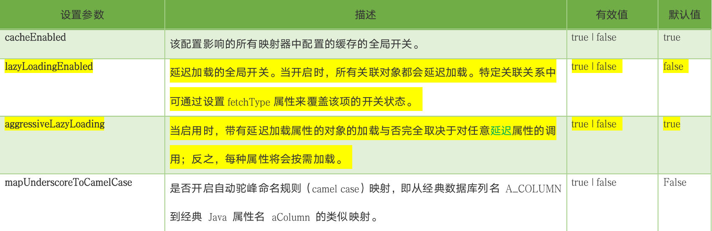

# 1.Mapper.xml映射文件可选字段


## 1.1select查询注意点

- id：在同一个命名空间下的唯一标识，使用动态代理之后，要求和mapper接口的方法名一致。
- resultType：sql语句的结果集封装类型；使用动态代理之后，要求和mapper接口方法的返回类型一致。和resultMap二选一
- parameterType：参数类型；使用动态代理之后，要求和mapper接口的方法参数类型一致。可省略，这里就省略了

## 1.2主键回写

### 1.2.1useGeneratedKeys

```XML
	<!-- 
		1.useGeneratedKeys：开启主键回写，回写到pojo参数中
		2.keyProperty：主键的属性名
		3.keyColumn：主键的列名，如果主键的列名和属性名一致，该属性可省略
		内容：新增的sql语句
	 -->
	<insert id="insertUser" useGeneratedKeys="true" keyProperty="id" keyColumn="id" parameterType="com.breeze.pojo.User">
```

### 1.2.2selectKey标签

```xml
<insert id="insertUser" parameterType="com.breeze.pojo.User">
		<!-- 查询新增数据的主键，可以在新增sql语句之前或者之后执行
     		order：执行顺序，必须
				BEFORE：在新增sql语句之前执行，通常主键自增长的oracle使用这种方式
				AFTER：在新增sql语句之后执行，通常主键自增长的mysql使用这种方式
				keyProperty：返回值写到pojo参数的属性名，必须
				resultType:返回值类型，必须
		 -->
		<selectKey order="AFTER" resultType="long" keyProperty=”id”>
			select LAST_INSERT_ID()
		</selectKey>
  		INSERT INTO user (user_name, password)
			VALUES (#{userName}, #{password});
	</insert>
```

## 1.3parameterType传入参数

1. 传入参数类型
   1. 基本数据类型
   2. HashMap（使用方式和pojo类似）
   3. pojo自定义包装类型
2. 接受参数方式
   1. #{}预编译
   2. ${}非预编译，**直接的sql拼接，不能防止sql注入**

## 1.4#{}和${}区别

### 1.4.1什么情况下会使用${}

情景：数据库存在两张一模一样的表，历史表和当前表。若是表名作为参数执行查询，使用#{}会报错，如下


如果你要动态传入的字段名是表名，并且sql执行是预编译的，这显然是不行的，所以你必须改成非预编译的，也就是需要使用${}

> 注意：1.使用${} 去接收参数信息，在一个参数时，默认情况下必须使用${value}获取参数值
>
> ​			2.而#{} 只是表示占位，与参数的名字无关，如果只有一个参数，可以使用任意参数名接收参数值，会自动对应
>
> **但这并不是稳妥的方案，可以在接口方法中使用@Param注解指定参数名**


### 1.4.2重点：#{}和${}区别（重点）

1. \#{}实现的是sql语句的预处理参数，之后执行的sql中用？代替，而${}实现的是sql语句的直接拼接
2. \#{}使用时不需要关注数据类型，mybatis自动实现数据类型的转换，而不做数据类型的转换，需要自行判断数据类型
3. \#{}可以防止sql注入问题，而${}不能

# 2.缓存

缓存指的是把一些常用的数据，保存到一个可以高速读取的缓冲区中。方便程序在频繁读取的时候，可以快速的取出数据，这就叫做缓存。

执行相同的sql语句和参数，mybatis不进行执行sql，而是从缓存中命中返回。

## 2.1一级缓存

### 2.1.1在mybatis中，一级缓存默认是开启的，并且一直无法关闭，作用域：**在同一个sqlSession下**

```java
	@Test
	public void testCache(){
		User user1 = this.userMapper.queryUserById(1l);
		System.out.println(user1);
		System.out.println("=================第二次查询======================");
		User user2 = this.userMapper.queryUserById(1l);
		System.out.println(user2);
	}
```


### 2.1.2使用**sqlSession.clearCache()**可以强制清除缓存

```java
	@Test
	public void testCache(){
		User user1 = this.userMapper.queryUserById(1l);
		System.out.println(user1);
		this.sqlSession.clearCache();
		System.out.println("=================第二次查询======================");
		User user2 = this.userMapper.queryUserById(1l);
		System.out.println(user2);
	}
```


### 2.1.3执行update、insert、delete的时候，会清空缓存

```java
	@Test
	public void testCache(){
		User user1 = this.userMapper.queryUserById(1l);
		System.out.println(user1);
//		this.sqlSession.clearCache();
		System.out.println("================更新======================");
		User user = new User();
		user.setAge(18);
		user.setName("柳岩");
		user.setPassword("123456");
		user.setUserName("yanyan2");
//		user.setSex(3);
		user.setBirthday(new Date());
		user.setId(12l);
		this.userMapper.updateUser (user);
		System.out.println("=================第二次查询======================");
		User user2 = this.userMapper.queryUserById(1l);
		System.out.println(user2);
	}
```


### 2.1.4不同的sqlSession也不会从缓存中命中

```java
    @Test
    public void testCache() {
        User user1 = this.userMapper.queryUserById(1l);
        System.out.println(user1);
        
        System.out.println("=================第二次查询======================");
        // 重新打开一个新的sqlSession会话
        this.sqlSession = this.sqlSessionFactory.openSession(true);
        // 通过新的sqlSession会话初始化userMapper接口对象
        this.userMapper = this.sqlSession.getMapper(UserMapper.class);
        User user2 = this.userMapper.queryUserById(1l);
        System.out.println(user2);
    }
```


## 2.2二级缓存

### 2.2.1mybatis 的二级缓存的作用域

1. 同一个mapper的namespace，同一个namespace中查询sql可以从缓存中命中。
2. 跨sqlSession，不同的SqlSession可以从二级缓存中命中

### 2.2.2如何开启二级缓存

1. 在全局配置文件中，设置cacheEnabled参数，默认已开启
2. 在Mapper映射文件中，添加cache标签

> 注意：由于缓存数据是在sqlSession调用close方法时，放入二级缓存的，所以第一个sqlSession必须先关闭
>
> ​			二级缓存的对象必须序列化，例如：User对象必须实现Serializable接口。

### 2.2.3实体类必须实现Serializable接口

```java
	@Test
	public void testCache2(){
		User user1 = this.userMapper.queryUserById(1l);
		System.out.println(user1);
		// 注意：关闭sqlSession
		sqlSession.close();
		System.out.println("=================第二次查询======================");
		// 重新打开一个sqlSession会话
		SqlSession sqlSession2 = this.sqlSessionFactory.openSession();
		// 通过sqlSession2重新实例化UserMapper
		this.userMapper = sqlSession2.getMapper(UserMapper.class);
		User user2 = this.userMapper.queryUserById(1l);
		System.out.println(user2);
	}
```


### 2.2.4执行update、insert、delete的时候，会清空缓存

```java
	@Test
	public void testCache2(){
		User user1 = this.userMapper.queryUserById(1l);
		System.out.println(user1);
		
		// 注意：关闭sqlSession
		sqlSession.close();
		System.out.println("=======================================");
		// 重新打开一个sqlSession会话
		SqlSession sqlSession2 = this.sqlSessionFactory.openSession();
		// 通过sqlSession2重新实例化UserMapper
		this.userMapper = sqlSession2.getMapper(UserMapper.class); 		
		User user = new User();
		user.setAge(18);
		user.setName("柳岩");
		user.setPassword("123456");
		user.setUserName("yanyan2");
		user.setBirthday(new Date());
		user.setId(12l);
		this.userMapper.updateUserSelective(user);
		System.out.println("=======================================");
		User user2 = this.userMapper.queryUserById(1l);
		System.out.println(user2);
	}
```


### 2.2.5关闭二级缓存

不使用cache标签或者关闭全局开关

```xml
	<settings>
		<!-- 行为参数，name:参数名，value：参数值，默认为false，true：开启驼峰匹配，即从经典的数据库列名到经典的java属性名 -->
		<setting name="mapUnderscoreToCamelCase" value="true"/>
		<!-- 关闭二级缓存，默认是开启，false：关闭 -->
		<setting name="cacheEnabled" value="false"/>
	</settings>
```

## 2.3缓存执行顺序

1. 当我们执行一个查询语句的时候，mybatis会先去二级缓存中查询数据。如果二级缓存中没有，就到一级缓存中查找。
2. 如果二级缓存和一级缓存都没有，就发sql语句到数据库中去查询。
3. 查询出来之后马上把数据保存到一级缓存中。
4. 当SqlSession关闭的时候，会把一级缓存中的数据保存到二级缓存中。

## 2.4思考：一级缓存和二级缓存会同时存在缓存数据吗？

# 3.通常一个mapper.xml文件，都会对应一个Mapper接口，这个接口的工作原理是什么？接口里的方法，参数不同时，方法能重载吗？

**Mapper 接口的工作原理是JDK动态代理，Mybatis运行时会使用JDK动态代理为Mapper接口生成代理对象proxy，代理对象会拦截接口方法，根据类的全限定名+方法名，唯一定位到一个MapperStatement并调用执行器执行所代表的sql，然后将sql执行结果返回。**

> 详细的工作原理请参考这篇文章：https://blog.csdn.net/a745233700/article/details/89308762

# 4.Mybatis是否支持延迟加载？如果支持，它的实现原理是什么？

## 4.1如何开启延迟加载



```XML
	<settings>
		<!-- 开启延迟加载 -->
		<setting name="lazyLoadingEnabled" value="true"/>
		<!-- 开启按需加载 -->
		<setting name="aggressiveLazyLoading" value="false"/>
	</settings>
```

## 4.2实现原理

```java
    @Test
    public void testQueryOrderByOrderNumber(){
        Order order = this.orderMapper.queryOrderByOrderNumber("20140921001");
        System.out.println(order.getOrderNumber());
        System.out.println("==========================================");
        System.out.println(order.getUser());
    }
```


1. Mybatis仅支持association关联对象和collection关联集合对象的延迟加载，association指的就是一对一，collection指的就是一对多查询。
2. **延迟加载的基本原理是，使用CGLIB创建目标对象的代理对象，当调用目标方法时，进入拦截器方法**。比如调用order.getUser().getName()方法，拦截器invoke()方法会发现order.getUser()为null，就会通过sql去查询并通过order.setUser()进行赋值，最后就可以执行order.getUser().getName()获取到值。

