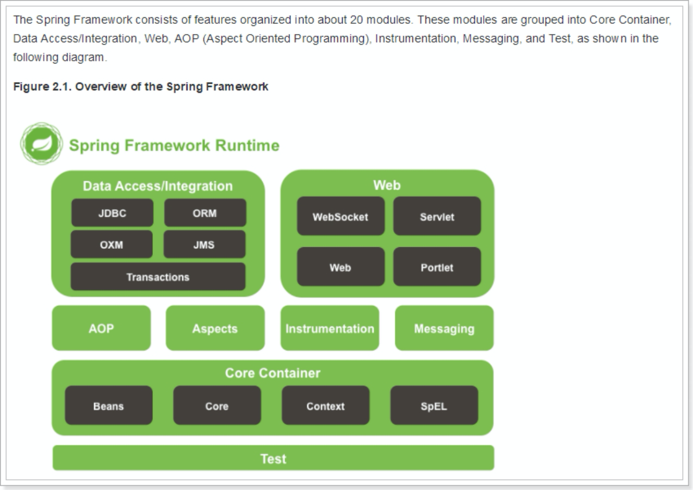
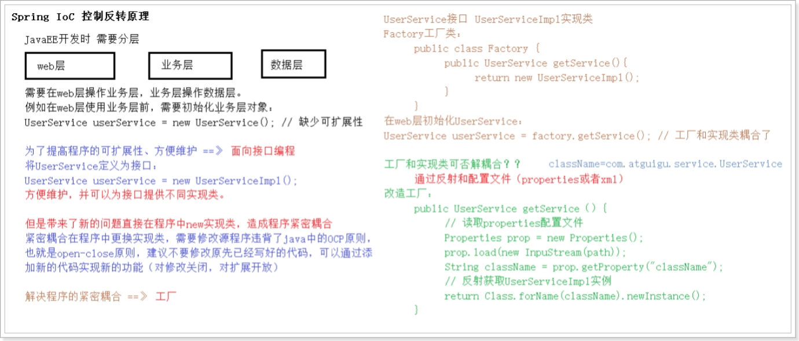
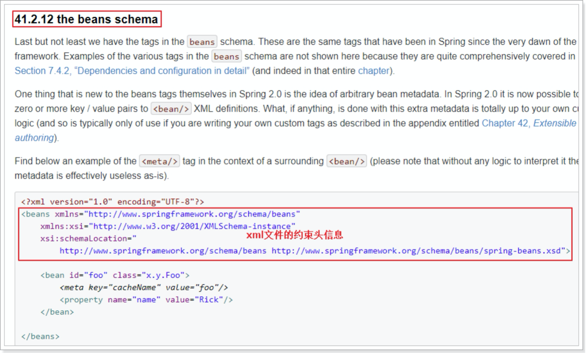
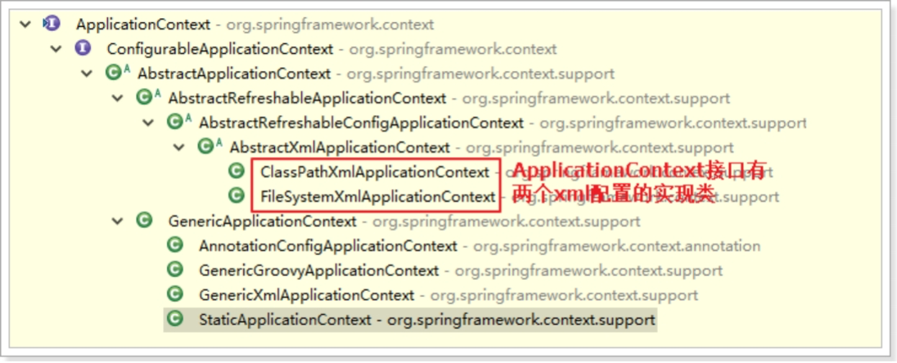

## 1.Spring概述

### 1.1Spring是什么？

#### 1.1.1简介

​		Spring为简化企业级开发而生，使用Spring开发可以将Bean对象、Dao组件对象、Service组件对象等交给Spring容器来管理，这样使得很多复杂的代码在Spring中开发却变得非常的优雅和简洁，有效的降低代码的耦合度，极大的方便项目的后期维护、升级和扩展，是“一站式”轻量级开源框架。

#### 1.1.2什么是一站式框架

JavaEE开发规范规定我们的程序应该要分为三层：WEB层、业务层、持久层。每一层的含的含义如下：

- WEB层（页面数据显示、页面跳转调度），提供Spring MVC框架。
- 业务层（业务处理和功能逻辑、事务控制），提供AOP管理事务。
- 持久层（数据存取和封装、和数据库打交道），提供Mybatis。

### 1.2Spring优点

1. 方便解耦，简化开发

   Spring就是一个大工厂，可以将所有对象的创建和依赖关系的维护，交给spring容器（IoC）。

2. AOP编程的支持

   Spring通过面向切面编程，可以方便的实现对程序进行权限拦截、运行监控等功能。

3. 声明式事务的支持

   只需要通过配置就可以完成对事务的控制，而无需手动编程。

4. 方便程序的测试

   Spring提供了对Junit4的支持，可以通过注解方便的测试spring应用程序。

5. 方便集成各种优秀框架

   Spring不排序任何优秀的开源框架，其内部提供了对各种优秀框架（Struts2、Hibernate、Solr、Quartz，elasticSearch等）的直接支持，降低各种框架的使用难度。

6. 降低JavaEE API的使用难度

   Spring对JavaEE开发中一些非常难用的API（如JDBC、JavaMail、远程调用等）进行了薄薄的封装层，使这些API的使用难度大为降低。

###  1.3Spring体系结构

#### 1.3.1完整架构图



#### 1.3.2Spring框架的四大模块

- Core核心模块。负责管理组件的Bean对象
  - spring-beans-x.x.x.RELEASE.jar
  - spring-context-x.x.x.RELEASE.jar
  - spring-core-x.x.x.RELEASE.jar
  - spring-expression-x.x.x.RELEASE.jar

- 面向切面编程
  - spring-aop-x.x.x.RELEASE.jar
  - spring-aspects-x.x.x.RELEASE.jar
- 数据访问
  - spring-jdbc-x.x.x.RELEASE.jar
  - spring-orm-x.x.x.RELEASE.jar
  - spring-oxm-x.x.x.RELEASE.jar
  - spring-tx-x.x.x.RELEASE.jar
  - spring-jms-x.x.x.RELEASE.jar 
- Web模块
  - spring-web-x.x.x.RELEASE.jar
  - spring-webmvc-x.x.x.RELEASE.jar
  - spring-websocket-x.x.x.RELEASE.jar
  - spring-webmvc-portlet-x.x.x.RELEASE.jar
  - spring-webflux-x.x.x.RELEASE.jar

### 1.4Spring的核心

这里主要介绍Spring中两大核心技术：IOC和AOP

1. IOC（Inverse of Control 反转控制）： 将对象创建权利交给Spring工厂进行管理。
2. AOP（Aspect Oriented Programming 面向切面编程），基于动态代理功能增强。

## 2.IOC快速入门

### 2.1引入依赖

https://mvnrepository.com/artifact/org.springframework/spring

### 2.2下载jar包

https://repo.spring.io/release/org/springframework/spring/

### 2.3IOC原理



### 2.4编写配置文件

#### 2.4.0编写接口

```java
/**
 * 接口
 */
public interface UserService { 
    public void sayHello();
}

/**
 * 实现类
 */
public class UserServiceImpl implements UserService {

    @Override
    public void sayHello() {
        System.out.println("hello spring!!!!!");
    }

}

/**
 * 传统写法
 */
public class UserServiceTest {
    @Test
    public void test1() {
        // 传统写法，紧密耦合
        UserService userService = new UserServiceImpl();
        userService.sayHello();
    }

}
```

#### 2.4.1ApplicationContext.xml内容

```XML
<?xml version="1.0" encoding="UTF-8"?>
<!-- xml配置的约束头信息 -->
<beans xmlns="http://www.springframework.org/schema/beans"
    xmlns:xsi="http://www.w3.org/2001/XMLSchema-instance"
    xsi:schemaLocation="
        http://www.springframework.org/schema/beans http://www.springframework.org/schema/beans/spring-beans.xsd">

	<!-- 配置使用哪个实现类，对UserService接口进行实例化 -->
	<!-- id:唯一标识，通过它获取配置的实现类。 class：配置UserService这个实现类 -->
	<bean id="userService" class="com.breeze.spring.quickstart.UserServiceImpl"></bean>

</beans>
```

#### 2.4.2头信息的配置



### 2.5通过IOC容器获取Bean

```java
    @Test
    public void test2() {
        // 反射 + 工厂 + 配置文件，实例化UserService接口对象
        ApplicationContext context = new 				
          				ClassPathXmlApplicationContext("applicationContext.xml");
        // 通过工厂根据配置名称获取实例化对象
        UserService userService = (UserService) context.getBean("userService");
        userService.sayHello();
    }
```

### 2.6结合案例理解IOC

1. 反转控制的概念，就是原本在程序中自己手动初始化的UserService接口对象，现在交给Spring框架管理。
2. 简单来说，就是**初始化UserService对象的控制权反转给了Spring框架**。

### 2.7DI依赖注入

1. **DI**：Dependency Injection，翻译过来就是，依赖注入。是指spring框架在创建bean对象时，动态的将依赖对象注入到bean组件中
2. 参照2.7.1中新增msg属性和set方法：如果我们需要给字段注入属性，一般都是通过userService.setMsg(“世界”);的方式进行。但是使用了Spring之后，我们只需要使用xml配置，或者注解配置，就可以直接注入。

#### 2.7.1扩展UserServiceImpl

```java
/**
 * UserService接口的实现类
 */
public class UserServiceImpl implements UserService {
    
    private String msg;

    @Override
    public void sayHello() {
        System.out.println("hello " + msg);
    }

    // UserServiceImpl的对象，依赖于String类型的msg数据
    public void setMsg(String msg) {
        this.msg = msg;
    }

}
```

#### 2.7.2通过配置属性注入

```XML
<?xml version="1.0" encoding="UTF-8"?>
<!-- xml配置的约束头信息 -->
<beans xmlns="http://www.springframework.org/schema/beans"
    xmlns:xsi="http://www.w3.org/2001/XMLSchema-instance"
    xsi:schemaLocation="
        http://www.springframework.org/schema/beans http://www.springframework.org/schema/beans/spring-beans.xsd">

	<!-- 配置使用哪个实现类，对UserService接口进行实例化 -->
	<!-- id:唯一标识，通过它获取配置的实现类。 class：配置UserService这个实现类 -->
	<bean id="userService" class="com.breeze.spring.quickstart.UserServiceImpl">
		<!-- spring框架初始化UserService对象后，自动调用该对象的setMsg方法，注入依赖数据：msg -->
		<property name="msg" value="测试依赖注入"></property>
	</bean>
</beans>
```

#### 2.7.3测试

```java
public class UserServiceTest {

    @Test
    public void test1() {
        // 传统写法，紧密耦合
        UserServiceImpl userService = new UserServiceImpl();
        // 手动注入userService对象依赖的msg数据
        userService.setMsg("世界");
        userService.sayHello();
    }

    @Test
    public void test2() {
        // 反射 + 工厂 + 配置文件，实例化UserService接口对象
        ApplicationContext context = new 
          					ClassPathXmlApplicationContext("applicationContext.xml");
        // 通过工厂根据配置名称获取实例化对象
        UserService userService = (UserService) context.getBean("userService");
        userService.sayHello();
    }

}
```

### 2.8Spring中的工厂

#### 2.8.1ApplicationContext接口



1. ClassPathXmlApplicationContext -- 加载类路径下的Spring配置文件 
2. FileSystemXmlApplicationContext -- 加载本地磁盘下的Spring配置文件
3. 下面演示FileSystemXmlApplicationContext的用法：把src下的applicationContext.xml拷贝到你电脑的某个目录，例如：c:\tmp，可以通过FileSystemXmlApplicationContext加载本地磁盘下的spring配置文件

```java
  	@Test
    public void test2() {
        // 反射 + 工厂 + 配置文件，实例化UserService接口对象
        ApplicationContext context = new FileSystemXmlApplicationContext("C:\\tmp\\applicationContext.xml");
        // 通过工厂根据配置名称获取实例化对象
        UserService userService = (UserService) context.getBean("userService");
        userService.sayHello();
    }
```

#### 2.8.2