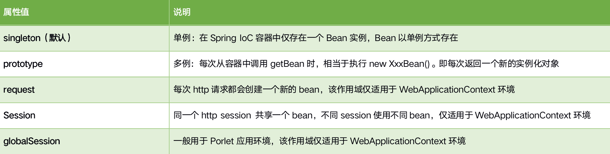
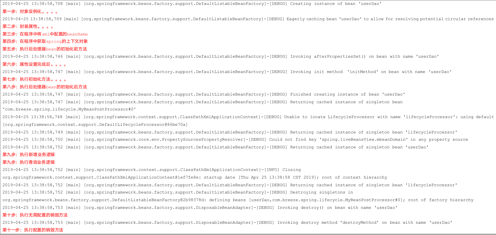
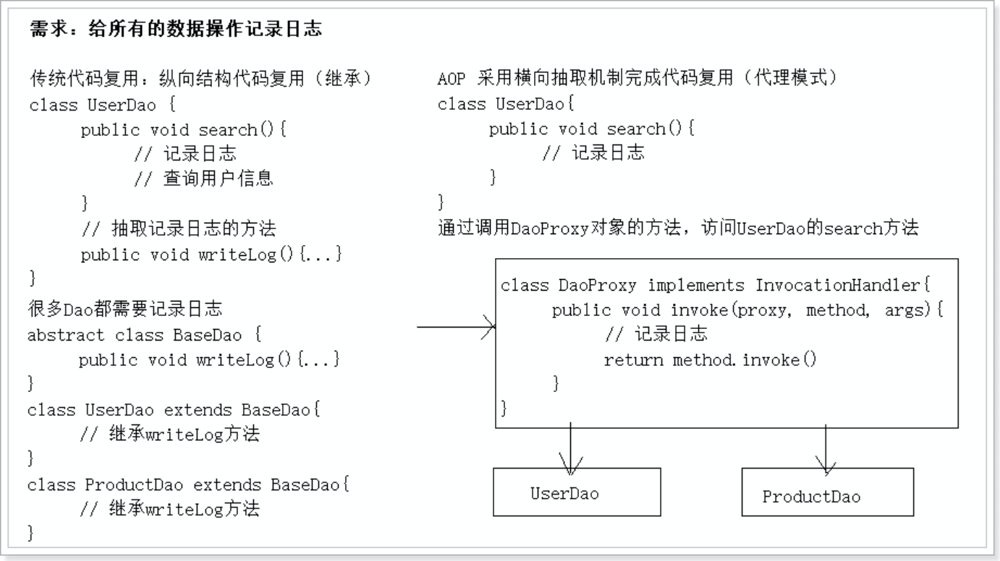
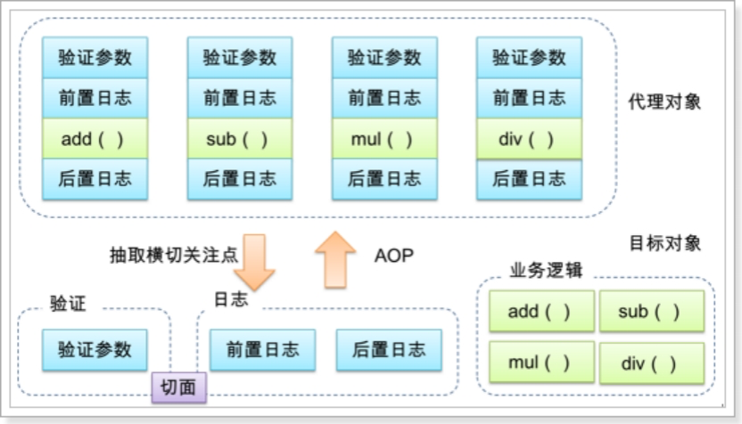
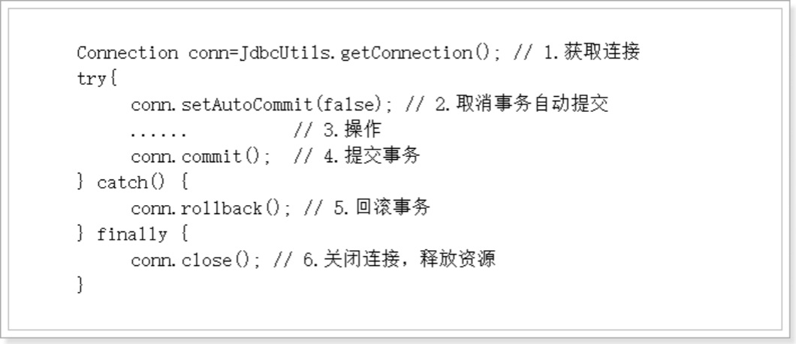
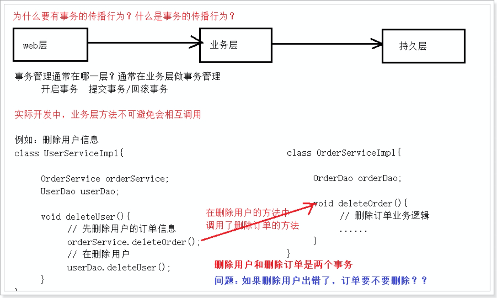

## 1.Spring IOC（控制反转）

### 1.1IOC和DI区别

1. IOC：控制反转，指将对象的创建权反转到Spring容器。
2. DI：依赖注入，指在创建对象的过程中，将对象依赖的属性通过配置进行注入。DI的实现依赖于IoC，先有控制反转才有依赖注入。

### 1.2依赖注入的方式

#### 1.2.1主要有三种方式

1. 接口注入
2. 构造器注入
3. setter方法注入

#### 1.2.2注入演示

- 构造方法注入就是利用bean的构造方法完成对bean中属性的赋值，在配置文件中，使用<-constructor-arg>标签完成

```java
public class User {
    
    private String name;
    private Integer age;
    
    public User(String name, Integer age) {
        super();
        this.name = name;
        this.age = age;
    }

    @Override
    public String toString() {
        return "User [name=" + name + ", age=" + age + "]";
    }
}

public class Order {

    private String number;
    private Double price;
    private User user;
    
    public void setNumber(String number) {
        this.number = number;
    }
    public void setPrice(Double price) {
        this.price = price;
    }
    public void setUser(User user) {
        this.user = user;
    }
    @Override
    public String toString() {
        return "Order [number=" + number + ", price=" + price + ", user=" + user + "]";
    }
    
}
```

- 常用的构造方法注入有3种：
  - 参数名注入
  - 通过索引值指定参数位置
  - 通过类型区分重载的构造器

```xml
<?xml version="1.0" encoding="UTF-8"?>
<!-- xml配置的约束头信息 -->
<beans xmlns="http://www.springframework.org/schema/beans"
    xmlns:xsi="http://www.w3.org/2001/XMLSchema-instance"
    xsi:schemaLocation="
        http://www.springframework.org/schema/beans http://www.springframework.org/schema/beans/spring-beans.xsd">

	<bean id="user" class="com.breeze.spring.di.User">
		<!-- 构造参数注入：name-参数名，value-参数值 -->
		<constructor-arg name="name" value="柳岩"></constructor-arg>
		<constructor-arg name="age" value="21"></constructor-arg>
    
    <!-- 构造参数注入：name-参数名，value-参数值 -->
		<constructor-arg index="0" value="柳岩"></constructor-arg>
		<constructor-arg index="1" value="21"></constructor-arg>
    
    <!-- 构造参数注入：name-参数名，value-参数值 -->
		<constructor-arg index="0" type="java.lang.String" value="柳岩"></constructor-arg>
		<constructor-arg index="1" type="java.lang.Integer" value="21"></constructor-arg>
	</bean>
  
  	<!-- setter方法注入 -->
	<bean id="order" class="com.breeze.spring.di.Order">
		<!-- property通过setter方法注入，name的属性值取决于set后的字符串，例如方法名是setNumber，这里应该配number -->
		<property name="number" value="20190001" />
		<property name="price" value="20000.00" />
		<!-- 通过ref引用其他对象，ref的值为被引用的bean的id -->
		<property name="user" ref="user"></property>
	</bean>
  
</beans>
```

### 1.3scope（作用域）

1. 在Spring中，可以在<-bean>元素的scope属性里设置bean的作用域，以决定这个bean是单实例的还是多实例的。
2. 默认情况下，Spring只为每个在IOC容器里声明的bean创建唯一一个实例，整个IOC容器范围内都能共享该实例：所有后续的getBean()调用和bean引用都将返回这个唯一的bean实例。该作用域被称为singleton，它是所有bean的默认作用域。
3. 当bean的作用域为单例<font color='red'><b>singleton</b></font>时，Spring会在IOC容器对象**创建时就创建bean的对象实例**。而当bean的作用域为<font color='red'><b>prototype</b></font>时，IOC容器在**获取bean的实例时创建bean的实例对象**。



## 1.4Bean的生命周期（了解）

1. Instantiate bean对象实例化。
2. Populate properties封装属性。即：调用属性的setter方法
3. 如果Bean实现BeanNameAware执行setBeanName
4. 如果Bean实现BeanFactoryAware或者ApplicationContextAware。执行设置工厂setBeanFactory或者设置上下文对象setApplicationContext
5. 如果存在类实现BeanPostProcessor（后处理Bean），执行PostProcessBeforeInitialization
6. 如果bean实现InitializingBean，执行afterPropertiesSet
7. 调用<-bean init-method="init">指定初始化方法init
8. 如果存在类实现BeanPostProcessor（后处理bean），执行postProcessAfterInitialization
9. 执行业务处理
10. 如果Bean实现DisposableBean执行destroy
11. 调用<-bean destroy-method="customerDestroy">指定销毁方法customerDestroy

第3步和第4步，使bean了解spring容器

第5步和第8步，BeanPostProcessor（钩子函数），用来对bean对象进行扩展

### 1.4.1UserDaoImpl

```java
public class UserDaoImpl implements UserDao, BeanNameAware, ApplicationContextAware, InitializingBean, DisposableBean {
    
    private String prop;

    public UserDaoImpl() {
        System.out.println("第一步：对象实例化。。。。");
    }

    @Override
    public void save() {
        System.out.println("第九步：执行新增业务逻辑");
    }

    @Override
    public void query() {
        System.out.println("第九步：执行查询业务逻辑");

    }
    
    public void setProp(String prop) {
        this.prop = prop;
        System.out.println("第二步：封装属性。。。。");
    }

    @Override
    public void setBeanName(String beanName) {
        System.out.println("第三步：在程序中将xml中配置的beanName");
    }

    @Override
    public void setApplicationContext(ApplicationContext applicationContext) throws BeansException {
        System.out.println("第四步：在程序中获取spring的上下文对象");
    }

    @Override
    public void afterPropertiesSet() throws Exception {
        System.out.println("第六步：属性设置完成后。。。。");
    }
    
    public void initMethod(){
        System.out.println("第七步：执行初始化方法。。。。");
    }

    @Override
    public void destroy() throws Exception {
        System.out.println("第十步：执行无需配置的销毁方法");
    }
    
    public void destroyMethod(){
        System.out.println("第十一步：执行配置的销毁方法");
    }
}
```

### 1.4.2自定义后处理器bean

```java
public class MyBeanPostProcessor implements BeanPostProcessor {

    /* 
     * bean：实例对象
     * beanName：xml配置bean时，指定的id
     */
    @Override
    public Object postProcessBeforeInitialization(Object bean, String beanName) throws BeansException {
        System.out.println("第五步：执行后处理器bean的初始化前方法");
        return bean;
    }

    @Override
    public Object postProcessAfterInitialization(Object bean, String beanName) throws BeansException {
        System.out.println("第八步：执行后处理器bean的初始化后方法");
        return bean;
    }

}
```

### .3applicationContext.xml

```xml
<bean id="userDao" class="com.breeze.spring.lifecycle.UserDaoImpl" 
		init-method="initMethod" destroy-method="destroyMethod">
		<property name="prop" value="breeze"></property>
	</bean>
	<!-- 注入自定义的后处理器，没有配置id，因为这个bean由spring内部调用 -->
	<bean class="com.breeze.spring.lifecycle.MyBeanPostProcessor" />
```

### 1.4.4Test测试

```java
    @Test
    public void test() {
        ClassPathXmlApplicationContext context = new 
          						ClassPathXmlApplicationContext("applicationContext.xml");
        UserDao userDao = (UserDao) context.getBean("userDao");
        userDao.save();
        context.close();
    }
```

### 1.4.5结果



## 2.Spring常用注解

### 2.1@Component

1. 作用： 把资源让spring来管理，相当于在xml中配置一个bean。
2. 属性：value：指定bean的id，如果不指定value属性，默认bean的id是当前类的类名，首字母小写。

### 2.2@Controller@Service@Repository

​		这三个注解都是针对@Component的衍生注解，他们的作用及属性都是一模一样的。他们只不过是提供了更加明确的语义化，让标注类本身的用途更加清晰。

1. @Controller：一般用于表现层实现类的注解。
2. @Service：一般用于业务层实现类的注解。
3. @Repository：一般用于持久层实现类的注解。（以后采用Mapper接口代理，所以这个注解基本不用）

### 2.3@Value

### 2.4@Scope（改变作用域）

### 2.5与生命周期相关

1. **@PostConstruct**加在方法上，指定bean对象创建好之后，调用该方法初始化对象，类似于xml的init-method方法。
2. **@PreDestory**加在方法上，指定bean销毁之前，调用该方法，类似于xml的destory-method方法。

### 2.6Autowire和Resource（自动装配）

#### 2.6.1xml方式的Autowire

- default和no一样，都表示不装配，如果对象你不手动设置，就没有值。
- byName：表示Spring容器会自动按照子对象的属性名，当成是id来查找对象。找到就注入，找不到就为null
  - 举例：private Car car;
  - 就会以car做为id去spring容器中去查找对象，找到就把值注入给属性car。
- byType：表示Spring容器会自动的按照子对象的类型去查找bean对象注入。找到就注入，找不到为null，找到多个就报错
  - 举例：private Car car;
  - Spring容器就会自动的按照Car.class类型去Spring容器中查找。
- constructor：表示Spring容器会按照子对象的类型去查找构造方法，根据构造方法中参数需要的类型去注入。
  - 先按照类型查询，如果找到一个就注入。
  - 如果找到多个，再按照构造方法中参数的变量名做为id来查找，如果找到就注入。如果没有找到就为null

```xml
	<!-- ByName方式 -->
	<bean id="order" class="com.breeze.spring.di.Order" autowire="byName"></bean>

	<!-- ByType方式 -->
	<bean id="order" class="com.breeze.spring.di.Order" autowire="byType"></bean>
  
	<!-- constructor方式 
		Order类中添加构造方法
    public Order(User user) {
        super();
        this.user = user;
    }
		-->
  <bean id="order" class="com.breeze.spring.di.Order" autowire="constructor"></bean>
```

#### 2.6.2@Autowire和@Resource区别

1. @Autowire由Spring提供，只按照<font color='red'><b>byType</b></font>注入，如果有相同类型会通过<font color='red'><b>byName</b></font>注入；@Resource由J2EE提供，默认按照<font color='red'><b>byName</b></font>自动注入，找不到再按type去匹配。
2. @Resource提供了name和type属性，可以配置精确装配；@Autowire如果想要直接采用byName注入可以结合<font color='red'><b>@Qualifier</b></font>使用。它也有一个属性**required**，设置为false时候可以让对象为null，不报错。
3. 如果找不到，两个注解都会报错（当然，排除required=false情况）

## 3.Spring AOP（面向切面编程）

### 3.1简介

1. AOP：Aspect Oriented Programing 面向切面编程
2. 面向切面编程指的是：程序是运行期间，动态地将某段代码插入到原来方法代码的某些位置中
3. AOP采用横向抽取机制，取代了传统纵向继承体系抽取重复性代码（性能监视、事务管理、安全检查、缓存）
4. <font color='red'><b>面向对象  纵向继承机制</b></font>
5. <font color='red'><b>面向切面  横向抽取机制</b></font>



### 3.2动态代理两种方式

1. 基于接口实现动态代理： JDK动态代理
2. 基于继承实现动态代理： CGLIB代理

#### 3.2.1JDK代理

```java
//计算接口
public interface Calculator {
    public int add(int a, int b);
}
```

```java
//计算接口实现类
public class CalculatorImpl implements Calculator {
		@Override
    public int add(int a, int b) {
        return a + b;
    }
}
```

```java
//代理类
public class CalculatorLogProxy implements InvocationHandler {

    // 持有被代理对象（目标对象）
    private Object target;

    // 代理对象构造方法
    public CalculatorLogProxy(Object target) {
        super();
        this.target = target;
    }

    // 代理对象的每个执行方法都会替换执行invoke方法
    @Override
    public Object invoke(Object proxy, Method method, Object[] args) throws Throwable {
        System.out.println("开始" + method.getName() + "方法执行，方法参数：" + Arrays.asList(args));
        Object result = method.invoke(target, args);
        System.out.println("结束" + method.getName() + "方法执行，方法参数：" + Arrays.asList(args));
        return result;
    }

    // 创建一个代理对象来代理目标对象，代理对象也要实现目标对象的接口
    public static Object createInstance(Object target) {
        return Proxy.newProxyInstance(target.getClass().getClassLoader(), target.getClass().getInterfaces(),
                new CalculatorLogProxy(target));
    }

}
```

```java
		//测试
		@Test
    public void test(){
        Calculator calculator = new CalculatorImpl();
        Calculator calculatorProxy = (Calculator) 
          		CalculatorLogProxy.createInstance(calculator);
        
        calculatorProxy.add(100, 200);
    }
```

#### 3.2.2CGLIB代理（了解）

​		在实际开发中，可能需要对没有实现接口的类增强，用JDK动态代理的方式就没法实现。采用Cglib动态代理可以对没有实现接口的类产生代理，实际上是生成了目标类的子类来增强。 

​		CGLIB是第三方开源技术，使用它需要导入Cglib所需的jar包。（spring3.2以前需要导入jar包）

> 提示：新版本spring已经集成了cglib，我们已经导入了spring包，故不需要再导入其它包了。

```java
		@Test
    public void test2() {
        CalculatorImpl calculator = new CalculatorImpl();
        // 创建cglib的核心对象
        Enhancer enhancer = new Enhancer();
        // 设置父类：把CalculatorImpl作为父类
        enhancer.setSuperclass(calculator.getClass());
        // 设置回调
        enhancer.setCallback(new MethodInterceptor() {
          	/*
             * 当你调用目标方法时，实质上是调用该方法 
             * intercept四个参数： 
             *  proxy:代理对象
             *  method:目标方法 
             *  args：目标方法的形参
             *  methodProxy:代理方法
             */
          @Override
          public Object intercept(Object proxy, Method method, Object[] args, MethodProxy methodProxy) throws Throwable {
                // 添加记录的功能
                System.out.println("记录日志开始...");
                // 调用目标(父类)方法
                Object result = methodProxy.invokeSuper(proxy, args);
                System.out.println("记录日志结束...");
                return result;
            }
        });
        // 创建代理对象
        CalculatorImpl proxy = (CalculatorImpl) enhancer.create();
        proxy.add(100, 200);
    }
```

### 3.3AOP好处

1. 每个公共逻辑位于一个位置，代码不分散，便于维护和升级

   AOP编程操作的主要对象是切面(aspect)，而切面**模块化横切关注点**（公共功能）。

   在应用AOP编程时，仍然需要定义公共功能，但可以明确的定义这个功能应用在哪里，以什么方式应用，并且不必修改受影响的类。这样一来横切关注点就被模块化到特殊的类里——这样的类我们通常称之为“切面”。 

2. 业务模块更简洁，只包含核心业务代码

3. AOP图解

4. 

### 3.4AOP术语

1. Proxy（代理）：一个类被AOP织入增强后，就产生一个结果代理类
2. Target（目标对象）：被代理的对象
3. Joinpoint（连接点）：所谓连接点是指那些可以被拦截到的点（目标对象中的方法）。在spring中，这些点指的是方法，因为spring只支持方法类型的连接点。
4. Pointcut（切入点）：所谓切入点是指我们要对那些Joinpoint连接点进行拦截。每个类的方法中都包含多个连接点，所以连接点是类中客观存在的事物。如果把连接点看作数据库中的记录，那么切入点就是查询条件——AOP可以通过切入点定位到特定的连接点。
5. Aspect（切面）：封装横切关注点信息的类，每个关注点体现为一个通知方法。
6. Advice（通知/增强）：增强的业务逻辑：日志记录、性能监控、安全检查。所谓通知是指拦截到Joinpoint之后所要做的事情就是通知。通知分为：前置通知、后置通知、环绕通知、异常通知、最终通知，一个切面类中包含多个通知方法。

### 3.5五种通知类型

#### 3.5.1前置通知（@Before）

1. 前置通知：在方法执行之前执行的通知
2. 场景：权限控制 （权限不足，抛出异常）、 记录方法调用信息日志，只需要在通知方法的参数中，加入一个JoinPoint参数，就可以获取到拦截方法的信息。

#### 3.5.2返回通知（@AfterReturning）

1. 返回通知：在方法返回结果之后执行，可获取返回值并对返回值增强
2. 应用场景：与业务相关的，如ATM取款机取款后，自动下发短信。
3. 获取方法的返回值：
   1. 在返回值通知的方法中，追加一个参数 Object 参数名
   2. 在@AfterReturning注解中添加参数returning="参数名"
   3. <font color='red'><b>两个参数名必须一致。</b></font>

#### 3.5.3异常通知（@AfterThrowing）

1. 异常通知，在方法抛出异常之后执行
2. 应用场景：处理异常（一般不可预知），记录日志
3. 获取方法抛出的异常分为两个步骤：
   1. 在异常通知的方法中，追加一个参数：Exception 参数名
   2. 在@AfterThrowing 注解中添加参数：throwing="参数名"

#### 3.5.4后置通知（@After）又称最终通知

1. 作用：不管目标方法是否发生异常，最终通知都会执行（类似于finally代码功能）
2. 应用场景：释放资源 （关闭文件、 关闭数据库连接、 网络连接、 释放内存对象 ）

#### 3.5.5环绕通知（@Around）

1. 环绕通知，目标执行前后，都进行增强，甚至可以控制目标方法执行，<font color='red'><b>环绕通知优先于其他通知先执行。</b></font>
2. 应用场景：日志、缓存、权限、性能监控、事务管理
3. 环绕通知必须满足以下条件：
   1. <font color='red'><b>接受的参数：ProceedingJoinPoint（可执行的连接点）</b></font>
   2. <font color='red'><b>需要通过proceed = joinPoint.proceed(joinPoint.getArgs());执行目标方法，否则目标方法不执行</b></font>
   3. <font color='red'><b>返回值：Object返回值，否则返回通知无法执行</b></font>
   4. <font color='red'><b>抛出Throwable异常。否则其他通知无法捕获异常</b></font>

#### 3.5.6通知执行顺序（@Order）

1. 正常情况（整个执行过程没有收到抛出的异常）：

   ​	环绕通知====>>>>前置通知====>>>>业务逻辑====>>>>环绕通知====>>>>后置通知（最终通知）=====>>>>返回通知（返回值之后）

2. 异常情况（收到抛出的异常）：

   ​	环绕通知====>>>>前置通知====>>>>业务逻辑====>>>>后置通知（最终通知）=====>>>>返回通知（返回值之后）

3. 当我们有多个切面，多个通知的时候：

   1. 在同一个连接点上应用不止一个切面时，除非明确指定，通知的执行顺序默认是由切面类的字母先后顺序决定。
   2. 切面的优先级可以通过实现Ordered接口或利用@Order注解指定。
   3. 实现Ordered接口，getOrder()方法的返回值越小，优先级越高。@Order(1)
   4. 在切面类上使用@Order注解决定通知执行的顺序（值越小，越先执行）

### 3.6advisor和aspect区别

1. advisor是spring中aop定义切面，通常由一个切点和一个通知组成
2. aspect是规范中切面，允许由多个切点和多个通知组成

## 4.事务控制

### 4.1概念

事务是逻辑上一组操作，组成这组操作各个逻辑单元，<font color='red'><b>要么一起成功，要么一起失败。</b></font>

### 4.2事务的四个特性（ACID）

1. <font color='red'><b>原子性(atomicity)</b></font>：“原子”的本意是“**不可再分**”，事务的原子性表现为一个事务中涉及到的多个操作在逻辑上缺一不可。事务的原子性要求事务中的所有操作要么都执行，要么都不执行。 
2. <font color='red'><b>一致性(consistency)</b></font>：“一致”指的是数据的一致，具体是指：所有数据都处于满足业务规则的一致性状态。一致性原则要求：一个事务中不管涉及到多少个操作，都必须保证事务执行之前数据是正确的，事务执行之后数据仍然是正确的。如果一个事务在执行的过程中，其中某一个或某几个操作失败了，则必须将其他所有操作撤销，将数据恢复到事务执行之前的状态，这就是回滚。
3. <font color='red'><b>隔离性(isolation)</b></font>：在应用程序实际运行过程中，事务往往是并发执行的，所以很有可能有许多事务同时处理相同的数据，因此每个事务都应该与其他事务隔离开来，防止数据损坏。隔离性原则要求多个事务在并发执行过程中不会互相干扰。
4. <font color='red'><b>持久性(durability)</b></font>：持久性原则要求事务执行完成后，对数据的修改永久的保存下来，不会因各种系统错误或其他意外情况而受到影响。通常情况下，事务对数据的修改应该被写入到持久化存储器中。

### 4.3事务并发的问题

1. 脏读：一个事务可以读取另一个事务未提交的数据
2. 幻读：一个事务可以读取另一个事务已提交的数据	新增 表
3. 不可重复读：一个事务可以读取另一个事务已提交的数据 更新 删除 行

### 4.4事务隔离级别

1. read uncommitted(0)：读未提交
2. read committed(2)：读已提交
3. repeatable read(4)：可重复读
4. Serializable(8)：可序列化

### 4.5Spring事务管理

#### 4.5.1编程式事务管理

##### 4.5.1.1使用原生JDBC API进行事务管理



##### 4.5.1.2存在的问题

​		使用原生的JDBC API实现事务管理是所有事务管理方式的基石，同时也是最典型的编程式事务管理。编程式事务管理需要将事务管理代码嵌入到业务方法中来控制事务提交和回滚。相对于核心业务而言，事务管理的代码显然属于非核心业务。在使用编程的方式管理事务时，必须在每个业务操作中<font color='red'><b>包含额外的事务管理代码</b></font>。如果多个模块都使用同样模式的代码进行事务管理，显然会造成较大程度的<font color='red'><b>代码冗余</b></font>。

#### 4.5.2声明式事务管理

##### 4.5.2.1声明式事务

​		<font color='red'><b>是建立在AOP之上的</b></font>，其本质是对方法前后进行拦截，然后在目标方法开始之前创建或者加入一个事务，在执行完目标方法之后根据执行情况提交或者回滚事务。声明式事务最大的优点就是不需要通过编程的方式管理事务，这样就不需要在业务逻辑代码中掺杂事务管理的代码，只需在配置文件中做相关的事务规则声明(或通过基于**@Transactional**注解的方式)，便可以将事务规则应用到业务逻辑中。

#### 4.5.3事务七大传播行为



- **propagation_requierd**：如果当前没有事务，就新建一个事务，如果已存在一个事务中，加入到这个事务中，这是最常见的选择。
- **propagation_supports**：支持当前事务，如果没有当前事务，就以非事务方法执行。
- **propagation_mandatory**：使用当前事务，如果没有当前事务，就抛出异常。
- **propagation_required_new**：新建事务，如果当前存在事务，把当前事务挂起。
- **propagation_not_supported**：以非事务方式执行操作，如果当前存在事务，就把当前事务挂起。
- **propagation_never**：以非事务方式执行操作，如果当前事务存在则抛出异常。
- **propagation_nested**：如果当前存在事务，则在嵌套事务内执行。如果当前没有事务，则执行与propagation_required类似的操作

#### 4.5.4最常用的传播机制就三种

1. <font color='red'><b>PROPAGATION_REQUIRED</b></font>
2. <font color='red'><b>PROPAGATION_REQUIRES_NEW</b></font>
3. <font color='red'><b>PROPAGATION_NESTED</b></font>

## 5.Spring监听器

1. <font color='red'><b>ContextLoaderListener</b></font>是Spring中的核心监听器，当web工程启动时，该监听器负责创建Spring的IOC容器，存放在ServletContext中；当需要用IOC容器时，就从ServletContext中获取。
2. 好处：不用我们手动创建IOC容器，由监听器负责创建；可以保证整个工程中只有一个IOC容器；

