## 1.线程

### 1.1线程和进程

1. 进程：进程是一个具有一定独立功能的程序关于某个数据集合的一次运行活动。它是操作系统动态执行的基本单元，在传统的操作系统中，进程既是基本的分配单元，也是基本的执行单元。 
2. 线程：通常在一个进程中可以包含若干个线程，当然一个进程中至少有一个线程，不然没有存在的意义。线程可以利用进程所拥有的资源，在引入线程的操作系统中，通常都是把进程作为分配资源的基本单位，而把线程作为独立运行和独立调度的基本单位，由于线程比进程更小，基本上不拥有系统资源，故对它的调度所付出的开销就会小得多，能更高效的提高系统多个程序间并发执行的程度。

> 例子：
>
> 1. 使用QQ，打开任务管理器，一定会有一个QQ.exe的进程，我可以用 qq 和 A 文字聊天，和 B 视频聊天，给 C 传文件，给 D 发一段语言， QQ 支持录入信息的搜索，这是多个线程并行。
> 2. 大四的时候写论文，用 word 写论文，同时用 QQ 音乐放音乐，同时用 QQ 聊天，多个进程。 

### 1.2并发和并行

1. 并发：同一时刻多个线程在访问同一个资源，多个线程对一个点。

   > 春运抢票、电商秒杀、限量抢购

2. 并行：多项工作一起执行，之后再汇总

   > 泡方便面：电热水壶烧开水的同时，撕调料包倒入桶中

### 1.3线程的状态

```java
	//Thread State中
	public enum State {
        /**
         * Thread state for a thread which has not yet started.
         */
        NEW,（新建）

        /**
         * Thread state for a runnable thread.  A thread in the runnable
         * state is executing in the Java virtual machine but it may
         * be waiting for other resources from the operating system
         * such as processor.
         */
        RUNNABLE,（准备就绪、运行中）

        /**
         * Thread state for a thread blocked waiting for a monitor lock.
         * A thread in the blocked state is waiting for a monitor lock
         * to enter a synchronized block/method or
         * reenter a synchronized block/method after calling
         * {@link Object#wait() Object.wait}.
         */
        BLOCKED,（阻塞）

        /**
         * Thread state for a waiting thread.
         * A thread is in the waiting state due to calling one of the
         * following methods:
         * <ul>
         *   <li>{@link Object#wait() Object.wait} with no timeout</li>
         *   <li>{@link #join() Thread.join} with no timeout</li>
         *   <li>{@link LockSupport#park() LockSupport.park}</li>
         * </ul>
         *
         * <p>A thread in the waiting state is waiting for another thread to
         * perform a particular action.
         *
         * For example, a thread that has called <tt>Object.wait()</tt>
         * on an object is waiting for another thread to call
         * <tt>Object.notify()</tt> or <tt>Object.notifyAll()</tt> on
         * that object. A thread that has called <tt>Thread.join()</tt>
         * is waiting for a specified thread to terminate.
         */
        WAITING,（不见不散）

        /**
         * Thread state for a waiting thread with a specified waiting time.
         * A thread is in the timed waiting state due to calling one of
         * the following methods with a specified positive waiting time:
         * <ul>
         *   <li>{@link #sleep Thread.sleep}</li>
         *   <li>{@link Object#wait(long) Object.wait} with timeout</li>
         *   <li>{@link #join(long) Thread.join} with timeout</li>
         *   <li>{@link LockSupport#parkNanos LockSupport.parkNanos}</li>
         *   <li>{@link LockSupport#parkUntil LockSupport.parkUntil}</li>
         * </ul>
         */
        TIMED_WAITING,（过时不候）

        /**
         * Thread state for a terminated thread.
         * The thread has completed execution.
         */
        TERMINATED;（终结）
    }
```

### 1.4线程的生命周期

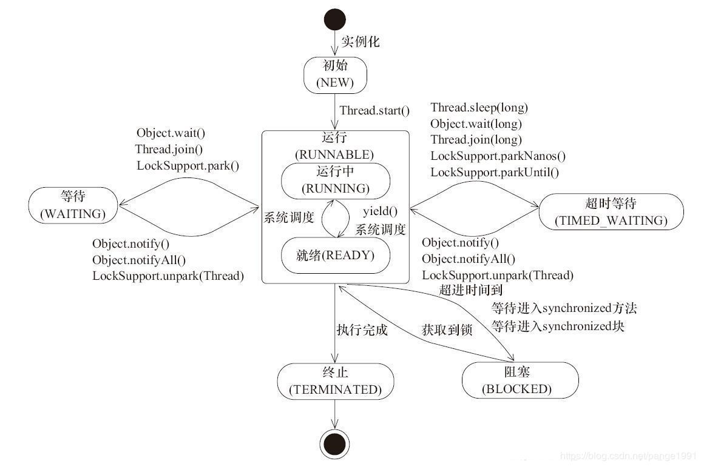

### 1.5创建线程的四种方式

1. 继承Thread类，重写run方法，调用start方法启动线程。

2. 实现Runnable接口，重写run方法，放入Thread构造器中，通过thread的start方法调用。

3. 实现Callable接口，重写call方法，有返回值可以抛出异常。

4. - 创建FutureTask对象，传入Thread构造器中，通过start方法调用。
   - FutureTask对象.get() 获取返回值。

5. **线程池**

### 1.6wait和sleep区别

功能都相当于是暂停

1. wait放开手去睡，放开手里的锁
2. sleep握紧手去睡，醒了手里还有锁

## 2.JUC

### 2.1什么是JUC

java.util.concurrent在并发编程中使用的工具类

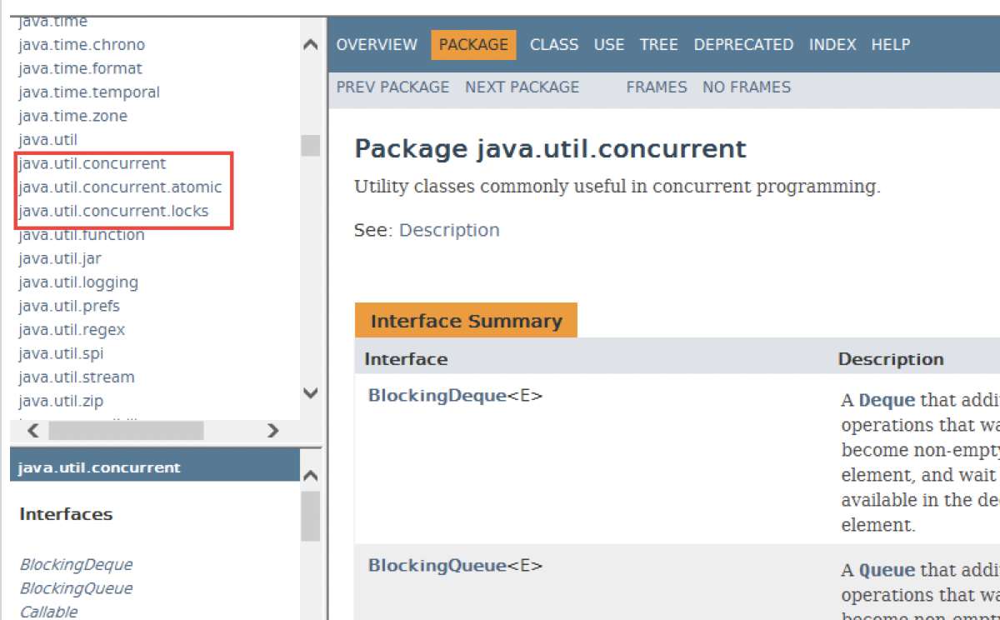

## 3.谈谈你对volatile的理解

### 3.1volatile是Java虚拟机提供的轻量级的同步机制

1. 保证可见性
2. **不保证原子性**
3. 禁制指令重排

### 2.2.2谈谈JMM

1. Java内存模型（Java Memory Model）

   > JMM（ Java内存模型 ，简称JMM）本身是一种抽象的概念 **并不真实存在** ，它描述的是一组规则或规范，通过这组规范定义了程序中各个变量（包括实例字段，静态字段和构成数组对象的元素）的访问方式。 

2. JMM关于同步的规定： 

   1. 线程解锁前，必须把共享变量的值刷新回主内存。 
   2. 线程加锁前，必须读取主内存的最新值到自己的工作内存。 
   3. 加锁解锁是同一把锁。 

3. 由于JVM运行程序的实体是线程，而每个线程创建时JVM都会为其创建一个 **工作内存** （有些地方称为栈空间），工作内存是每个线程的私有数据区域，而Java内存模型中规定所有变量都存储到 **主内存** **，** 主内存是共享内存区域，所有线程都可以访问， **但线程对变量的操作（读取、复制等）必须在工作内存中进行，首先要将变量从主内存拷贝到自己的工作内存空间，然后对变量进行操作，操作完成后再将变量写回主内存** ，不能直接操作主内存中的变量，各个线程中的工作内存中存储着主内存中的 **变量副本拷贝** ，因此不同的线程间无法访问对方的工作内存，线程间的通信（传值）必须通过主内存来完成，其简要访问过程如下图： 

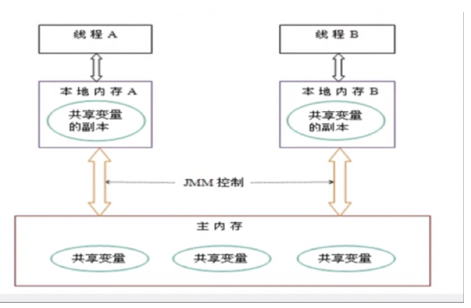

#### 3.2.1JMM要求保证可见性

1. 通过前面对JMM的介绍，我们知道各个线程对主内存中共享变量的操作都是各个线程各自拷贝到自己的工作内存进行操作后再写回主内存中的。 
2. 这就可能存在一个线程A修改了共享变量X的值但还未写回主内存时，另一个线程B又对准内存中同一个共享变量X进行操作，但此时A线程工作内存中共享变量X对线程B来说并不是可见，这种工作内存与主内存同步存在延迟现象就造成了可见性问题。 

#### 3.2.2JMM要求保证原子性

#### 3.2.3JMM要求有序性

1. 计算机在执行程序时，为了提高性能，编译器和处理器常常会对 **指令做重排** **，** 一般分一下3种 **：** 
   1. 源代码-> **编译器优化的重排** -> **指令并行的重排** -> **内存系统的重排** ->最终执行的指令 
   2. 单线程环境里面确保程序最终执行结果和代码顺序执行的结果一致。 
   3. 处理器在进行重排序时必须考虑指令之间的数据 **依赖性** 。 
2. 多线程环境中线程交替执行，由于编译器优化重排的存在，两个线程中使用的变量能否保证一致性是无法确定的，结果无法预测。 

### 2.2.3volatile保证可见性和不保证原子性代码演示

```java
/**
 * @author : breeze
 * @date : 2020/5/25
 * @description : 多线程资源类
 */
public class VolatileData {
    volatile int number = 0;
    boolean flag = false;
    /**
     * 改变成员变量值的方法
     */
    public void changeValue() {
        number = 1;
        flag = true;
    }
    public void addNumber() {
        if (flag) {
            number += 5;
            System.out.println(Thread.currentThread().getName() + "\tnumber：" + number);
        }
    }
    public void numberTo60() {
        this.number = 60;
    }
    /**
     * 注意：测试的时候，此时的number是由volatile修饰的，测试其不能保证原子性
     */
    public void addPlus() {
        number++;
    }
    AtomicInteger atomicInteger = new AtomicInteger();
    /**
     * 验证AtomicInteger保证原子性
     */
    public void addAtomic() {
        atomicInteger.getAndIncrement();
    }
}
```

```java
/**
  * 如何保证原子性
  *  1.加synchronize锁
  *  2.使用juc下AtomicInteger
  */
public static void unAtomicity() {
  VolatileData volatileData = new VolatileData();

  for (int i = 1; i <= 20; i++) {
    new Thread(() -> {
      for (int j = 1; j <= 1000 ; j++) {
        volatileData.addPlus();
        volatileData.addAtomic();
      }
    }, String.valueOf(i)).start();
  }
  //需要等上面的20个线程全部执行完，才可以继续走
  while (Thread.activeCount() > 2) {
    Thread.yield();
  }
  System.out.println(Thread.currentThread().getName() + "\tfinally number value: " + volatileData.number);
  System.out.println(Thread.currentThread().getName() + "\tmission is over atomic value: " + volatileData.atomicInteger);
}

/**
  * 验证volatile可见性
  */
public static void visibility() {
  VolatileData volatileData = new VolatileData();

  new Thread(() -> {
    System.out.println(Thread.currentThread().getName() + "\tcome in");
    try { TimeUnit.SECONDS.sleep(3); } catch (InterruptedException e) { e.printStackTrace(); }

    volatileData.numberTo60();
    System.out.println(Thread.currentThread().getName() + "\tupdate number value: " + volatileData.number);
  }, "A").start();

  while (volatileData.number == 0) {
    //不加volatile，程序会一直在这里打转，下面的mission is over不会执行
    //加了volatile 下面会打印
  }

  System.out.println(Thread.currentThread().getName() + "\tmission is over main number value: " + volatileData.number);
}
```

### 2.2.4volatile禁止指令重排

1. volatile实现 **禁止指令重排优化** **，** 从而避免多线程环境下程序出现乱序执行的现象 **。** 
2. 先了解一个概念，内存屏障又称**内存栅栏**，是一个CPU指令，它的作用有两个： 
   1. 一是保证特定操作的执行顺序 
   2. 二是保证某些变量的内存可见性（利用该特性实现volatile的内存可见性） 

由于编译器和处理器都能执行指令重排优化。如果在指令间插入一条Memory Barrier则告诉编译器和CPU，不管什么指令都不能和这条Memory Barrier指令重新排序，也就是说 **通过插入内存屏障禁止在内存屏障前后的指令执行重排序优化** 。内存屏障另外一个作用是强制刷出各种CPU的缓存数据，因此任何CPU上的线程都能读取到这些数据的最新版本。 

> 由于指令重排比较难复现，这里便不做演示。

###  2.2.5小总结

1. 工作内存和主内存同步延迟现象导致的可见性问题 ，可以使用**synchronized**或**volatile**关键字解决，他们都可以使一个线程 **修改后的变量立即对其他线程可见** 。 
2. 对于指令重排导致的可见性问题和有序性问题可以利用 **volatile** 关键字解决，因为volatile的另外一个作用就是禁止重排序优化。 

### 2.2.6你在哪些地方用过volatile

1. 单例模式DCL（双端检索机制）代码

   ```java
   /**
    * @author : breeze
    * @date : 2020/5/25
    * @description : Volatile解决单例模式指令重排问题
    *
    *  1.synchronize可以控制线程安全问题，但是会导致并发性下降
    *  2.多线程情况下，由于指令重排会出现安全性问题，所以需要Volatile
    *  3.多线程单例模式：需要DCL（double check lock）双端检锁机制
    */
   public class SingletonByVolatile {
   
       private static volatile SingletonByVolatile instance = null;
   
       private SingletonByVolatile() {
           System.out.println(Thread.currentThread().getName() + "我是SingletonByVolatile构造方法");
       }
   
       public static SingletonByVolatile getInstance() {
           if (instance == null) {
               //锁前锁后分别校验（DCL）
               synchronized (SingletonByVolatile.class) {
                   if (instance == null) {
                       instance = new SingletonByVolatile();
                   }
               }
           }
           return instance;
       }
   }
   ```

2. 单例模式volatile分析

   1. **DCL（双端检锁 Double Check Lock）** 机制不一定线程安全，原因是有指令重排序的存在，加入volatile可以禁止指令重排。原因在于某一个线程执行到第一个检测，读取到的instance 不为null时，instance的引用对象**可能没有完成初始化**。
   2. 指令重排只会保证串行语义的执行一致性（单线程），但并不会关心多线程间的语义一致性。 
   3. **所以当一条线程访问instance不为null时，由于instance实例未必已初始化完成，也就造成了线程安全问题 。**

### 2.2.7synchronized和volatile区别

1. volatile本质是在告诉jvm当前变量在寄存器（工作内存）中的值是不确定的，需要从主存中读取； synchronized则是锁定当前变量，只有当前线程可以访问该变量，其他线程被阻塞住。 
2. volatile仅能使用在变量级别；synchronized则可以使用在静态方法、方法、和类级别的 
3. volatile仅能实现变量的修改可见性，不能保证原子性；而synchronized则可以保证变量的修改可见性和原子性 
4. volatile不会造成线程的阻塞；synchronized可能会造成线程的阻塞。 
5. volatile标记的变量不会被编译器优化；synchronized标记的变量可以被编译器优化 

## 4.CAS你了解不？

> **CAS -> CAS底层原理 -> Unsafe -> ABA -> 原子引用更新 -> 如何规避ABA问题**

### 4.1CAS（CompareAndSwap ）比较并交换

### 4.2CAS底层原理：Unsafe类 + CAS思想(自旋锁) 

#### 4.2.1看下atomicInteger.getAndIncrement()底层

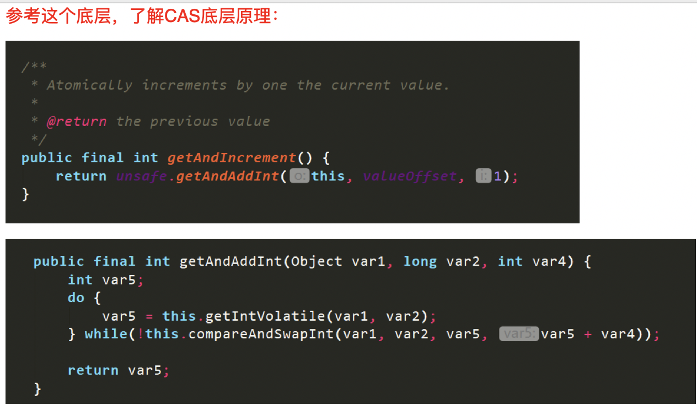

#### 4.2.2Unsafe类

1. UnSafe是CAS的核心类，由于Java方法无法直接访问底层系统，需要通过本地（native）方法来访问，Unsafe相当于一个后门，基于该类可以直接操作特定内存的数据。 **Unsafe类存在于sun.misc包中**，其内部方法操作可以像C的指针一样直接操作内存，因为Java中CAS操作的执行依赖于Unsafe类的方法。 

   > 注意Unsafe类中的所有方法都是native修饰的，也就是说Unsafe类中的方法都直接调用操作系统底层资源执行相应任务。 

2. 变量valueOffset，表示该变量在**内存中的偏移地址**，因为Unsafe就是根据内存偏移地址获取数据的。 

3. 变量value用volatile修饰，保证了多线程之间的内存可见性。 

### 4.3CAS缺点

1. synchronized保证一致性，并发性下降

2. CAS不加锁，保证一致性，也保证了并发性

3. 但是 CAS自旋循环时间长，开销大。如果CAS失败，会一直进行尝试。如果CAS长时间一直不成功，可能会给CPU带来很大的开销。 

4. 只能保证一个变量的原子操作

   > 当对一个共享变量执行操作时，我们只能使用循环CAS的方式来保证原子操作，但是，对多个共享变量操作时，循环CAS就无法保证操作的原子性，这个时候就可以用锁来保证原子性。 

5. **引出ABA问题**

### 4.4如何解决ABA问题？(通过带时间戳原子引用)

#### 4.4.1什么是ABA问题？(狸猫换太子)

1. CAS会导致**“ABA问题”**。 
2. CAS算法实现一个重要前提需要取出内存中某时刻的数据并在当下时刻比较并替换，那么在这个**时间差**类会导致数据的变化。 

> 举例： 
>
> 线程1从内存位置V处取出A，线程2也从内存位置V取出A。并且线程2经过一系列操作将值变成B，然后线程2又将V位置的数据变成A，这时候线程1进行CAS操作发现内存中仍然是A，线程1操作成功。 
>
> **尽管线程1的CAS操作成功，但是不代表这个过程就是没问题的。**

#### 4.4.2原子引用AtomicReference

```java
@Data
@AllArgsConstructor
@NoArgsConstructor
public class User{
    String username;
    int age;

    public void setUsername(String username) {
        this.username = username;
    }
}
```

```java
    public static void main(String[] args) {

        User z3 = new User("z3",22);
        User l4 = new User("l4",26);

        AtomicReference<User> atomicReference = new AtomicReference<>();

        atomicReference.set(z3);

        System.out.println(atomicReference.compareAndSet(z3, l4) + "\t" + atomicReference.get().toString());

        System.out.println(atomicReference.compareAndSet(z3, l4) + "\t" + atomicReference.get().toString());
    }
```

#### 4.4.3解决ABA问题使用带时间戳的原子引用AtomicStampedReference

```java
/**
 * @author : breeze
 * @date : 2020/5/25
 * @description : 带时间戳的原子引用
 */
public class AtomicStampedReferenceDemo {
    static AtomicReference<Integer> atomicReference = new AtomicReference<>(100);

    static AtomicStampedReference<Integer> atomicStampedReference = new AtomicStampedReference<>(100,1);

    public static void main(String[] args) {

        System.out.println("====以下是ABA问题的产生====");
        new Thread(() -> {
            atomicReference.compareAndSet(100,101);
            atomicReference.compareAndSet(101,100);
        }, "t1").start();

        new Thread(() -> {
            //暂停1s 保证t1线程完成了一次ABA操作
            try { TimeUnit.SECONDS.sleep(1); } catch (InterruptedException e) {e.printStackTrace(); }
            System.out.println(atomicReference.compareAndSet(100, 2019) + "\t" + atomicReference.get());
        }, "t2").start();

        //暂停一会
        try { TimeUnit.SECONDS.sleep(2); } catch (InterruptedException e) {e.printStackTrace(); }

        System.out.println("====以下是ABA问题的解决====");
        new Thread(() -> {
            //获取初始版本号
            int stamp = atomicStampedReference.getStamp();
            System.out.println(Thread.currentThread().getName() + "\t第一次版本号：" + stamp);

            //暂停一秒钟
            try { TimeUnit.SECONDS.sleep(1); } catch (InterruptedException e) {e.printStackTrace(); }

            atomicStampedReference.compareAndSet(100, 101,
                    atomicStampedReference.getStamp(), atomicStampedReference.getStamp()+1);

            System.out.println(Thread.currentThread().getName() + "\t第二次版本号：" + atomicStampedReference.getStamp());

            atomicStampedReference.compareAndSet(101, 100,
                    atomicStampedReference.getStamp(), atomicStampedReference.getStamp()+1);

            System.out.println(Thread.currentThread().getName() + "\t第三次版本号：" + atomicStampedReference.getStamp());
        }, "t3").start();

        new Thread(() -> {
            //获取初始版本号
            int stamp = atomicStampedReference.getStamp();
            System.out.println(Thread.currentThread().getName() + "\t第一次版本号：" + stamp);

            //暂停3秒钟 保证t3线程完成了一次ABA操作
            try { TimeUnit.SECONDS.sleep(3); } catch (InterruptedException e) {e.printStackTrace(); }

            boolean result = atomicStampedReference.compareAndSet(100, 2019, stamp, stamp+1);
            System.out.println(Thread.currentThread().getName() + "\t修改成功否：" + result +
                    "\t当前最新实际版本号：" + atomicStampedReference.getStamp());

            System.out.println(Thread.currentThread().getName() +
                    "\t当前最新实际值：" + atomicStampedReference.getReference());

        }, "t4").start();
    }
}
```

## 5.线程不安全的集合类

### 5.1ArrayList

> 回顾：
>
> 1.ArrayList底层是Object的数组，刚new出来默认是空
>
> 2.第一次调用add方法，初始化长度变成10
>
> 3.一半扩容，第二次15，第三次22，底层是先Arrays.copyOf()原先数组，再add
>
> 4.在确定数据量的时候，一般使用new ArrayList(int initialCapacity)
>
> 5.线程不安全，会出现 java.util.ConcurrentModificationException

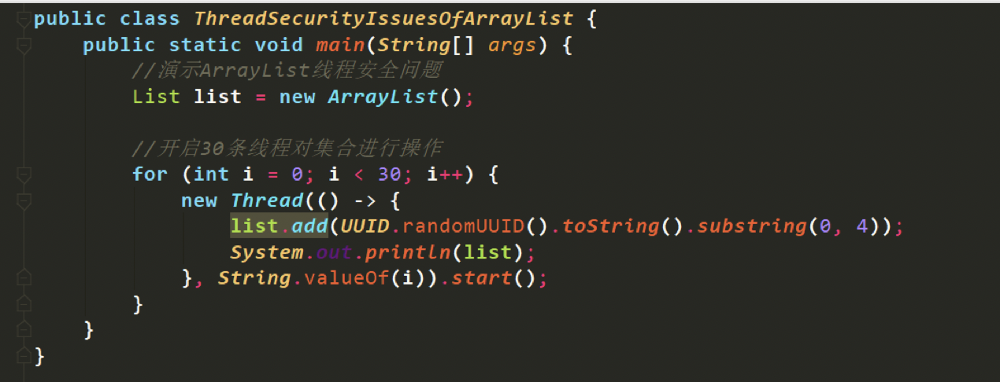

#### 5.1.1解决线程不安全

1. 使用 Collections.synchronizedList() 解决线程安全问题
2. 使用 **CopyOnWriteArrayList** 解决线程安全问题【重点】---> 【 **读写分离，写时复制** 
3. 使用new Vector(); (基本上不采取 效率低) 

#### 5.1.2写时复制

**CopyOnWrite**容器即写时复制的容器。往一个容器添加元素的时候，不直接往当前容器Object[]添加，而是先将当前容器Object[]进行Copy，复制出一个新的容器Object[] newElements，然后新的容器Object[] newElements里添加元素，添加完元素之后，再将原容器的引用指向新的容器setArray(newElements);。这样做的好处是可以对CopyOnWrite容器进行并发的读，而不需要加锁，因为当前容器不会添加任何元素。所以CopyOnWrite容器也是一种读写分离的思想，读和写不同的容器。

```java
public boolean add(E e) { 
    final ReentrantLock lock = this.lock; 
    lock.lock(); 
    try { 
      Object[] elements = getArray(); 
      int len = elements.length; 
    	Object[] newElements = Arrays.copyOf(elements, len + 1); 
    	newElements[len] = e; 
    	setArray(newElements); 
    	return true; 
  	} finally { 
    	lock.unlock(); 
  	} 
} 
```

### 5.2HashSet

> 回顾：
>
> 1.底层是HashMap
>
> 2.add方法的源码
>
> 3.只是采用了HashMap的键，值是**PRESENT**常量

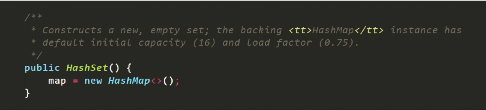

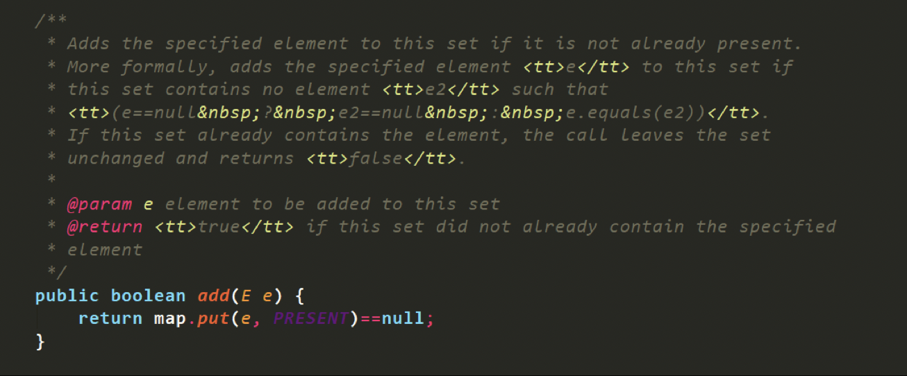

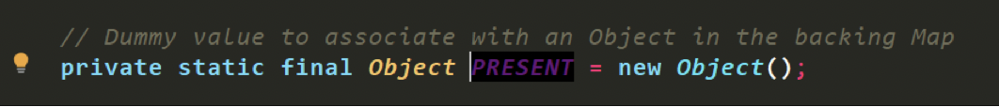

#### 5.2.1解决线程不安全

1. 使用 Collections.synchronizedSet() 解决线程安全问题
2. 使用 **CopyOnWriteArraySet** 解决线程安全问题【**重点**】

### 5.3HashMap

1. 使用 Collections.synchronizedMap() 解决线程安全问题
2. 使用 **ConcurrentHashMap** 解决线程安全问题【**重点**】

## 6.锁机制

### 6.1线程8锁

```java
/**
 * @author : breeze
 * @date : 2020/5/26
 * @description : 线程8锁
 *
 * 	1.同一个对象，两个同步方法，请问先发送邮件还是短信？               Email
 * 	2.同一个对象，邮件新增暂停4秒钟的方法，请问先打印邮件还是短信？     Email
 * 	3.同一个对象，新增普通的hello方法，请问先打印邮件还是hello?        hello
 * 	4.有两部手机，请问先打印邮件还是短信？                 SMS
 * 	5.两个静态同步方法，同一部手机，请问先打印邮件还是短信？ Email
 * 	6.两个静态同步方法，2部手机，请问先打印邮件还是短信？    Email
 * 	7.1个静态同步方法,1个普通同步方法，1部手机，请问先打印邮件还是短信？   SMS
 * 	8.1个静态同步方法,1个普通同步方法，2部手机，请问先打印邮件还是短信？   SMS
 */
public class lock8 {
    public static void main(String[] args) {
        Phone p1 = new Phone();
        Phone p2 = new Phone();

        new Thread(() -> {
            p1.sendEmail();
        }, "ThreadCommunication").start();

        try { TimeUnit.SECONDS.sleep(1); } catch (InterruptedException e) { e.printStackTrace(); }

        new Thread(() -> {
            p1.sendSMS();
            // p1.hello();
            // p2.sendSMS();
        }, "B").start();

    }
}

public class Phone {
    //发邮件
    public synchronized void sendEmail() {
        try { TimeUnit.SECONDS.sleep(4); } catch (InterruptedException e) { e.printStackTrace(); }
        System.out.println("========Email=========");
    }
    //发短信
    public synchronized void sendSMS() {
        System.out.println("=======SMS============");
    }

    public void hello() {
        System.out.println("========Hello=========");
    }
}
```

#### 6.1.2结论

1. 一个对象里面如果有多个synchronized方法，某一个时刻内，只要一个线程去调用其中的一个synchronized方法了，其它的线程都只能等待。换句话说，某一个时刻内，只能有唯一一个线程去访问这些synchronized方法，锁的是**当前对象this**，被锁定后，其它的线程都不能进入到当前对象的其它的synchronized方法。

2. 换成两个对象后，不是同一把锁了，情况立刻变化。

3. 加个普通方法后发现和同步锁无关。

4. 都换成静态同步方法后，情况又变化

   1. 若是普通同步方法，new   this,  具体的一部手机，所有的普通同步方法用的都是同一把锁——实例对象本身
   2. 若是静态同步方法，static Class ，唯一的一个模板 

5. synchronized是实现同步的基础：Java中的每一个对象都可以作为锁，具体表现为以下3种形式。 

   1. 对于普通同步方法，锁是当前实例对象。
   2. 对于同步方法块，锁是Synchonized括号里配置的对象。
   3. 对于静态同步方法，锁是当前类的Class对象本身。

   > 当一个线程试图访问同步代码时它首先必须得到锁，退出或抛出异常时必须释放锁。 所有的普通同步方法用的都是同一把锁——实例对象本身，就是new出来的具体实例对象本身。也就是说如果一个实例对象的普通同步方法获取锁后，该实例对象的其他普通同步方法必须等待获取锁的方法释放锁后才能获取锁，可是别的实例对象的普通同步方法因为跟该实例对象的普通同步方法用的是不同的锁，所以不用等待该实例对象已获取锁的普通同步方法释放锁就可以获取他们自己的锁。所有的静态同步方法用的也是同一把锁——类对象本身，就是我们说过的唯一模板Class 

6. 具体实例对象this和唯一模板Class，这两把锁是两个不同的对象，所以静态同步方法与普通同步方法之间是不会有竞态条件的。但是一旦一个静态同步方法获取锁后，其他的静态同步方法都必须等待该方法释放锁后才能获取锁， 

### 6.2公平锁和非公平锁

#### 6.2.1是什么？

1. 公平锁：是指多个线程按照申请锁的**顺序**来获取锁，类似排队打饭，先来后到。
2. 非公平锁：是指多个线程获取锁的顺序**并不是按照申请锁的顺序**，有可能后申请的线程比先申请的线程优先获取锁。在高并发的情况下，有可能会造成优先级反转或者饥饿现象。 

#### 6.2.2二者区别

1. 公平锁：Threads acquire a fair lock in the order in which they requested it. 

   > 公平锁，就是很公平，在并发情况下，每个线程在获取锁时会查看此锁维护的等待队列，如果为空，或者当前线程是等待队列的第一个，就占有锁，否则就会加入到等待队列中，以后会按照FIFO的规则从队列中取到自己。 

2. 非公平锁：非公平锁比较粗鲁，上来就直接尝试占有锁，如果尝试失败，就再采取类似公平锁那种方式。 

#### 6.2.3常见的公平锁/非公平锁

1. Java ReentrantLock而言，通过构造函数**boolean类型**指定该锁是否是公平锁，**默认是非公平锁**。非公平锁的优点在于**吞吐量**比公平锁大。 
2. 对于Synchronized而言，也是一种非公平锁。 

### 6.3可重入锁（递归锁）

1. **可重入锁**（也就是递归锁）：指的是同一个线程外层函数获得锁之后，内层递归函数仍然能获取该锁的代码，在同一线程在外层方法获取锁的时候，在进入内层方法会自动获取锁。 也就是说， **线程可以进入任何一个它已经拥有的锁所有同步着的代码块。** 
2. **ReentrantLock/Synchronized**就是一个典型的可重入锁
3. 作用：防止死锁

```java
public class SeveralLocks {
    public static void main(String[] args) {
        /**
         * 运行结果
         * A	invoked sendSMS   在同一个线程的外层方法获取锁的时候
         * A	invoked sendEmail  在进入内层方法会自动获取锁
         * B	invoked sendSMS
         * B	invoked sendEmail
         *
         * C	invoked get()
         * C	invoked set()
         * D	invoked get()
         * D	invoked set()
         */
        Phone phone = new Phone();
        //测试synchronized的可重入锁
        new Thread(() -> {
            try {
                phone.sendSMS();
            } catch (Exception e) {
                e.printStackTrace();
            }
        }, "A").start();

        new Thread(() -> {
            try {
                phone.sendSMS();
            } catch (Exception e) {
                e.printStackTrace();
            }
        }, "B").start();

        try {
            TimeUnit.SECONDS.sleep(1);
        } catch (InterruptedException e) {
            e.printStackTrace();
        }

        System.out.println();
        System.out.println();
        System.out.println();
        System.out.println();

        //测试ReentrantLock的可重入锁
        Thread t3 = new Thread(phone, "C");
        Thread t4 = new Thread(phone, "D");

        t3.start();
        t4.start();

    }
}

class Phone implements Runnable{
    public synchronized void sendSMS() throws Exception{
        System.out.println(Thread.currentThread().getName() + "\tinvoked sendSMS");
        sendEmail();
    }
    public synchronized void sendEmail() throws Exception{
        System.out.println(Thread.currentThread().getName() + "\tinvoked sendEmail");
    }

    private Lock lock = new ReentrantLock();
    @Override
    public void run() {
        get();
    }
    public void get(){
        lock.lock();
        lock.lock();
        try {
            System.out.println(Thread.currentThread().getName() + "\tinvoked get()");
            set();
        }finally {
            lock.unlock();
            lock.unlock();
        }
    }
    public void set(){
        lock.lock();
        try {
            System.out.println(Thread.currentThread().getName() + "\tinvoked set()");
        }finally {
            lock.unlock();
        }
    }
}
```

### 6.4独占锁/共享锁

1. 独占锁：指该锁一次只能被一个线程所持有。对 ReentrantLock 和 Synchronized 而言都是独占锁。

2. 共享锁：指该锁可被多个线程所持有。 

   > 对ReentrantReadWriteLock，其读锁是共享锁，其写锁是独占锁。读锁的共享锁可保证并发读是非常高效的，读写，写读，写写的过程是互斥的。 

### 6.5自旋锁（请手写自旋锁）

自旋锁：是指尝试获取锁的线程不会立即阻塞，而是**采用循环的方式去尝试获取锁**，这样的好处是减少线程上下切换的消耗，缺点是循环会 消耗CPU 。 

```java
/**
 * @author : breeze
 * @date : 2020/5/26
 * @description : 手写自旋锁
 */
public class SpinLock {

    AtomicReference<Thread> atomicReference = new AtomicReference<>();

    public void myLock() {
        Thread thread = Thread.currentThread();
        System.out.println(Thread.currentThread().getName() + "\tinvoked myLock()");
        //如果是null就更新
        while (!atomicReference.compareAndSet(null, thread)) {

        }
    }

    public void unLock() {
        Thread thread = Thread.currentThread();
        atomicReference.compareAndSet(thread, null);
        System.out.println(Thread.currentThread().getName() + "\tinvoked unLock()");
    }

}
```

```java
/**
 * @author : breeze
 * @date : 2020/5/26
 * @description : 自旋锁主类验证
 *
 * 通过CAS操作完成自旋锁，A线程先进来调用myLock()方法并持有锁5秒
 * B随后进来发现当前有线程持有锁，不是null，所以通过自旋等待A释放锁
 */
public class SpinLockMain {
    public static void main(String[] args) {

        SpinLock spinLock = new SpinLock();

        new Thread(() -> {
            spinLock.myLock();
            try { TimeUnit.SECONDS.sleep(5); } catch (InterruptedException e) { e.printStackTrace(); }
            spinLock.unLock();
        }, "A").start();

        try { TimeUnit.SECONDS.sleep(1); } catch (InterruptedException e) { e.printStackTrace(); }

        new Thread(() -> {
            spinLock.myLock();
            try { TimeUnit.SECONDS.sleep(1); } catch (InterruptedException e) { e.printStackTrace(); }
            spinLock.unLock();
        }, "B").start();
    }
}
```

### 6.7分布式锁

#### 6.7.1ZK版本

1.编写ZKLock接口

```java
/**
 * @author : breeze
 * @date : 2020/5/30
 * @description :
 */
public interface ZkLock {
    /**
     * 加锁方法
     */
    void lock();

    /**
     * 解锁方法
     */
    void unlock();
}
```

2.生成订单编号资源类

```java
/**
 * @author : breeze
 * @date : 2020/5/30
 * @description : 生成订单号工具类
 */
public class OrderNumberUtil {

    private static int number = 0;

    public String getOrderNum() {
        return "" + (++number);
    }
}
```

3.编写抽象类 

```java
/**
 * @author : breeze
 * @date : 2020/5/30
 * @description : 编写抽象类
 */
public abstract class ZkAbstractLock implements ZkLock{

    private static final String ZK_SERVER = "localhost:2181";

    private static final int TIME_OUT = 45 * 1000;

    //创建Zk客户端
    ZkClient zkClient = new ZkClient(ZK_SERVER, TIME_OUT);

    String path = "/zkLock";
    CountDownLatch countDownLatch = null;

    public abstract boolean tryLock();
    public abstract void waitLock();

    @Override
    public void lock() {
        //尝试抢占锁
        if (tryLock()) {
            System.out.println(Thread.currentThread().getName() + "\t抢占锁成功！");
        } else {
            waitLock();

            //递归调用加锁方法
            lock();
        }
    }

    @Override
    public void unlock() {
        if (zkClient != null) {
            zkClient.close();
        }
        System.out.println(Thread.currentThread().getName() + "\t 释放锁成功");
        System.out.println();
        System.out.println();
    }
}
```

4.重写尝试加锁和等待加锁方法

```java
/**
 * @author : breeze
 * @date : 2020/5/30
 * @description : 重写加锁和等待方法
 */
public class ZkDistributedLock extends ZkAbstractLock {

    @Override
    public boolean tryLock() {
        try {
            zkClient.createEphemeral(path);
            return true;
        } catch (RuntimeException e) {
            return false;
        }
    }

    @Override
    public void waitLock() {

        IZkDataListener iZkDataListener = new IZkDataListener() {
            @Override
            public void handleDataChange(String s, Object o) throws Exception {

            }

            @Override
            public void handleDataDeleted(String s) throws Exception {
                if (countDownLatch != null) {
                    countDownLatch.countDown();
                }
            }
        };

        //开启监听
        zkClient.subscribeDataChanges(path, iZkDataListener);

        if (zkClient.exists(path)) {
            countDownLatch = new CountDownLatch(1);

            try {
                countDownLatch.await();
            }catch (Exception e){
                e.printStackTrace();
            }
        }

        //关闭监听
        zkClient.unsubscribeDataChanges(path, iZkDataListener);
    }
}
```

5.测试

```java
public class ZkDistributedMain {

    OrderNumberUtil orderNumberUtil = new OrderNumberUtil();
    private ZkLock zkLock = new ZkDistributedLock();

    public void getOrderNumber() {
        zkLock.lock();
        try {
            System.out.println("订单编号：" + orderNumberUtil.getOrderNum());
        } finally {
            zkLock.unlock();
        }
    }

    public static void main(String[] args) {

        for (int i = 1; i <= 20; i++) {
            new Thread(() -> {
                new ZkDistributedMain().getOrderNumber();
            }, String.valueOf(i)).start();
        }
    }
}
```

#### 6.7.2Redis版

### 6.8死锁

1. 死锁是指两个或两个以上的进程在执行过程中，因抢夺资源而造成的一种相互等待的现象，若无外力干涉那它们都将无法推进下去，如果系统资源充足，进程的资源请求都能够得到满足，死锁出现的可能性就很低，否则就会因争夺有限的资源而陷入死锁。

2. 产生原因

   1. 系统资源不足
   2. 进程运行推进的顺序不合适
   3. 资源分配不当

3.  Linux系统下可以通过 ps -ef|grep xxx   ls -l 查看，windows下的java运行程序也有类似ps的查看进程的命令，但是目前我们需要查看的只是java jps 即java ps  jps -l 定位进程号，再通过jstack + pid 查看运行的java程序的信息，找到死锁查看 。

   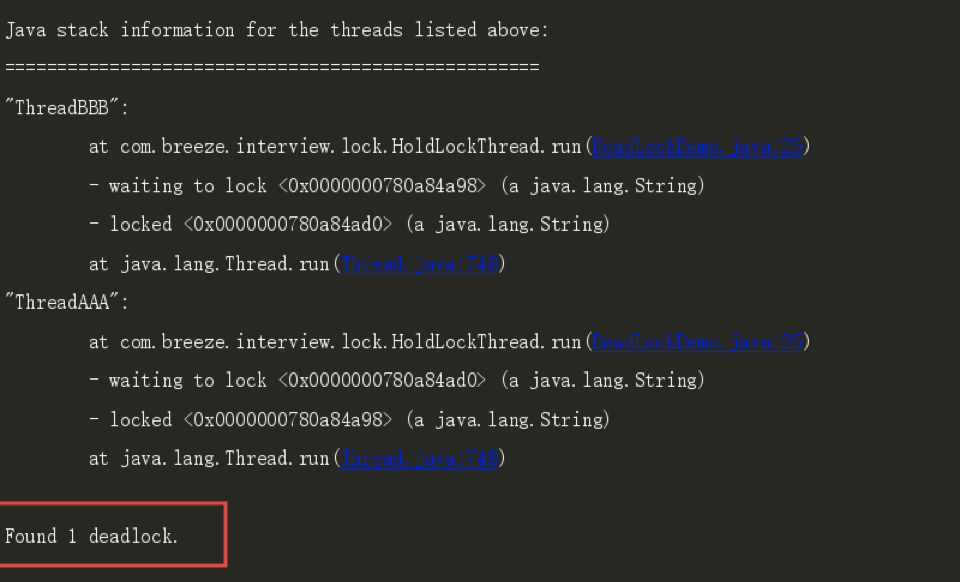

```java
/**
 * @author : breeze
 * @date : 2020/5/26
 * @description : 死锁
 */
@AllArgsConstructor
public class DeadLock implements Runnable{

    private String lockA;
    private String lockB;

    @Override
    public void run() {
        synchronized (lockA) {
            System.out.println(Thread.currentThread().getName() + "\t自己持有：" + lockA + "尝试获取：" + lockB);

            try { TimeUnit.SECONDS.sleep(2); } catch (InterruptedException e) { e.printStackTrace(); }

            synchronized (lockB) {
                System.out.println(Thread.currentThread().getName() + "\t自己持有：" + lockB + "尝试获取：" + lockA);
            }
        }
    }
}
```

```java
/**
 * @author : breeze
 * @date : 2020/5/26
 * @description : 死锁验证Main方法
 */
public class DeadLockMain {
    public static void main(String[] args) {

        new Thread(new DeadLock("lockA", "lockB"), "AAAA").start();
        new Thread(new DeadLock("lockB", "lockA"), "BBBB").start();

    }
}
```

### 6.9synchronized和lock有什么区别？用新的lock有什么好处？

1. **原始构成**

   1. synchronized是关键字，属于JVM层面，monitorenter（底层是通过monitor对象来完成，其实wait/notify等方法也依赖于monitor对象只有在同步块或者方法中才能调用wait/notify等方法） 
   2. Lock是具体类（java.util.concurrent.locks.lock）是api层面的锁。

2. **使用方法**

   1.  synchronized不需要用户去手动释放锁，当synchronized代码执行完后系统会自动让线程释放对锁的占用。 
   2. ReentrantLock则需要用户去手动释放锁，若没有主动释放锁，就有可能导致出现死锁现象。需要lock()和unlock()方法配合try/finally语句块来完成。 

3. **等待是否可中断**

   1. synchronized不可中断，除非抛出异常或者正常运行完成。 

   2. ReentrantLock可中断

      > 设置超时方法 tryLock(long timeout,TimeUnit unit)；
      >
      > lockInterruptibly()放代码块中，调用interrupt()方法可中断。 

4. **加锁是否公平**

   1. synchronized非公平锁 
   2. ReentrantLock两者都可以，默认非公平锁，构造方法可以传入boolean值，true为公平锁，false为非公平锁。 

5. **锁绑定多个条件Condition**：synchronized没有ReentrantLock用来实现分组唤醒需要唤醒的线程，可以**精确唤醒**，而不是像synchronized要么随机唤醒一个要么唤醒全部线程。 

## 7.并发容器（CountDownLatch/CyclicBarrier/Semaphore）

### 7.1CountDownLatch减少计数

1. **原理**：CountDownLatch主要有两个方法，当一个或多个线程调用await方法时，这些线程会阻塞。 其它线程调用countDown方法会将计数器减1(调用countDown方法的线程不会阻塞)，当计数器的值变为0时，因await方法阻塞的线程会被唤醒，继续执行。

```java
/** 
 * @Description: 让一些线程阻塞直到另一些线程完成一系列操作后才被唤醒。  
 *  
 * 解释：6个同学陆续离开教室后值班同学才可以关门。 
 *  
 * main主线程必须要等前面6个线程完成全部工作后，自己才能开干  
 */ 
public class CountDownLatchDemo { 
   public static void main(String[] args) throws InterruptedException { 
         CountDownLatch countDownLatch = new CountDownLatch(6); 
        
       for (int i = 1; i <=6; i++) { //6个上自习的同学，各自离开教室的时间不一致 
          new Thread(() -> { 
              System.out.println(Thread.currentThread().getName()+"\t 号同学离开教室"); 
              countDownLatch.countDown(); 
          }, String.valueOf(i)).start(); 
       } 
       countDownLatch.await(); 
       System.out.println(Thread.currentThread().getName()+"\t****** 班长关门走人，main线程是班长");       
   } 
} 
```

### 7.2CyclicBarrier循环栅栏

1. **原理**：CyclicBarrier的字面意思是可循环（Cyclic）使用的屏障（Barrier）。它要做的事情是，让一组线程到达一个屏障（也可以叫同步点）时被阻塞， 直到最后一个线程到达屏障时，屏障才会开门，所有被屏障拦截的线程才会继续干活，线程进入屏障通过CyclicBarrier的await()方法。 

```java
/**
 * 集齐7颗龙珠就可以召唤神龙
 */
public class CyclicBarrierDemo {
  private static final int NUMBER = 7;
  
  public static void main(String[] args) {
    
     //CyclicBarrier(int parties, Runnable barrierAction) 
     CyclicBarrier cyclicBarrier = new CyclicBarrier(NUMBER, ()->{System.out.println("*****集齐7颗龙珠就可以召唤神龙");}) ;
     
     for (int i = 1; i <= 7; i++) {
       new Thread(() -> {
          try {
            System.out.println(Thread.currentThread().getName()+"\t 星龙珠被收集 ");
            cyclicBarrier.await();
          } catch (InterruptedException | BrokenBarrierException e) {
            // TODO Auto-generated catch block
            e.printStackTrace();
          }
       }, String.valueOf(i)).start();
     }
  }
}

```

### 7.3Semaphore信号量（信号灯）

1. **原理**： 在信号量上我们定义两种操作：**acquire**（获取） 当一个线程调用acquire操作时，它要么通过成功获取信号量（信号量减1），要么一直等下去，直到有线程释放信号量，或超时。 **release**（释放）实际上会将信号量的值加1，然后唤醒等待的线程。信号量主要用于两个目的，**一个是用于多个共享资源的互斥使用，另一个用于并发线程数的控制。** 

```java
/**
 * 
 * @Description: TODO(这里用一句话描述这个类的作用)  
 * 
 * 在信号量上我们定义两种操作：
 * acquire（获取） 当一个线程调用acquire操作时，它要么通过成功获取信号量（信号量减1），
 *             要么一直等下去，直到有线程释放信号量，或超时。
 * release（释放）实际上会将信号量的值加1，然后唤醒等待的线程。
 * 
 * 信号量主要用于两个目的，一个是用于多个共享资源的互斥使用，另一个用于并发线程数的控制。
 */
public class SemaphoreDemo {
  public static void main(String[] args) {
     Semaphore semaphore = new Semaphore(3);//模拟3个停车位
     
     for (int i = 1; i <=6; i++) {//模拟6部汽车
       new Thread(() -> {
          try {
            semaphore.acquire();
            System.out.println(Thread.currentThread().getName()+"\t 抢到了车位");
            TimeUnit.SECONDS.sleep(new Random().nextInt(5));
            System.out.println(Thread.currentThread().getName()+"\t------- 离开");
          } catch (InterruptedException e) {
            e.printStackTrace();
          }finally {
            semaphore.release();
          }
       }, String.valueOf(i)).start();
     }
  }
}
```

## 8.阻塞队列

### 8.1栈与队列

1. 栈：先进后出，后进先出
2. 队列：先进先出

### 8.2阻塞队列

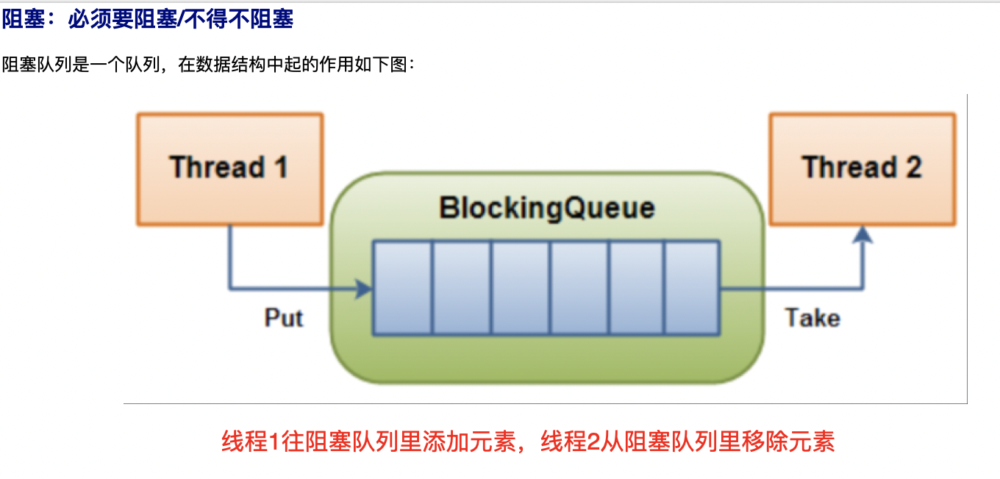

当队列是空的，从队列中 获取 元素的操作将会被阻塞

当队列是满的，从队列中 添加 元素的操作将会被阻塞 

 试图从空的队列中获取元素的线程将会被阻塞，直到其他线程往空的队列插入新的元素 

 试图向已满的队列中添加新元素的线程将会被阻塞，直到其他线程从队列中移除一个或多个元素或者完全清空，使队列变得空闲起来并后续新增 

### 8.3阻塞队列的用处

1. 在多线程领域：所谓阻塞，在某些情况下会**挂起**线程（即阻塞），一旦条件满足，被挂起的线程又会自动**被唤起**
2. 为什么需要BlockingQueue，好处是我们不需要关心什么时候需要阻塞线程，什么时候需要唤醒线程，因为这一切BlockingQueue都给你一手包办了 
3. 在concurrent包发布以前，在多线程环境下， 我们每个程序员都必须去自己控制这些细节，尤其还要兼顾效率和线程安全 ，而这会给我们的程序带来不小的复杂度。 

### 8.4架构图

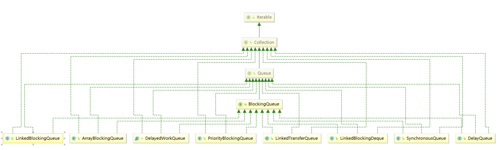

### 8.5种类

1. **ArrayBlockingQueue**：由数组结构组成的有界阻塞队列。
2. **LinkedBlockingQueue**：由链表结构组成的有界（但大小默认值为integer.MAX_VALUE）阻塞队列。
3. PriorityBlockingQueue：支持优先级排序的无界阻塞队列。
4. DelayQueue：使用优先级队列实现的延迟无界阻塞队列。
5. **SynchronousQueue**：不存储元素的阻塞队列，也即单个元素的队列。
6. LinkedTransferQueue：由链表组成的无界阻塞队列。
7. LinkedBlockingDeque：由链表组成的双向阻塞队列。

### 8.6BlockingQueue核心方法

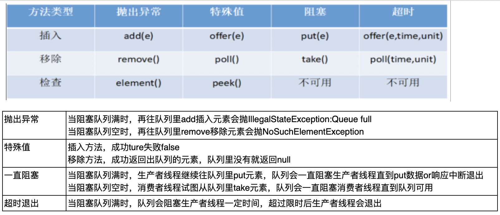

### 8.7代码演示

```java
/**
 * 阻塞队列
 */
public class  BlockingQueueDemo {

     public static void  main(String[] args)  throws  InterruptedException {

//        List list = new ArrayList();

         BlockingQueue<String> blockingQueue =  new  ArrayBlockingQueue<>( 3 );
         //第一组
//        System.out.println(blockingQueue.add("a"));
//        System.out.println(blockingQueue.add("b"));
//        System.out.println(blockingQueue.add("c"));
//        System.out.println(blockingQueue.element());

        //System.out.println(blockingQueue.add("x"));
//        System.out.println(blockingQueue.remove());
//        System.out.println(blockingQueue.remove());
//        System.out.println(blockingQueue.remove());
//        System.out.println(blockingQueue.remove());
//    第二组
//        System.out.println(blockingQueue.offer("a"));
//        System.out.println(blockingQueue.offer("b"));
//        System.out.println(blockingQueue.offer("c"));
//        System.out.println(blockingQueue.offer("x"));
//        System.out.println(blockingQueue.poll());
//        System.out.println(blockingQueue.poll());
//        System.out.println(blockingQueue.poll());
//        System.out.println(blockingQueue.poll());
//    第三组        
//         blockingQueue.put("a");
//         blockingQueue.put("b");
//         blockingQueue.put("c");
//         //blockingQueue.put("x");
//        System.out.println(blockingQueue.take());
//        System.out.println(blockingQueue.take());
//        System.out.println(blockingQueue.take());
//        System.out.println(blockingQueue.take());
        
//    第四组        
         System. out .println(blockingQueue.offer( "a" ));
        System. out .println(blockingQueue.offer( "b" ));
        System. out .println(blockingQueue.offer( "c" ));
        System. out .println(blockingQueue.offer( "a" , 3L , TimeUnit. SECONDS ));

    }
}
```

### 8.8在哪里使用过？

1. 线程池
2. 消息中间件
3. 生产者消费者模式

> 题目：
>
> 现在两个线程，可以操作初始值为零的一个变量，实现一个线程对该变量加1，一个线程对该变量减1， 实现交替，来10轮，变量初始值为零。 
>
> ​	1.在高内低耦的前提下，线程操作资源类
>
> ​	2.判断/干活/通知
>
> ​	3.小心，防止多线程虚假唤醒，判断的时候用while不用if 

#### 8.8.1传统版本

```java
/**
 * @author : breeze
 * @date : 2020/5/30
 * @description : 模拟空调资源类 - 普通版本
 */
public class AirConditioner {
    private int temperature = 0; //温度
    private Lock lock = new ReentrantLock();
    private Condition condition = lock.newCondition();

    /**
     * 升高温度
     * @throws Exception
     */
    public void increment() throws Exception {
        lock.lock();
        try {
            //1.如果温度不为0，等待
            while (temperature != 0) {
                condition.await();
            }
            //2.温度为0，升高1度
            temperature++;
            System.out.println(Thread.currentThread().getName()+"\t温度："+temperature);
            //3.通知
            condition.signalAll();
        } finally {
            lock.unlock();
        }
    }

    /**
     * 降低温度
     * @throws Exception
     */
    public void decrement() throws Exception{
        lock.lock();
        try {
            //1.如果温度为0，等待
            while (temperature == 0) {
                condition.await();
            }
            //2.温度为0，升高1度
            temperature--;
            System.out.println(Thread.currentThread().getName()+"\t温度："+temperature);
            //3.通知
            condition.signalAll();
        } finally {
            lock.unlock();
        }
    }
}
```

```java
/**
 * @author : breeze
 * @date : 2020/5/30
 * @description : 生产消费者 - 传统版本
 */
public class AirConditionerMain {
    public static void main(String[] args) {

        AirConditioner airConditioner = new AirConditioner();

        new Thread(() -> {
            for (int i = 0; i < 10; i++) {
                try { airConditioner.increment(); } catch (Exception e) { e.printStackTrace(); }
            }
        }, "A").start();

        new Thread(() -> {
            for (int i = 0; i < 10; i++) {
                try { airConditioner.decrement(); } catch (Exception e) { e.printStackTrace(); }
            }
        }, "B").start();

        new Thread(() -> {
            for (int i = 0; i < 10; i++) {
                try { airConditioner.increment(); } catch (Exception e) { e.printStackTrace(); }
            }
        }, "C").start();

        new Thread(() -> {
            for (int i = 0; i < 10; i++) {
                try { airConditioner.decrement(); } catch (Exception e) { e.printStackTrace(); }
            }
        }, "D").start();
    }
}
```

#### 8.8.2阻塞队列版本

```java
/**
 * @author : breeze
 * @date : 2020/5/31
 * @description : 资源类 - 阻塞队列版本生消模式
 */
public class BlockingQueueResource {
    //默认开启生消模式
    private volatile boolean flag = true;
    private AtomicInteger atomicInteger = new AtomicInteger();

    BlockingQueue<String> blockingQueue = null;

    public BlockingQueueResource(BlockingQueue<String> blockingQueue) {
        this.blockingQueue = blockingQueue;
        System.out.println(blockingQueue.getClass().getName());
    }

    /**
     * 生产者
     * @throws Exception
     */
    public void produce() throws Exception {

        String data = null;
        boolean retValue;

        while (flag) {
            data = atomicInteger.getAndIncrement() + "";
            retValue = blockingQueue.offer(data, 2L, TimeUnit.SECONDS);

            if (retValue) {
                System.out.println(Thread.currentThread().getName() + "\t插入队列" + data + "成功");
            } else {
                System.out.println(Thread.currentThread().getName() + "\t插入队列" + data + "失败");
            }
            TimeUnit.SECONDS.sleep(1);
        }
        System.out.println(Thread.currentThread().getName()+"大老板叫停了，停止生产！");
    }

    /**
     * 消费者
     * @throws Exception
     */
    public void consumer() throws Exception {

        String result = null;
        while (flag) {
            result = blockingQueue.poll(2L, TimeUnit.SECONDS);

            if (result == null || result.equalsIgnoreCase("")) {
                flag = false;
                System.out.println(Thread.currentThread().getName() + "\t超过2秒没有取到蛋糕，消费退出！");
                return;
            }
            System.out.println(Thread.currentThread().getName() + "\t消费蛋糕队列" + result + "成功！");
        }
    }

    public void stop() {
        this.flag = false;
    }

}
```

```java
/**
 * @author : breeze
 * @date : 2020/5/31
 * @description : 主启动 - 阻塞队列版本生消模式
 */
public class BlockingQueueMain {
    public static void main(String[] args) {
        BlockingQueueResource resource = new BlockingQueueResource(new ArrayBlockingQueue<>(10));

        new Thread(() -> {
            System.out.println(Thread.currentThread().getName()+"\t生产线程启动！");

            try {
                resource.produce();
            } catch (Exception e) {
                e.printStackTrace();
            }
        }, "PRO").start();

        new Thread(() -> {
            System.out.println(Thread.currentThread().getName()+"\t消费线程启动！");
            System.out.println();
            System.out.println();

            try {
                resource.consumer();
            } catch (Exception e) {
                e.printStackTrace();
            }
        }, "CON").start();

        try { TimeUnit.SECONDS.sleep(5); } catch (InterruptedException e) { e.printStackTrace(); }

        System.out.println();
        System.out.println();
        System.out.println("5秒钟时间到了，大老板叫停！");
        resource.stop();

    }
}
```

## 9.ThreadPool线程池

### 9.1自定义线程池

```java
public class MyThreadPoolExecutor {
    public static void main(String[] args) {

        System.out.println("CPU的线程数量：" + Runtime.getRuntime().availableProcessors());
        System.out.println(8/(1 - 0.9));

        ExecutorService executorService = new ThreadPoolExecutor(
                2,
                5,
                2L,
                TimeUnit.SECONDS,
                new ArrayBlockingQueue<>(3),
                Executors.defaultThreadFactory(),
          			//new ThreadPoolExecutor.AbortPolicy()
          			//new ThreadPoolExecutor.CallerRunsPolicy()
          			//new ThreadPoolExecutor.DiscardOldestPolicy()
                new ThreadPoolExecutor.CallerRunsPolicy());

        //开发中不使用jdk自带的，需要自己手动写线程池
        //ExecutorService executorService = Executors.newFixedThreadPool(5);//一池5线程
        //ExecutorService executorService = Executors.newSingleThreadExecutor();//一池1线程
        //ExecutorService executorService = Executors.newCachedThreadPool();//一池n线程

        try {
            for (int i = 1; i <= 20; i++) {
                executorService.submit(() -> {
                    System.out.println(Thread.currentThread().getName() + "\t办理业务: "
                            + new Random().nextInt(10));
                });
            }
        } finally { executorService.shutdown(); }
    }
}
```

### 9.2为什么用线程池

> 例子：10年前单核CPU电脑，假的多线程，像马戏团小丑玩多个球，CPU需要来回切换。 现在是多核电脑，多个线程各自跑在独立的CPU上，不用切换效率高。 

**线程池的优势：** 

**线程池做的工作只要是控制运行的线程数量，** **处理过程中将任务放入队列** **，然后在线程创建后启动这些任务，** **如果线程数量超过了最大数量，超出数量的线程排队等候** **，等其他线程执行完毕，再从队列中取出任务来执行。** 

**它的主要特点为：** **线程复用、控制最大并发数、管理线程。** 

第一：降低资源消耗。通过重复利用已创建的线程降低线程创建和销毁造成的销耗。 

第二：提高响应速度。当任务到达时，任务可以不需要等待线程创建就能立即执行。 

第三：提高线程的可管理性。线程是稀缺资源，如果无限制的创建，不仅会销耗系统资源，还会降低系统的稳定性，使用线程池可以进行统一的分配，调优和监控。 

### 9.3线程池如何使用

#### 9.3.1架构说明

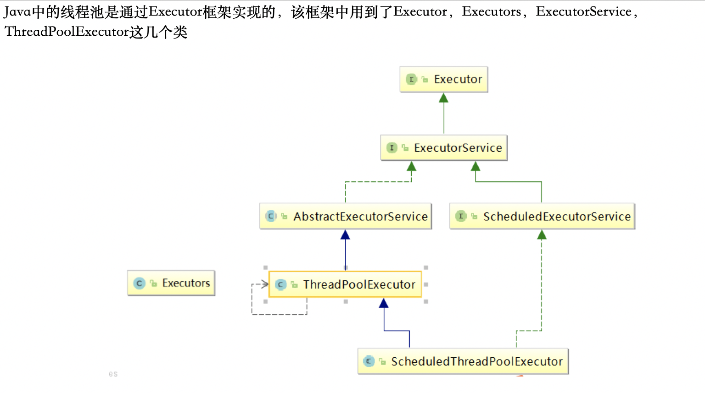

#### 9.3.2编码实现

1. Executors.newFixedThreadPool(int)，执行长期任务性能好，创建一个线程池，一池有N个固定的线程，有固定线程数的线程。

   ```java
   //newFixedThreadPool创建的线程池corePoolSize和maximumPoolSize值是相等的，它使用的是LinkedBlockingQueue 
   public static ExecutorService newFixedThreadPool(int nThreads) {
           return new ThreadPoolExecutor(nThreads, nThreads,
                                         0L, TimeUnit.MILLISECONDS,
                                         new LinkedBlockingQueue<Runnable>());
   }
   ```

2. Executors.newSingleThreadExecutor()，一个任务一个任务的执行，一池一线程

   ```java
   //newSingleThreadExecutor 创建的线程池corePoolSize和maximumPoolSize值都是1，它使用的是LinkedBlockingQueue 
   public static ExecutorService newSingleThreadExecutor() {
           return new FinalizableDelegatedExecutorService
               (new ThreadPoolExecutor(1, 1,
                                       0L, TimeUnit.MILLISECONDS,
                                       new LinkedBlockingQueue<Runnable>()));
   }
   ```

3. Executors.newCachedThreadPool()，执行很多短期异步任务，线程池根据需要创建新线程，但在先前构建的线程可用时将重用它们。可扩容，遇强则强。

   ```java
   //newCachedThreadPool创建的线程池将corePoolSize设置为0，将maximumPoolSize设置为Integer.MAX_VALUE，它使用的是SynchronousQueue，也就是说来了任务就创建线程运行，当线程空闲超过60秒，就销毁线程。 
   public static ExecutorService newCachedThreadPool() {
           return new ThreadPoolExecutor(0, Integer.MAX_VALUE,
                                         60L, TimeUnit.SECONDS,
                                         new SynchronousQueue<Runnable>());
   }
   ```

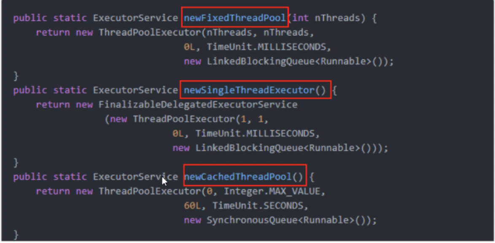

### 9.4线程池7大参数

> ```java
> //ThreadPoolExecutor构造方法
> public ThreadPoolExecutor(int corePoolSize,
>                               int maximumPoolSize,
>                               long keepAliveTime,
>                               TimeUnit unit,
>                               BlockingQueue<Runnable> workQueue,
>                               ThreadFactory threadFactory,
>                               RejectedExecutionHandler handler) {
>         if (corePoolSize < 0 ||
>             maximumPoolSize <= 0 ||
>             maximumPoolSize < corePoolSize ||
>             keepAliveTime < 0)
>             throw new IllegalArgumentException();
>         if (workQueue == null || threadFactory == null || handler == null)
>             throw new NullPointerException();
>         this.acc = System.getSecurityManager() == null ?
>                 null :
>                 AccessController.getContext();
>         this.corePoolSize = corePoolSize;
>         this.maximumPoolSize = maximumPoolSize;
>         this.workQueue = workQueue;
>         this.keepAliveTime = unit.toNanos(keepAliveTime);
>         this.threadFactory = threadFactory;
>         this.handler = handler;
> }
> ```

1. **corePoolSize**：线程池中的常驻核心线程数
2. **maximumPoolSize**：线程池中能够容纳同时执行的最大线程数，此值必须大于等于1
3. **keepAliveTime**：多余的空闲线程的存活时间。当前池中线程数量超过corePoolSize时，当空闲时间达到keepAliveTime时，多余线程会被销毁直到只剩下corePoolSize个线程为止。
4. **unit**：keepAliveTime的单位 
5. **workQueue**：任务队列，被提交但尚未被执行的任务
6. **threadFactory**：表示生成线程池中工作线程的线程工厂，用于创建线程，一般默认的即可
7. **handler**：拒绝策略，表示当队列满了，并且工作线程大于等于线程池的最大线程数（maximumPoolSize）时如何来拒绝请求执行的runnable的策略

### 9.5线程池工作原理（重点）

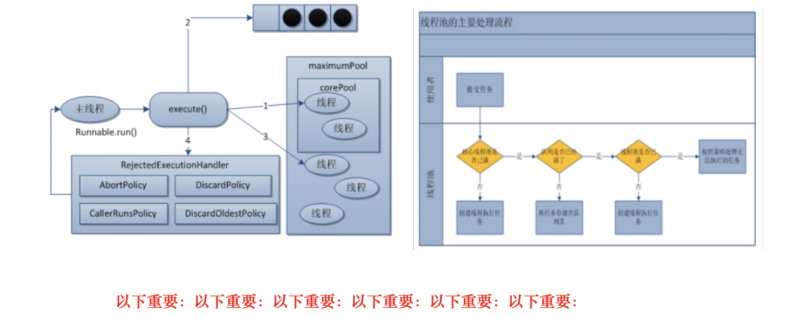

1. 在创建了线程池后，开始等待请求。 
2. 当调用 **execute()** 方法添加一个请求任务时，线程池会做出如下判断： 
   1. 如果正在运行的线程数量小于 **corePoolSize** ，那么马上创建线程运行这个任务； 
   2. 如果正在运行的线程数量大于或等于 **corePoolSize** ，那么将这个任务 放入队列 ； 
   3. 如果这个时候队列满了且正在运行的线程数量还小于 **maximumPoolSize** ，那么还是要创建非核心线程立刻运行这个任务； 
   4. 如果队列满了且正在运行的线程数量大于或等于 **maximumPoolSize** ，那么线程池会 启动饱和拒绝策略来执行 。 
3. 当一个线程完成任务时，它会从队列中取下一个任务来执行。 
4. 当一个线程无事可做超过一定的时间（ **keepAliveTime** ）时，线程会判断： 
   1. 如果当前运行的线程数大于 **corePoolSize** ，那么这个线程就被停掉。 
   2. 所有线程池的所有任务完成后， 它最终会收缩到 **corePoolSize** 的大小 。 

### 9.6工作中我们使用哪种线程池

> 在工作中单一的/固定数的/可变的三种创建线程池的方法哪个用的多？
>
> 答案是一个都不用，我们工作中只能使用自定义的。
>
> Executors中JDK已经给你提供了，为什么不用？（阿里巴巴开发手册强制规定）
>
> 在工作中如何使用线程池，是否自定义过线程池？

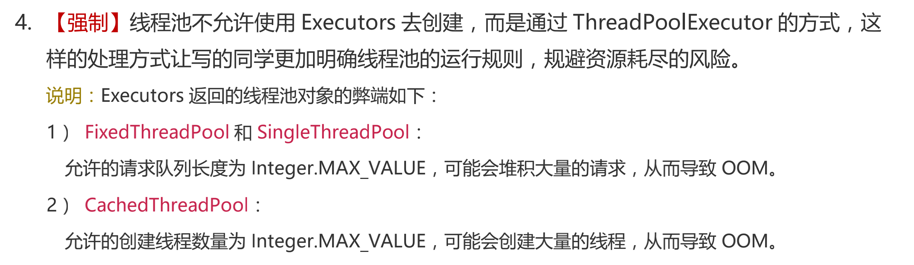

#### 9.6.1如何合理设置参数

1. **CPU密集**的意思是该任务需要大量的运算，而没有阻塞，CPU一直全速运行。 
   1. CPU密集型任务配置尽可能少的线程数量： **一般公式为： CPU核数+1个线程的线程的线程池。**
2. **IO密集型**
   1. 第一种：由于IO密集型任务线程并不是一直执行任务，则应配置尽可能多的线程，**如 CPU核数 x 2**
   2. 第二种： IO密集型，即该任务需要大量的IO，即大量的阻塞。在单线程上运行IO密集型的任务会导致浪费大量的CPU运算能力在等待上。所以IO密集型任务中使用多线程可以大大的加速程序运行。 IO密集型时，大部分线程都阻塞，故需要多配置线程数：**参考公式：CPU核数/(1-阻塞系数)  阻塞系数在0.8-0.9之间。** 

### 9.7线程池拒绝策略

#### 9.7.1是什么

等待队列已经排满了，再也塞不下新任务了同时，线程池中的max线程也达到了 ，无法继续为新任务服务。这个是时候我们就需要拒绝策略机制合理的处理这个问题。 

#### 9.7.2JDK内置的拒绝策略

> 以下内置拒绝策略均实现了RejectedExecutionHandle接口

1. **AbortPolicy**(默认)：直接抛出RejectedExecutionException异常阻止系统正常运行
2. **CallerRunsPolicy**：“调用者运行”一种调节机制，该策略既不会抛弃任务，也不会抛出异常，而是将某些任务回退到调用者，从而降低新任务的流量。
3. **DiscardOldestPolicy**：抛弃队列中等待最久的任务，然后把当前任务加人队列中尝试再次提交当前任务。
4. **DiscardPolicy**：该策略默默地丢弃无法处理的任务，不予任何处理也不抛出异常。如果允许任务丢失，这是最好的一种策略。

## 10.Java里面的锁请谈谈你的理解？越多越好