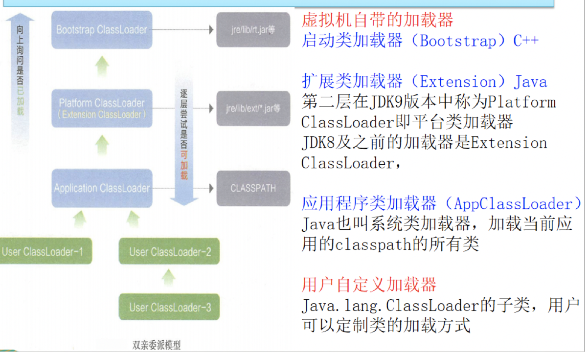

# 1.JVM简介和GC算法

## 1.1JVM是运行在操作系统之上的，它与硬件没有直接的交互

## 1.2JVM体系结构图

### 1.2.1 类加载器ClassLoader

负责加载class文件，class文件**在文件开头有特定的文件标识**，将class文件字节码内容加载到内存中，并将这些内容转换成方法区中的运行时数据结构并且ClassLoader只负责class文件的加载，至于它是否可以运行，则由Execution Engine决定。

类加载是一个将class字节码文件实例化成Class对象并进行相关初始化的过程。全小写的class是关键字用来定义类，而首字母大写的Class它是所有class的类。

### 1.2.2 双亲委派机制

当一个类收到了类加载请求，他首先不会尝试自己去加载这个类，而是把这个请求委派给父类去完成。每一个层次类加载器都是如此，因此所有的加载请求都应该传送到启动类加载其中，只有当父类加载器反馈自己无法完成这个请求的时候（在它的加载路径下没有找到所需加载的Class），子类加载器才会尝试自己去加载。 

采用双亲委派的一个好处是比如加载位于 rt.jar 包中的类 java.lang.Object，不管是哪个加载器加载这个类，最终都是委托给顶层的启动类加载器进行加载，这样就保证了使用不同的类加载器最终得到的都是同样一个 Object对象。 

### 1.2.3 Execution Engine执行引擎负责解释命令，提交操作系统执行。

### 1.2.4 本地方法接口

本地接口的作用是融合不同的编程语言为Java所用，它的初衷是融合C/C++程序。Java诞生的时候是C/C++横行的时候，要想立足，必须有调用C/C++程序，于是就在内存中专门开辟了一块区域处理标记为native的代码，它的具体做法是Native Method Stack中登记native方法，在Execution Engine执行时加载native libraies。

只是目前该方法使用的越来越少，除非是与硬件有关的应用，比如通过Java程序驱动打印机或者Java系统管理生成设备，在企业级的应用中已经比较少见。因为现在的异构领域的通信很发达，比如可以使用Socket通信，业可以使用Web Service等等，不多做介绍。

### 1.2.5本地方法栈

它的具体做法是将Native Method Stack中登记native方法，在Execution Engine执行时加载本地方法库。

### 1.2.6PC寄存器

每个线程都有一个程序计数器，是线程私有的，就是一个指针，指向方法区中的方法字节码（**是来存储指向下一条指令的地址，也即将要执行的指令代码**），由执行引擎读取下一条指令，是一个非常小的内存空间，几乎可以忽略不计。

这块内存区域很小，**它是当前线程所执行的字节码的行号指示器**，字节码解释器通过改变这个计数器的值来选取下一条需要执行的字节码指令。

### 1.2.7方法区（线程共享）

供各**线程共享**的运行时内存区域。**它存储了每一个类的结构信息**，例如运行时常量池、字段和方法数据、构造函数和普通方法的字节码内容。

方法区其实是规范，在不同的虚拟机里实现是不一样的，最经典的就是永久代（PermGen space）和元空间（Metaspace）

**实例变量存在堆内存中，和方法区无关**

### 1.2.8栈

栈也叫栈内存，主管Java程序的运行，是在线程创建时创建，它的生命期是跟随线程的生命期的。线程结束栈内存也就释放，**对于栈来说不存在垃圾回收问题**，只要线程一结束该栈就Over，生命周期和线程一致，是线程私有的。**8种基础类型的变量、对象的引用变量、实例方法都是在栈内存中分配的**。

#### 1.2.8.1栈存储什么？

1. 本地变量（Local Variables）：输入参数和输出参数以及方法内的变量
2. 栈操作（Operand Stack）：记录出栈、入栈的操作
3. 栈桢数据（Frame Data）：包括类文件、方法等等

#### 1.2.8.2.栈运行原理

栈中的数据都是以栈桢（Stack Frame）的格式存在，栈桢是一个内存区块，是一个数据集，是一个有关方法和运行期数据的数据集，当一个方法A被调用时就产生了一个栈桢F1，并被压入栈中。A方法有调用了B方法，于是产生栈桢F2也被压入栈；B方法有调用了C方法，于是产生栈桢F3也被压入栈……

执行完毕后，先弹出F3栈桢，再弹出F2栈桢，再弹出F1栈桢……

**每个方法执行的同时都会创建一个栈桢，用于存储局部变量表、操作数栈、动态链接、方法出口等信息**，每一个方法从调用直至执行完毕的过程，就对应着一个栈桢在虚拟机中入栈到出栈的过程。**栈的大小和具体JVM实现有关，通常在256K ~ 756K之间，约等于1Mb左右。**

### 1.2.9堆（线程共享）

1. 新生代（复制算法）
   1. Eden区
   2. Survivor 0 (from)
   3. Survivor 1 (to)
2. 老年代（标清和标压结合）
3. 元空间(逻辑上包括)

## 1.3GC（分代收集算法）

1. 频繁收集新生代
2. 较少收集老年代
3. 基本不动元空间

## 1.4回收算法 

### 1.4.1GC算法整体概述

JVM在进行GC时，并非每次都对上面三个内存区域（即新生、老年、元空间）一起回收的，大部分时候回收的都是指**新生代**。 因此GC按照回收的区域又分了两种类型，一种是**普通GC（minor GC）**，一种是**全局GC（major GC or Full GC）** 

**Minor GC和Full GC的区别：**

　　 **普通GC（minor GC）** ：只针对新生代区域的GC，指发生在新生代的垃圾收集动作，因为大多数Java对象存活率都不高，所以Minor GC非常频繁，一般回收速度也比较快。 

　　 **全局GC（major GC or Full GC）** ：指发生在老年代的垃圾收集动作，出现了Major GC，经常会伴随至少一次的Minor GC（但并不是绝对的），Major GC的速度一般要比Minor GC慢上10倍以上。

> 何时触发MGC：**Eden区空间不足时触发**
>
> 何时触发FGC：**old区空间不足**、**元空间空间不足**、显示调用System.gc() ，包括RMI等的定时触发、YGC时的悲观策略、dump live的内存信息时(jmap –dump:live)
>
> 最复杂的是所谓的悲观策略，它触发的机制是在首先会计算之前晋升的平均大小，也就是从新生代，通过ygc变成新生代的平均大小，然后如果老年代剩余的空间小于晋升大小，那么就会触发一次FullGC。sdk考虑的策略是， 从平均和长远的情况来看，下次晋升空间不够的可能性非常大， 与其等到那时候在fullGC 不如悲观的认为下次肯定会触发FullGC， 直接先执行一次FullGC。而且从实际使用过程中来看， 也达到了比较稳定的效果。

### 1.4.2四种算法

#### 1.4.2.1引用计数

#### 1.4.2.2复制算法(Copying)

##### 1.年轻代中使用的是Minor GC，这种GC算法采用的是复制算法(Copying)

##### 2.原理

Minor GC会把Eden中的所有活的对象都移到Survivor区域中，如果Survivor区中放不下，那么剩下的活的对象就被移到Old generation中， 也即一旦收集后，Eden是就变成空的了。 

当对象在 Eden出生后，在经过一次 Minor GC 后，如果对象还存活，并且能够被另外一块 Survivor 区域所容纳( 上面已经假设为 from 区域，这里应为 to 区域，即 to 区域有足够的内存空间来存储 Eden 和 from 区域中存活的对象 )，则使用**复制算法**将这些仍然还存活的对象复制到另外一块 Survivor 区域 ( 即 to 区域 ) 中，然后清理所使用过的 Eden 以及 Survivor 区域 ( 即 from 区域 )，并且将这些对象的年龄设置为1，以后对象在 Survivor 区每熬过一次 Minor GC，就将对象的年龄 + 1，当对象的年龄达到某个值时 ( 默认是 15 岁)，这些对象就会进入老年代

**-XX:MaxTenuringThreshold — 设置对象在新生代中存活的次数** 

> 年轻代中的GC，主要是**复制算法**（Copying） 
>
> HotSpot JVM把年轻代分为了三部分：1个Eden区和2个Survivor区（分别叫from和to）。默认比例为**8:1:1**,一般情况下，新创建的对象都会被分配到Eden区(一些大对象特殊处理)。这些对象经过第一次Minor GC后，如果仍然存活，将会被移到Survivor区。对象在Survivor区中每熬过一次Minor GC，年龄就会增加1岁，当它的年龄增加到一定程度时，就会被移动到年老代中。因为年轻代中的对象基本都是朝生夕死的(90%以上)，所以在 年轻代的垃圾回收算法使用的是复制算法 ，复制算法的基本思想就是将内存分为两块，每次只用其中一块，当这一块内存用完，就将还活着的对象复制到另外一块上面。 **复制算法不会产生内存碎片**。 
>
> 在GC开始的时候，对象只会存在于Eden区和名为“From”的Survivor区，Survivor区“To”是空的。紧接着进行GC，Eden区中所有存活的对象都会被复制到“To”，而在“From”区中，仍存活的对象会根据他们的年龄值来决定去向。年龄达到一定值(年龄阈值，可以通过-XX:MaxTenuringThreshold来设置)的对象会被移动到年老代中，没有达到阈值的对象会被复制到“To”区域。 **经过这次GC后，Eden区和From区已经被清空。这个时候，“From”和“To”会交换他们的角色，也就是新的“To”就是上次GC前的“From”，新的“From”就是上次GC前的“To”**。 不管怎样，都会保证名为To的Survivor区域是空的。Minor GC会一直重复这样的过程，直到“To”区被填满，“To”区被填满之后，会将所有对象移动到年老代中。
>
> 因为Eden区对象一般存活率较低，一般的，使用两块10%的内存作为空闲和活动区间，而另外80%的内存，则是用来给新建对象分配内存的。一旦发生GC，将10%的from活动区间与另外80%中存活的eden对象转移到10%的to空闲区间，接下来，将之前90%的内存全部释放，以此类推。 

##### 3.劣势

复制算法它的缺点也是相当明显的。 

1）它浪费了一半的内存，这太要命了。 

2）如果对象的存活率很高，我们可以极端一点，假设是100%存活，那么我们需要将所有对象都复制一遍，并将所有引用地址重置一遍。复制这一工作所花费的时间，在对象存活率达到一定程度时，将会变的不可忽视。 所以从以上描述不难看出，复制算法要想使用， **最起码对象的存活率要非常低才行** ，而且最重要的是，我们必须要克服50%内存的浪费。 

#### 1.4.2.3标记清除(Mark-Sweep)

##### 1.老年代一般是由标记清除或者是标记清除与标记整理的混合实现

##### 2.原理

用通俗的话解释一下标记清除算法，就是当程序运行期间，若可以使用的内存被耗尽的时候，GC线程就会被触发并将程序暂停，随后将要回收的对象标记一遍，最终统一回收这些对象，完成标记清理工作接下来便让应用程序恢复运行。 

主要进行两项工作，第一项则是**标记**，第二项则是**清除**。  

 标记：从引用根节点开始标记遍历先标记出要回收的对象。 

 清除：遍历整个堆，把标记的对象清除。 

  缺点：**此算法需要暂停整个应用（STW），会产生内存碎片**  

##### 3.劣势

1）首先，它的缺点就是**效率比较低**（递归与全堆对象遍历），而且在进行GC的时候，需要停止应用程序，这会导致用户体验非常差劲 

2）其次，主要的缺点则是这种方式清理出来的**空闲内存是不连续的**，这点不难理解，我们的死亡对象都是随即的出现在内存的各个角落的，现在把它们清除之后，内存的布局自然会乱七八糟。而为了应付这一点，JVM就不得不维持一个内存的空闲列表，这又是一种开销。而且在分配数组对象的时候，寻找连续的内存空间会不太好找。 

#### 1.4.2.4标记压缩(Mark-Compact)

##### 1.老年代一般是由标记清除或者是标记清除与标记整理的混合实现

##### 2.原理

在整理压缩阶段，不再对标记的对像做回收，而是通过所有存活对像都向一端移动，然后直接清除边界以外的内存。 

可以看到，标记的存活对象将会被整理，按照内存地址依次排列，而未被标记的内存会被清理掉。如此一来，当我们需要给新对象分配内存时，JVM只需要持有一个内存的起始地址即可，这比维护一个空闲列表显然少了许多开销。 

**标记整理算法: 弥补标记清除算法当中内存区域分散的缺点，也消除了复制算法当中内存减半的高额代价**

##### 3.劣势

标记整理算法唯一的缺点就是**效率也不高**，不仅要标记所有存活对象，还要整理所有存活对象的引用地址。 

**从效率上来说，标记整理算法要低于复制算法。** 

#### 1.4.2.5标记清除压缩(Mark-Sweep-Compact)

### 1.4.3小总结

1. 内存效率：复制算法>标记清除算法>标记整理算法（此处的效率只是简单的对比时间复杂度，实际情况不一定如此）。 
2. 内存整齐度：复制算法=标记整理算法>标记清除算法。 
3. 内存利用率：标记整理算法=标记清除算法>复制算法。  

可以看出，效率上来说，复制算法是当之无愧的老大，但是却浪费了太多内存，而为了尽量兼顾上面所提到的三个指标，标记/整理算法相对来说更平滑一些，但效率上依然不尽如人意，它比复制算法多了一个标记的阶段，又比标记/清除多了一个整理内存的过程 

难道就没有一种最优算法吗？

回答：无，没有最好的算法，只有最合适的算法。==========> **分代收集算法。**  

**年轻代(Young Gen)：年轻代特点是区域相对老年代较小，对像存活率低。**  

**这种情况复制算法的回收整理，速度是最快的。复制算法的效率只和当前存活对像大小有关，因而很适用于年轻代的回收。而复制算法内存利用率不高的问题，通过hotspot中的两个survivor的设计得到缓解。** 

**老年代(Tenure Gen)：老年代的特点是区域较大，对像存活率高。** 

**这种情况，存在大量存活率高的对像，复制算法明显变得不合适。一般是由标记清除或者是标记清除与标记整理的混合实现。** 

**Mark阶段的开销与存活对像的数量成正比， **这点上说来，对于老年代，标记清除或者标记整理有一些不符，但可以通过多核/线程利用，以并发、并行的形式提标记效率。

**Sweep阶段的开销与所管理区域的大小形正相关，**但Sweep就地处决的特点，回收的过程没有对像的移动。使其相对其它有对像移动步骤的回收算法，仍然是效率最好的。但是需要解决内存碎片问题。 

**Compact阶段的开销与存活对像的数据成开比，**如上一条所描述，对于大量对像的移动是很大开销的，做为老年代的第一选择并不合适。

基于上面的考虑，**老年代一般是由标记清除或者是标记清除与标记整理的混合实现**。以hotspot中的CMS回收器为例，CMS是基于Mark-Sweep实现的，对于对像的回收效率很高，而对于碎片问题，CMS采用基于Mark-Compact算法的Serial Old回收器做为补偿措施：当内存回收不佳（碎片导致的Concurrent Mode Failure时），将采用Serial Old执行Full GC以达到对老年代内存的整理。 

# 2.