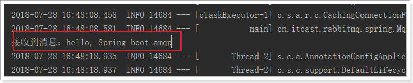

# 1.消息队列（MQ）

## 1.1什么是消息队列

消息队列，即MQ，Message Queue，是一种应用程序对应用程序的通信方式。应用程序通过读写出入队列的消息（针对应用程序的数据）来通信，而无需专用连接来链接它们。消息传递指的是程序之间通过在消息中发送数据进行通信，而不是通过直接调用彼此来通信，直接调用通常是用于诸如远程过程调用的技术。排队指的是应用程序通过队列来通信。队列的使用除去了接收和发送应用程序同时执行的要求。

消息队列是典型的：**生产者、消费者模型**。生产者不断向消息队列中生产消息，消费者不断的从队列中获取消息。因为消息的生产和消费都是异步的，而且只关心消息的发送和接收，没有业务逻辑的侵入，这样就实现了生产者和消费者的**解耦**。

## 1.2AMQP和JMS

MQ是消息通信的模型，并不是具体实现。现在实现MQ的有两种主流方式：AMQP、JMS。

### 1.2.1AMQP

AMQP即Advanced Message Queuing Protocol，一个提供统一消息服务的应用层标准高级消息队列协议，是应用层协议的一个开放标准，为面向消息的中间件设计。基于此协议的客户端与消息中间件可传递消息，并不受客户端/中间件不同产品，不同的开发语言等条件的限制。Erlang中的实现由RabbitMQ等。

### 1.2.2JMS

通常而言提到JMS（Java MessageService）实际上是指JMS API。JMS是由Sun公司早起提出的消息标准，旨在为Java应用提供统一的消息操作，包括create、send、receive等。JMS已经成为Java Enterprise Edition的一部分。从使用角度看，JMS和JDBC担任差不多的角色，用户都是根据相应的接口可以个实现了JMS的服务进行通信，进行相关操作者。

两者间的区别和联系：

1. JMS是定义了统一的接口，来对消息操作进行统一；AMQP是通过规定协议来统一数据交互的格式
2. JMS限定了必须使用Java语言；AMQP只是协议，不规定实现方式，因此是跨语言的。
3. JMS规定了两种消息模型；而AMQP的消息模型更加丰富。

## 1.3常见的MQ产品

1. ActiveMQ：基于JMS
2. RabbitMQ：基于AMQP协议，erlang语言开发，稳定性好。
3. RocketMQ：基于JMS，阿里巴巴产品，目前交由Apache基金会。
4. Kafka：分布式消息系统，高吞吐量

## 1.4RabbitMQ

RabbitMQ是基于AMQP的一款消息管理系统

官网： http://www.rabbitmq.com/

官方教程：http://www.rabbitmq.com/getstarted.html

## 1.5下载和安装

### 1.5.1下载

官网下载地址：http://www.rabbitmq.com/download.html

### 1.5.2Docker方式

下载镜像：`docker pull rabbitmq:management`

创建实例并启动：

```shell
docker run -d --name rabbitmq --publish 5671:5671 \
--publish 5672:5672 --publish 4369:4369 --publish 25672:25672 --publish 15671:15671 --publish 15672:15672 \
rabbitmq:management
```

> 注：4369 -- erlang发现口
>
> ​        5672 --client端通信口(Java配置文件中配置的client端口)
>
> ​        15672 -- 管理界面ui端口（页面访问MQ时候的端口）
>
> ​         25672 -- server间内部通信口（集群端口）
>
> ​        默认账号：guest：guest

### 1.5.3访问


1. Overview：概览
2. Connections：无论生产者还是消费者，都需要与RabbitMQ建立连接后才可以完成消息的生产和消费，在这里可以查看连接情况。
3. Channels：通道，建立连接后，会形成通道，消息的投递获取依赖通道。
4. Exchanges：交换机，用来实现消息的路由。
5. Queues：消息队列，消息存放在队列中，等待消费，消费后被移除队列。

## 1.6管理界面

### 1.6.1添加用户


1. 超级管理员(administrator)：可登陆管理控制台，可查看所有的信息，并且可以对用户，策略(policy)进行操作。

2. 监控者(monitoring)：可登陆管理控制台，同时可以查看rabbitmq节点的相关信息(进程数，内存使用情况，磁盘使用情况等)

3. 策略制定者(policymaker)：可登陆管理控制台,，同时可以对policy进行管理。但无法查看节点的相关信息(上图红框标识的部分)。

4. 普通管理者(management)：仅可登陆管理控制台，无法看到节点信息，也无法对策略进行管理。

5. 其他：无法登陆管理控制台，通常就是普通的生产者和消费者。


### 1.6.2创建Virtual Hosts

虚拟主机：类似于mysql中的database，它们都是以“/”开头的


### 1.6.3设置权限


# 2.五种消息模型

RabbitMQ提供了6种消息模型，但是第6种其实是RPC，并不是MQ，因此不予学习，那么也就剩下5种。

但是其实3、4、5这三种都属于订阅模型，只不过进行路由的方式不同。


## 2.1基本消息模型

RabbitMQ是一个消息代理：它接受和转发消息。 你可以把它想象成一个邮局：当你把邮件放在邮箱里时，你可以确定邮差先生最终会把邮件发送给你的收件人。 在这个比喻中，RabbitMQ是邮政信箱，邮局和邮递员。

RabbitMQ与邮局的主要区别是它不处理纸张，而是接受，存储和转发数据消息的二进制数据块。


P（producer/ publisher）：生产者，一个发送消息的用户应用程序。

C（consumer）：消费者，消费和接收有类似的意思，消费者是一个主要用来等待接收消息的用户应用程序

队列（红色区域）：rabbitmq内部类似于邮箱的一个概念。虽然消息流经rabbitmq和你的应用程序，但是它们只能存储在队列中。队列只受主机的内存和磁盘限制，实质上是一个大的消息缓冲区。许多生产者可以发送消息到一个队列，许多消费者可以尝试从一个队列接收数据。

总之，生产者将消息发送到队列，消费者从队列中获取消息，队列是存储消息的缓冲区。

### 2.1.1生产者发送消息

```xml
		<dependency>
			<groupId>org.springframework.boot</groupId>
			<artifactId>spring-boot-starter-amqp</artifactId>
		</dependency>
```

```java
public class Send {

    private final static String QUEUE_NAME = "simple_queue";

    public static void main(String[] argv) throws Exception {
        // 获取到连接以及mq通道
        Connection connection = ConnectionUtil.getConnection();
        // 从连接中创建通道，这是完成大部分API的地方。
        Channel channel = connection.createChannel();

        // 声明（创建）队列，必须声明队列才能够发送消息，我们可以把消息发送到队列中。
        // 声明一个队列是幂等的 - 只有当它不存在时才会被创建
        channel.queueDeclare(QUEUE_NAME, false, false, false, null);

        // 消息内容
        String message = "Hello World!";
        channel.basicPublish("", QUEUE_NAME, null, message.getBytes());
        System.out.println(" [x] Sent '" + message + "'");

        //关闭通道和连接
        channel.close();
        connection.close();
    }
}
```

### 2.1.2消费者获取消息

```java
public class Recv {
    private final static String QUEUE_NAME = "simple_queue";

    public static void main(String[] argv) throws Exception {
        // 获取到连接
        Connection connection = ConnectionUtil.getConnection();
        // 创建通道
        Channel channel = connection.createChannel();
        // 声明队列
        channel.queueDeclare(QUEUE_NAME, false, false, false, null);
        // 定义队列的消费者
        DefaultConsumer consumer = new DefaultConsumer(channel) {
            // 获取消息，并且处理，这个方法类似事件监听，如果有消息的时候，会被自动调用
            @Override
            public void handleDelivery(String consumerTag, Envelope envelope, BasicProperties properties,
                    byte[] body) throws IOException {
                // body 即消息体
                String msg = new String(body);
                System.out.println(" [x] received : " + msg + "!");
            }
        };
        // 监听队列，第二个参数：是否自动进行消息确认。
        channel.basicConsume(QUEUE_NAME, true, consumer);
    }
}
```

### 2.1.1消息确认机制（ACK）

1. 自动ACK：消息一旦被接收，消费者自动发送ACK。

   > 如果消息不太重要，丢失也没有影响，那么自动ACK会比较方便。

2. 手动ACK：消息接收后，不会发送ACK，需要手动调用。

   > 如果消息非常重要，不容丢失。那么最好在消费完成后手动ACK，否则接收消息后就自动ACK，RabbitMQ就会把消息从队列中删除。如果此时消费者宕机，那么消息就丢失了。

注意：如果采用自动ACK，若是消费者抛出异常，消息是不会回滚的，消息已经被消费。

```java
public class Recv2 {
    private final static String QUEUE_NAME = "simple_queue";

    public static void main(String[] argv) throws Exception {
        // 获取到连接
        Connection connection = ConnectionUtil.getConnection();
        // 创建通道
        final Channel channel = connection.createChannel();
        // 声明队列
        channel.queueDeclare(QUEUE_NAME, false, false, false, null);
        // 定义队列的消费者
        DefaultConsumer consumer = new DefaultConsumer(channel) {
            // 获取消息，并且处理，这个方法类似事件监听，如果有消息的时候，会被自动调用
            @Override
            public void handleDelivery(String consumerTag, Envelope envelope, BasicProperties properties,
                    byte[] body) throws IOException {
                // body 即消息体
                String msg = new String(body);
                System.out.println(" [x] received : " + msg + "!");
                // 手动进行ACK
                channel.basicAck(envelope.getDeliveryTag(), false);
            }
        };
        // 监听队列，第二个参数false，手动进行ACK
        channel.basicConsume(QUEUE_NAME, false, consumer);
    }
}
```

## 2.2work消息模型

工作队列或者竞争消费模式


在第一篇教程中，我们编写了一个程序，从一个命名队列中发送并接受消息。在这里，我们将创建一个工作队列，在多个工作者之间分配耗时任务。

工作队列，又称任务队列。主要思想就是避免执行资源密集型任务时，必须等待它执行完成。相反我们稍后完成任务，我们将任务封装为消息并将其发送到队列。 在后台运行的工作进程将获取任务并最终执行作业。当你运行许多消费者时，任务将在他们之间共享，但是**一个消息只能被一个消费者获取**。

这个概念在Web应用程序中特别有用，因为在短的HTTP请求窗口中无法处理复杂的任务。

接下来我们来模拟这个流程：

P：生产者：任务的发布者

C1：消费者，领取任务并且完成任务，假设完成速度较快

C2：消费者2：领取任务并完成任务，假设完成速度慢

### 面试题：避免消息堆积？

1）采用workqueue，多个消费者监听同一队列。

2）接收到消息以后，而是通过线程池，异步消费。

### 2.2.1生产者

```java
public class Send {
    private final static String QUEUE_NAME = "test_work_queue";

    public static void main(String[] argv) throws Exception {
        // 获取到连接
        Connection connection = ConnectionUtil.getConnection();
        // 获取通道
        Channel channel = connection.createChannel();
        // 声明队列
        channel.queueDeclare(QUEUE_NAME, false, false, false, null);
        // 循环发布任务
        for (int i = 0; i < 50; i++) {
            // 消息内容
            String message = "task .. " + i;
            channel.basicPublish("", QUEUE_NAME, null, message.getBytes());
            System.out.println(" [x] Sent '" + message + "'");

            Thread.sleep(i * 2);
        }
        // 关闭通道和连接
        channel.close();
        connection.close();
    }
}
```

### 2.2.2消费者1


### 2.2.3消费者2


与消费者1类似，就是没有设置消费耗时时间。

这里是模拟有些消费者快，有些消费者慢

### 2.2.4测试


可以发现，两个消费者各自消费了25条消息，而且各不相同，这就实现了任务的分发。

### 2.2.5能者多劳

刚才的实现有问题吗？

- 消费者1比消费者2的效率要低，一次任务的耗时较长
- 然而两人最终消费的消息数量是一样的
- 消费者2大量时间处于空闲状态，消费者1一直忙碌

现在的状态属于是把任务平均分配，正确的做法应该是消费越快的人，消费的越多。

怎么实现呢？

我们可以使用basicQos方法和prefetchCount = 1设置。 这告诉RabbitMQ一次不要向工作人员发送多于一条消息。 或者换句话说，不要向工作人员发送新消息，直到它处理并确认了前一个消息。 相反，它会将其分派给不是仍然忙碌的下一个工作人员。


## 2.3订阅模型分类

在之前的模式中，我们创建了一个工作队列。 工作队列背后的假设是：每个任务只被传递给一个工作人员。 在这一部分，我们将做一些完全不同的事情 - 我们将会传递一个信息给多个消费者。 这种模式被称为“发布/订阅”。 

订阅模型示意图：


解读：

1. 1个生产者，多个消费者

2. 每一个消费者都有自己的一个队列

3. 生产者没有将消息直接发送到队列，而是发送到了交换机
4. 每个队列都要绑定到交换机

5. 生产者发送的消息，经过交换机到达队列，实现一个消息被多个消费者获取的目的


X（Exchanges）：交换机一方面，接收生产者发送的消息。另一方面，知道如何处理消息，例如递交给某个特别队列、递交给所有队列、或是将消息丢弃。到底如何操作，取决于Exchange的类型。

Exchange类型有以下几种：

1. Fanout：广播，将消息交给所有绑定到交换机的队列

2. Direct：定向，把消息交给符合指定routing key 的队列 

3. Topic：通配符，把消息交给符合routing pattern（路由模式） 的队列

**Exchange（交换机）只负责转发消息，不具备存储消息的能力**，因此如果没有任何队列与Exchange绑定，或者没有符合路由规则的队列，那么消息会丢失！

## 2.4订阅模式之Fanout（广播）


在广播模式下，消息发送流程是这样的：

1. 可以有多个消费者
2. 每个**消费者有自己的queue**（队列）
3. 每个**队列都要绑定到Exchange**（交换机）
4. **生产者发送的消息，只能发送到交换机**，交换机来决定要发给哪个队列，生产者无法决定。
5. 交换机把消息发送给绑定过的所有队列
6. 队列的消费者都能拿到消息。实现一条消息被多个消费者消费

### 2.4.1生产者

两个变化：

- 声明Exchange，不再声明Queue
- 发送消息到Exchange，不再发送到Queue

```java
public class Send {

    private final static String EXCHANGE_NAME = "fanout_exchange_test";

    public static void main(String[] argv) throws Exception {
        // 获取到连接
        Connection connection = ConnectionUtil.getConnection();
        // 获取通道
        Channel channel = connection.createChannel();
        
        // 声明exchange，指定类型为fanout
        channel.exchangeDeclare(EXCHANGE_NAME, "fanout");
        
        // 消息内容
        String message = "Hello everyone";
        // 发布消息到Exchange
        channel.basicPublish(EXCHANGE_NAME, "", null, message.getBytes());
        System.out.println(" [生产者] Sent '" + message + "'");

        channel.close();
        connection.close();
    }
}
```

### 2.4.2消费者1

```java
public class Recv {
    private final static String QUEUE_NAME = "fanout_exchange_queue_1";

    private final static String EXCHANGE_NAME = "fanout_exchange_test";

    public static void main(String[] argv) throws Exception {
        // 获取到连接
        Connection connection = ConnectionUtil.getConnection();
        // 获取通道
        Channel channel = connection.createChannel();
        // 声明队列
        channel.queueDeclare(QUEUE_NAME, false, false, false, null);

        // 绑定队列到交换机
        channel.queueBind(QUEUE_NAME, EXCHANGE_NAME, "");

        // 定义队列的消费者
        DefaultConsumer consumer = new DefaultConsumer(channel) {
            // 获取消息，并且处理，这个方法类似事件监听，如果有消息的时候，会被自动调用
            @Override
            public void handleDelivery(String consumerTag, Envelope envelope, BasicProperties properties,
                    byte[] body) throws IOException {
                // body 即消息体
                String msg = new String(body);
                System.out.println(" [消费者1] received : " + msg + "!");
            }
        };
        // 监听队列，自动返回完成
        channel.basicConsume(QUEUE_NAME, true, consumer);
    }
}
```

### 2.4.3消费者2

```java
public class Recv2 {
    private final static String QUEUE_NAME = "fanout_exchange_queue_2";

    private final static String EXCHANGE_NAME = "fanout_exchange_test";

    public static void main(String[] argv) throws Exception {
        // 获取到连接
        Connection connection = ConnectionUtil.getConnection();
        // 获取通道
        Channel channel = connection.createChannel();
        // 声明队列
        channel.queueDeclare(QUEUE_NAME, false, false, false, null);

        // 绑定队列到交换机
        channel.queueBind(QUEUE_NAME, EXCHANGE_NAME, "");
        
        // 定义队列的消费者
        DefaultConsumer consumer = new DefaultConsumer(channel) {
            // 获取消息，并且处理，这个方法类似事件监听，如果有消息的时候，会被自动调用
            @Override
            public void handleDelivery(String consumerTag, Envelope envelope, BasicProperties properties,
                    byte[] body) throws IOException {
                // body 即消息体
                String msg = new String(body);
                System.out.println(" [消费者2] received : " + msg + "!");
            }
        };
        // 监听队列，手动返回完成
        channel.basicConsume(QUEUE_NAME, true, consumer);
    }
}
```

### 2.4.4测试

运行两个消费者，然后发送一条消息，结果是两个消费者都接收到。

## 2.5订阅模型-Direct

有选择性的接收消息

在订阅模式中，生产者发布消息，所有消费者都可以获取所有消息。

在路由模式中，我们将添加一个功能 - 我们将只能订阅一部分消息。 例如，我们只能将重要的错误消息引导到日志文件（以节省磁盘空间），同时仍然能够在控制台上打印所有日志消息。

但是，在某些场景下，我们希望不同的消息被不同的队列消费。这时就要用到Direct类型的Exchange。

在Direct模型下，队列与交换机的绑定，不能是任意绑定了，而是要指定一个RoutingKey（路由key）

消息的发送方在向Exchange发送消息时，也必须指定消息的routing key。


P：生产者，向Exchange发送消息，发送消息时，会指定一个routing key。

X：Exchange（交换机），接收生产者的消息，然后把消息递交给 与routing key完全匹配的队列

C1：消费者，其所在队列指定了需要routing key 为 error 的消息

C2：消费者，其所在队列指定了需要routing key 为 info、error、warning 的消息

### 2.5.1生产者

此处我们模拟商品的增删改，发送消息的RoutingKey分别是：insert、update、delete

```java
public class Send {
    private final static String EXCHANGE_NAME = "direct_exchange_test";

    public static void main(String[] argv) throws Exception {
        // 获取到连接
        Connection connection = ConnectionUtil.getConnection();
        // 获取通道
        Channel channel = connection.createChannel();
        // 声明exchange，指定类型为direct
        channel.exchangeDeclare(EXCHANGE_NAME, "direct");
        // 消息内容
        String message = "商品新增了， id = 1001";
        // 发送消息，并且指定routing key 为：insert ,代表新增商品
        channel.basicPublish(EXCHANGE_NAME, "insert", null, message.getBytes());
        System.out.println(" [商品服务：] Sent '" + message + "'");

        channel.close();
        connection.close();
    }
}
```

### 2.5.2消费者1

我们此处假设消费者1只接收两种类型的消息：更新商品和删除商品。

```java
public class Recv {
    private final static String QUEUE_NAME = "direct_exchange_queue_1";
    private final static String EXCHANGE_NAME = "direct_exchange_test";

    public static void main(String[] argv) throws Exception {
        // 获取到连接
        Connection connection = ConnectionUtil.getConnection();
        // 获取通道
        Channel channel = connection.createChannel();
        // 声明队列
        channel.queueDeclare(QUEUE_NAME, false, false, false, null);
        
        // 绑定队列到交换机，同时指定需要订阅的routing key。假设此处需要update和delete消息
        channel.queueBind(QUEUE_NAME, EXCHANGE_NAME, "update");
        channel.queueBind(QUEUE_NAME, EXCHANGE_NAME, "delete");

        // 定义队列的消费者
        DefaultConsumer consumer = new DefaultConsumer(channel) {
            // 获取消息，并且处理，这个方法类似事件监听，如果有消息的时候，会被自动调用
            @Override
            public void handleDelivery(String consumerTag, Envelope envelope, BasicProperties properties,
                    byte[] body) throws IOException {
                // body 即消息体
                String msg = new String(body);
                System.out.println(" [消费者1] received : " + msg + "!");
            }
        };
        // 监听队列，自动ACK
        channel.basicConsume(QUEUE_NAME, true, consumer);
    }
}
```

### 2.5.3消费者2

我们此处假设消费者2接收所有类型的消息：新增商品，更新商品和删除商品。

```java
public class Recv2 {
    private final static String QUEUE_NAME = "direct_exchange_queue_2";
    private final static String EXCHANGE_NAME = "direct_exchange_test";

    public static void main(String[] argv) throws Exception {
        // 获取到连接
        Connection connection = ConnectionUtil.getConnection();
        // 获取通道
        Channel channel = connection.createChannel();
        // 声明队列
        channel.queueDeclare(QUEUE_NAME, false, false, false, null);
        
        // 绑定队列到交换机，同时指定需要订阅的routing key。订阅 insert、update、delete
        channel.queueBind(QUEUE_NAME, EXCHANGE_NAME, "insert");
        channel.queueBind(QUEUE_NAME, EXCHANGE_NAME, "update");
        channel.queueBind(QUEUE_NAME, EXCHANGE_NAME, "delete");

        // 定义队列的消费者
        DefaultConsumer consumer = new DefaultConsumer(channel) {
            // 获取消息，并且处理，这个方法类似事件监听，如果有消息的时候，会被自动调用
            @Override
            public void handleDelivery(String consumerTag, Envelope envelope, BasicProperties properties,
                    byte[] body) throws IOException {
                // body 即消息体
                String msg = new String(body);
                System.out.println(" [消费者2] received : " + msg + "!");
            }
        };
        // 监听队列，自动ACK
        channel.basicConsume(QUEUE_NAME, true, consumer);
    }
}
```

### 2.5.4测试


## 2.6订阅模型-Topic

`Topic`类型的`Exchange`与`Direct`相比，都是可以根据`RoutingKey`把消息路由到不同的队列。只不过`Topic`类型`Exchange`可以让队列在绑定`Routing key` 的时候使用通配符！

`Routingkey` 一般都是有一个或多个单词组成，多个单词之间以”.”分割，例如： `item.insert`

 通配符规则：

`#`：匹配一个或多个词

`*`：匹配不多不少恰好1个词

举例：

`audit.#`：能够匹配`audit.irs.corporate` 或者 `audit.irs`

`audit.*`：只能匹配`audit.irs`


### 2.6.1生产者

使用topic类型的Exchange，发送消息的routing key有3种： `item.isnert`、`item.update`、`item.delete`：

```java
public class Send {
    private final static String EXCHANGE_NAME = "topic_exchange_test";

    public static void main(String[] argv) throws Exception {
        // 获取到连接
        Connection connection = ConnectionUtil.getConnection();
        // 获取通道
        Channel channel = connection.createChannel();
        // 声明exchange，指定类型为topic
        channel.exchangeDeclare(EXCHANGE_NAME, "topic");
        // 消息内容
        String message = "新增商品 : id = 1001";
        // 发送消息，并且指定routing key 为：insert ,代表新增商品
        channel.basicPublish(EXCHANGE_NAME, "item.insert", null, message.getBytes());
        System.out.println(" [商品服务：] Sent '" + message + "'");

        channel.close();
        connection.close();
    }
}
```

### 2.6.2.消费者1

我们此处假设消费者1只接收两种类型的消息：更新商品和删除商品

```java
public class Recv {
    private final static String QUEUE_NAME = "topic_exchange_queue_1";
    private final static String EXCHANGE_NAME = "topic_exchange_test";

    public static void main(String[] argv) throws Exception {
        // 获取到连接
        Connection connection = ConnectionUtil.getConnection();
        // 获取通道
        Channel channel = connection.createChannel();
        // 声明队列
        channel.queueDeclare(QUEUE_NAME, false, false, false, null);
        
        // 绑定队列到交换机，同时指定需要订阅的routing key。需要 update、delete
        channel.queueBind(QUEUE_NAME, EXCHANGE_NAME, "item.update");
        channel.queueBind(QUEUE_NAME, EXCHANGE_NAME, "item.delete");

        // 定义队列的消费者
        DefaultConsumer consumer = new DefaultConsumer(channel) {
            // 获取消息，并且处理，这个方法类似事件监听，如果有消息的时候，会被自动调用
            @Override
            public void handleDelivery(String consumerTag, Envelope envelope, BasicProperties properties,
                    byte[] body) throws IOException {
                // body 即消息体
                String msg = new String(body);
                System.out.println(" [消费者1] received : " + msg + "!");
            }
        };
        // 监听队列，自动ACK
        channel.basicConsume(QUEUE_NAME, true, consumer);
    }
}

```

### 2.6.3.消费者2

我们此处假设消费者2接收所有类型的消息：新增商品，更新商品和删除商品。

```java
/**
 * 消费者2
 */
public class Recv2 {
    private final static String QUEUE_NAME = "topic_exchange_queue_2";
    private final static String EXCHANGE_NAME = "topic_exchange_test";

    public static void main(String[] argv) throws Exception {
        // 获取到连接
        Connection connection = ConnectionUtil.getConnection();
        // 获取通道
        Channel channel = connection.createChannel();
        // 声明队列
        channel.queueDeclare(QUEUE_NAME, false, false, false, null);
        
        // 绑定队列到交换机，同时指定需要订阅的routing key。订阅 insert、update、delete
        channel.queueBind(QUEUE_NAME, EXCHANGE_NAME, "item.*");

        // 定义队列的消费者
        DefaultConsumer consumer = new DefaultConsumer(channel) {
            // 获取消息，并且处理，这个方法类似事件监听，如果有消息的时候，会被自动调用
            @Override
            public void handleDelivery(String consumerTag, Envelope envelope, BasicProperties properties,
                    byte[] body) throws IOException {
                // body 即消息体
                String msg = new String(body);
                System.out.println(" [消费者2] received : " + msg + "!");
            }
        };
        // 监听队列，自动ACK
        channel.basicConsume(QUEUE_NAME, true, consumer);
    }
}

```

## 2.7持久化

如何避免消息丢失？

1）  消费者的ACK机制。可以防止消费者丢失消息。

2）  但是，如果在消费者消费之前，MQ就宕机了，消息就没了。

是可以将消息进行持久化呢？

要将消息持久化，前提是：队列、Exchange都持久化

### 2.7.1.交换机持久化


### 2.7.2.队列持久化


### 2.7.3.消息持久化


# 3.Spring AMQP

## 3.1简介

Spring AMQP的页面：http://spring.io/projects/spring-amqp

Spring-amqp是对AMQP协议的抽象实现，而spring-rabbit 是对协议的具体实现，也是目前的唯一实现。底层使用的就是RabbitMQ。

## 3.2依赖和配置

添加AMQP的启动器：

```xml
<dependency>
    <groupId>org.springframework.boot</groupId>
    <artifactId>spring-boot-starter-amqp</artifactId>
</dependency>

```

在`application.yml`中添加RabbitMQ地址：

```yaml
spring:
  rabbitmq:
    host: 192.168.56.101
    username: guest
    password: guest
    virtual-host: /test
```

## 3.3监听者

在SpringAmqp中，对消息的消费者进行了封装和抽象，一个普通的JavaBean中的普通方法，只要通过简单的注解，就可以成为一个消费者。

```java
@Component
public class Listener {

    @RabbitListener(bindings = @QueueBinding(
            value = @Queue(value = "spring.test.queue", durable = "true"),
            exchange = @Exchange(
                    value = "spring.test.exchange",
                    ignoreDeclarationExceptions = "true",
                    type = ExchangeTypes.TOPIC
            ),
            key = {"#.#"}))
    public void listen(String msg){
        System.out.println("接收到消息：" + msg);
    }
}

```

- `@Componet`：类上的注解，注册到Spring容器
- `@RabbitListener`：方法上的注解，声明这个方法是一个消费者方法，需要指定下面的属性：
  - `bindings`：指定绑定关系，可以有多个。值是`@QueueBinding`的数组。`@QueueBinding`包含下面属性：
    - `value`：这个消费者关联的队列。值是`@Queue`，代表一个队列
    - `exchange`：队列所绑定的交换机，值是`@Exchange`类型
    - `key`：队列和交换机绑定的`RoutingKey`

类似listen这样的方法在一个类中可以写多个，就代表多个消费者。

## 3.4.AmqpTemplate

Spring最擅长的事情就是封装，把他人的框架进行封装和整合。

Spring为AMQP提供了统一的消息处理模板：AmqpTemplate，非常方便的发送消息，其发送方法：


红框圈起来的是比较常用的3个方法，分别是：

- 指定交换机、RoutingKey和消息体
- 指定消息
- 指定RoutingKey和消息，会向默认的交换机发送消息

## 3.5测试代码

```java
@RunWith(SpringRunner.class)
@SpringBootTest(classes = Application.class)
public class MqDemo {

    @Autowired
    private AmqpTemplate amqpTemplate;

    @Test
    public void testSend() throws InterruptedException {
        String msg = "hello, Spring boot amqp";
        this.amqpTemplate.convertAndSend("spring.test.exchange","a.b", msg);
        // 等待10秒后再结束
        Thread.sleep(10000);
    }
}

```

运行后查看日志：




