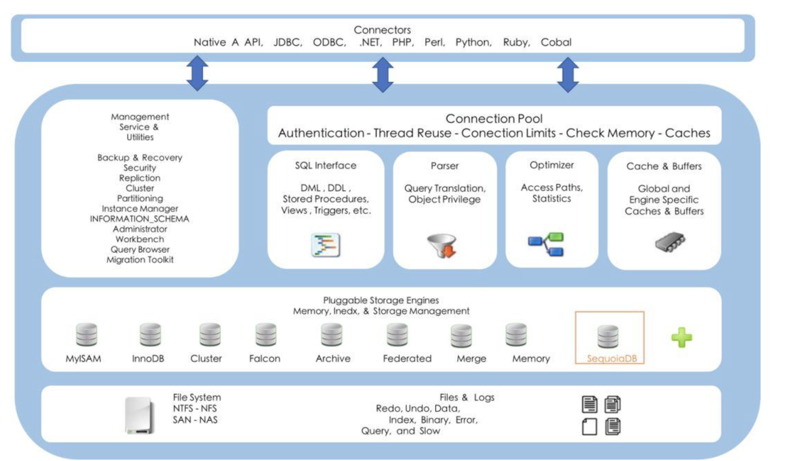
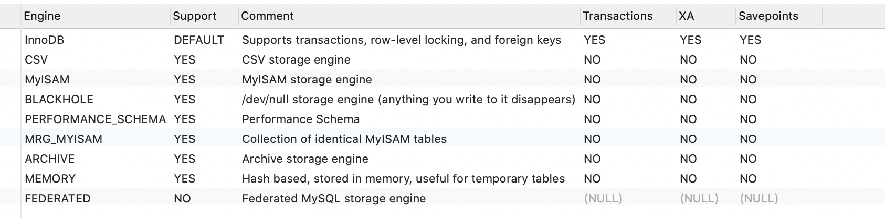
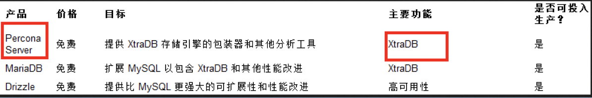
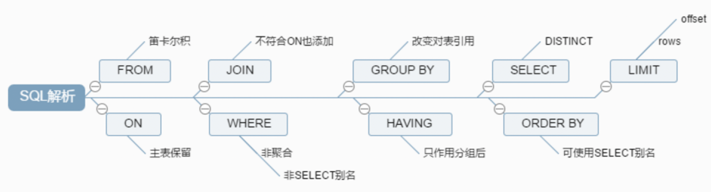
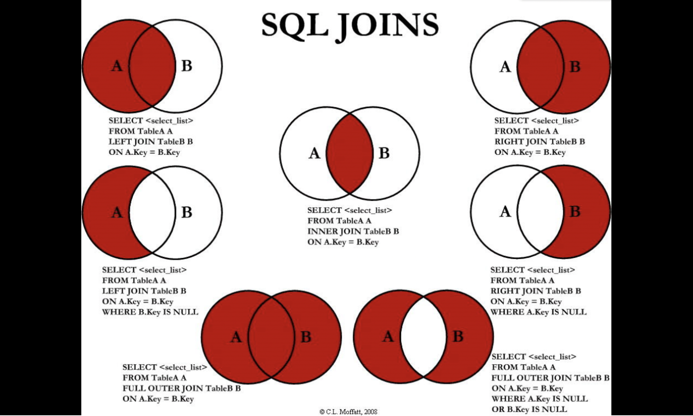

# 1.Mysql简介

MySQL是一个**[关系型数据库管理系统](https://baike.baidu.com/item/关系型数据库管理系统/696511)**，由瑞典MySQL AB 公司开发，属于[Oracle](https://baike.baidu.com/item/Oracle) 旗下产品。MySQL 是最流行的[关系型数据库管理系统](https://baike.baidu.com/item/关系型数据库管理系统/696511)之一，在 WEB 应用方面，MySQL是最好的 [RDBMS](https://baike.baidu.com/item/RDBMS/1048260) (Relational Database Management System，关系数据库管理系统) 应用软件之一。

MySQL是一种关系型数据库管理系统，关系数据库将数据保存在不同的表中，而不是将所有数据放在一个大仓库内，这样就增加了速度并提高了灵活性。

MySQL所使用的 SQL 语言是用于访问[数据库](https://baike.baidu.com/item/数据库/103728)的最常用标准化语言。MySQL 软件采用了双授权政策，分为社区版和商业版，由于其体积小、速度快、总体拥有成本低，尤其是[开放源码](https://baike.baidu.com/item/开放源码/7176422)这一特点，一般中小型网站的开发都选择 MySQL 作为网站数据库。

> 摘自百度百科

## 1.1Mysql逻辑架构图



和其它数据库相比，MySQL有点与众不同，它的架构可以在多种不同场景中应用并发挥良好作用。主要体现在存储引擎的架构上，**插件式的存储引擎架构将查询处理和其它的系统任务以及数据的存储提取相分离**。这种架构可以根据业务的需求和实际需要选择合适的存储引擎。 

1. **连接层**：最上层是一些客户端和连接服务，包含本地sock通信和大多数基于客户端/服务端工具实现的类似于tcp/ip的通信。主要完成一些类似于连接处理、授权认证、及相关的安全方案。在该层上引入了线程池的概念，为通过认证安全接入的客户端提供线程。同样在该层上可以实现基于SSL的安全链接。服务器也会为安全接入的每个客户端验证它所具有的操作权限。 
2. **服务层**：第二层架构主要完成大多少的核心服务功能，如SQL接口，并完成缓存的查询，SQL的分析和优化及部分内置函数的执行。所有跨存储引擎的功能也在这一层实现，如过程、函数等。在该层，服务器会解析查询并创建相应的内部解析树，并对其完成相应的优化如确定查询表的顺序，是否利用索引等，最后生成相应的执行操作。如果是select语句，服务器还会查询内部的缓存。如果缓存空间足够大，这样在解决大量读操作的环境中能够很好的提升系统的性能。 
3. **引擎层**：存储引擎层，存储引擎真正的负责了MySQL中数据的存储和提取，服务器通过API与存储引擎进行通信。不同的存储引擎具有的功能不同，这样我们可以根据自己的实际需要进行选取。后面介绍MyISAM和InnoDB 
4. **存储层**：数据存储层，主要是将数据存储在运行于裸设备的文件系统之上，并完成与存储引擎的交互。 

## 1.2命令查看提供的存储引擎

```mysql
SHOW ENGINES;
```



1. Engine：存储引擎名称
2. Support：说明Mysql是否支持该类型引擎
3. Comment：表示对该引擎的解释
4. Transactions：表示是否支持事务处理
5. XA：表示是否支持分布式交易处理的XA规范（即分布式事务）
6. Savepoints：表示是否支持保存点，以方便事务的回滚操作

## 1.3MyISAM和InnoDB

| 对比项 |                           MyISAM                           |                            InnoDB                            |
| :----: | :--------------------------------------------------------: | :----------------------------------------------------------: |
| 主外键 |                           不支持                           |                             支持                             |
|  事务  |                           不支持                           |                             支持                             |
| 行表锁 | 表锁，即使操作一条记录也会锁住整个表<br />不适合高并发操作 |   行锁，操作时只锁某一行<br />不对其他行有影响，适合高并发   |
|  缓存  |                 只缓存索引，不缓存真实数据                 | 不仅缓存索引还要缓存真实数据，对内存要求较高<br />而且内存大小对性能有决定性影响 |
| 表空间 |                             小                             |                              大                              |
| 关注点 |                            性能                            |                             事务                             |

## 1.4阿里巴巴、淘宝使用什么数据库？



1. Percona 为 MySQL 数据库服务器进行了改进，在功能和性能上较 MySQL 有着很显著的提升。该版本提升了在高负载情况下的 InnoDB 的性能、为 DBA 提供一些非常有用的性能诊断工具；另外有更多的参数和命令来控制服务器行为。 
2. 该公司新建了一款存储引擎叫 xtradb 完全可以替代 innodb, 并且在性能和并发上做得更好。
3. 阿里巴巴大部分 mysql 数据库其实使用的 percona 的原型加以修改 —— **AliSql+AliRedis** 

# 2.Join查询

## 2.1SQL执行顺序

### 2.1.1手写

```mysql
SELECT DISTINCT
	< select_list >
FROM < table_name > 
< join_type > JOIN <join_table_name > ON < join_condition >
WHERE < where_condition>
GROUP BY
	< group_by_list >
HAVING
	< having_condition >
ORDER BY
	< order_by_condition >
LIMIT < limit_number >
```

### 2.1.2机读

```mysql
FROM < table_name >
ON < join_condition >
< join_type > JOIN < join_table_name >
WHERE < where_condition >
GROUP BY < group_by_list >
HAVING < having_condition >
SELECT DISTINCT < select_list >
ORDER BY < order_by_condition >
LIMIT < limit_number >
```

### 2.1.3总结



## 2.2Join图



### 2.2.1建表模拟演示

```mysql
CREATE TABLE `tbl_dept` ( 
 `id` INT(11) NOT NULL AUTO_INCREMENT, 
 `deptName` VARCHAR(30) DEFAULT NULL, 
 `locAdd` VARCHAR(40) DEFAULT NULL, 
 PRIMARY KEY (`id`) 
) ENGINE=INNODB AUTO_INCREMENT=1 DEFAULT CHARSET=utf8; 
 
CREATE TABLE `tbl_emp` ( 
 `id` INT(11) NOT NULL AUTO_INCREMENT, 
 `name` VARCHAR(20) DEFAULT NULL, 
 `deptId` INT(11) DEFAULT NULL, 
 PRIMARY KEY (`id`), 
 KEY `fk_dept_id` (`deptId`) 
 #CONSTRAINT `fk_dept_id` FOREIGN KEY (`deptId`) REFERENCES `tbl_dept` (`id`) 
) ENGINE=INNODB AUTO_INCREMENT=1 DEFAULT CHARSET=utf8; 
 
INSERT INTO tbl_dept(deptName,locAdd) VALUES('RD',11); 
INSERT INTO tbl_dept(deptName,locAdd) VALUES('HR',12); 
INSERT INTO tbl_dept(deptName,locAdd) VALUES('MK',13); 
INSERT INTO tbl_dept(deptName,locAdd) VALUES('MIS',14); 
INSERT INTO tbl_dept(deptName,locAdd) VALUES('FD',15); 
 
INSERT INTO tbl_emp(NAME,deptId) VALUES('z3',1); 
INSERT INTO tbl_emp(NAME,deptId) VALUES('z4',1); 
INSERT INTO tbl_emp(NAME,deptId) VALUES('z5',1); 
INSERT INTO tbl_emp(NAME,deptId) VALUES('w5',2); 
INSERT INTO tbl_emp(NAME,deptId) VALUES('w6',2); 
INSERT INTO tbl_emp(NAME,deptId) VALUES('s7',3); 
INSERT INTO tbl_emp(NAME,deptId) VALUES('s8',4); 
INSERT INTO tbl_emp(NAME,deptId) VALUES('s9',51); 
```

### 2.2.2七种SQL演示

```mysql
-- A、B两 表共有 
select * from tbl_emp a  inner join  tbl_dept b on a.deptId = b.id; 

-- A、B 两表共有+A的独有 
 select * from tbl_emp a  left join  tbl_dept b on a.deptId = b.id; 

-- A、B 两表共有+B的独有 
select * from tbl_emp a  right join  tbl_dept b on a.deptId = b.id; 

-- A独有   
select * from tbl_emp a left join tbl_dept b on a.deptId = b.id where b.id is null;  

-- B的独有 
select * from tbl_emp a right join tbl_dept b on a.deptId = b.id where a.deptId is null; 

-- AB全有 
-- MySQL Full Join的实现 因为MySQL不支持FULL JOIN,下面是替代方法 
-- left join + union(可去除重复数据)+ right join 
SELECT * FROM tbl_emp A LEFT JOIN tbl_dept B ON A.deptId = B.id 
UNION 
SELECT * FROM tbl_emp A RIGHT JOIN tbl_dept B ON A.deptId = B.id 

-- A的独有 + B的独有 
SELECT * FROM tbl_emp A LEFT JOIN tbl_dept B ON A.deptId = B.id WHERE B.`id` IS NULL 
UNION 
SELECT * FROM tbl_emp A RIGHT JOIN tbl_dept B ON A.deptId = B.id WHERE A.`deptId` IS NULL; 
```

# 3.事务

# 4.存储过程和函数

# 5.索引

## 5.1Mysql InnoDB不支持Hash类型的索引，Navicat可以选择Hash类型，但是保存后自动变成Btree类型即B+树

## 5.2聚簇索引和非聚簇索引

1. 聚簇索引：物理内存上是连续的
2. 非聚簇索引：逻辑上连续的
3. InnoDB聚簇索引默认是以主键建立的，没有主键按照唯一非空的索引建立聚簇索引，都没有，建立一个隐式的聚簇索引，其他建立的辅助索引（非聚簇索引）叶子节点存储的是主键，再通过主键遍历聚簇索引树找到最终的数据行，即回表操作。
4. 使用覆盖索引可以避免回表操作，仅限于 比如我们建立name索引，查询name，或者id，如果再查询一个age还是会进行回表的


