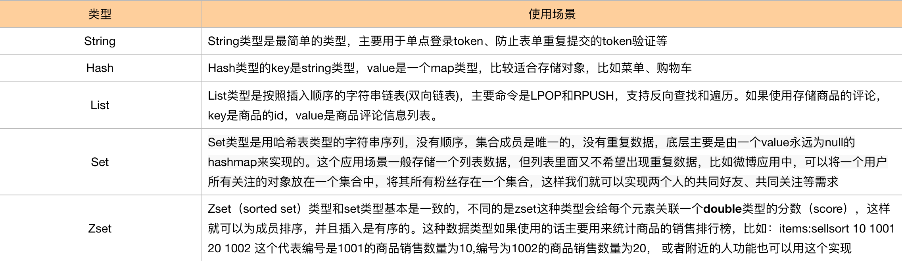
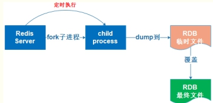
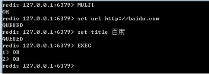
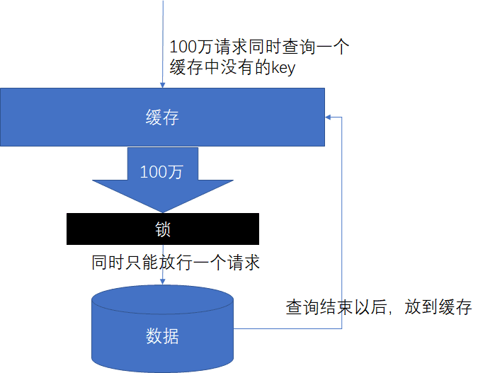
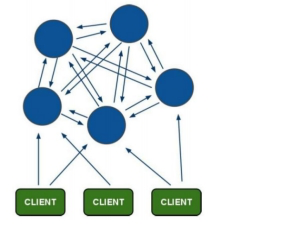

## 1.Redis基本知识

### 1.1.简单介绍一下Redis

1. Redis(Remote Dictionary Server) 是一个使用 **C 语言**编写的，开源的（BSD许可）高性能**非关系型**（NoSQL）的**键值对**数据库。Redis 可以存储键和五种不同类型的值之间的映射。键的类型只能为字符串，值支持五种数据类型：string、hash、list、set、zset（sorted set）
2. 与传统数据库不同的是 Redis 的数据是存在内存中的，采用**IO多路复用**，所以读写速度非常快，因此 redis 被广泛应用于缓存方向，每秒可以处理超过 10万次读写操作，是已知性能最快的Key-Value DB。另外，Redis 也经常用来做分布式锁。除此之外，Redis 支持事务 、持久化、LUA脚本、LRU驱动事件、多种集群方案。

### 1.2.Redis的优缺点

- 优点

- - 读写性能优异， Redis能读的速度是110000次/s，写的速度是81000次/s。
  - 支持数据持久化，支持AOF和RDB两种持久化方式。
  - 支持事务，Redis的所有操作都是原子性的，同时Redis还支持对几个操作合并后的原子性执行。
  - 数据结构丰富，除了支持string类型的value外还支持hash、set、zset、list等数据结构。
  - 支持主从复制，主机会自动将数据同步到从机，可以进行读写分离。

- 缺点

- - 数据库容量受到物理内存的限制，不能用作海量数据的高性能读写，因此Redis适合的场景主要局限在较小数据量的高性能操作和运算上。
  - Redis 不具备自动容错和恢复功能，主机从机的宕机都会导致前端部分读写请求失败，需要等待机器重启或者手动切换前端的IP才能恢复。
  - 主机宕机，宕机前有部分数据未能及时同步到从机，切换IP后还会引入数据不一致的问题，降低了系统的可用性。
  - Redis 较难支持在线扩容，在集群容量达到上限时在线扩容会变得很复杂。为避免这一问题，运维人员在系统上线时必须确保有足够的空间，这对资源造成了很大的浪费。

### 1.3.为什么我们要使用Redis而不直接操作内存？

- 主要可以从两方面入手：一个是横向的共享问题，一个是纵向的扩容问题
- **共享问题**：放在本地内存中，当你一台服务器不够用，需要负载均衡的时候，如何把你本地数据共享给其他服务器呢？每个服务器维护一份数据不是很浪费？如果要重新开一个协议去处理这个问题，那么和Redis的实现方式有什么区别？又要踩一遍Redis踩过的坑，重复造轮子。
- **扩容问题**：内存不够扩容问题怎么办？
- **备份问题**：突然宕机怎么处理数据备份问题

### 1.4.Redis的数据类型



### 1.5.Redis的持久化机制

#### 1.5.1RDB（半持久化机制）

- RDB是默认的持久化机制，按照配置不定期的通过异步的方式、快照的形式直接把内存中的数据持久化到磁盘的一个dump.rdb文件（二进制文件）中。

- 有三种触发方式

  - **save触发**，会造成阻塞，一般不推荐使用

    ```shell
    save <seconds> <changes>
    # save ""
    save 900 1
    save 300 10
    save 60 10000
    save <指定时间间隔> <执行指定次数更新操作>，满足条件就将内存中的数据同步到硬盘中。
    官方出厂配置默认是 900秒内有1个更改，300秒内有10个更改以及60秒内有10000个更改，则将内存中的数据快照写入磁盘。
    ```

  - **bgsave模式**，redis会fork一个子进程（阻塞出现在fork阶段非常短），这个子进程会将数据写到一个临时文件中；当子进程完成写临时文件后，会将原来的.rdb文件替换掉，这样的好处是写时拷贝技术（copy-on-write），可以参考下面的流程图

    

  - 自定义触发方式，我们通过修改配置文件来完成

```shell
save m n：# 表示m秒内数据存在n次修改，自动触发bgsave
stop-writes-on-bgsave-error ：# 默认值为yes。当启用了RDB且最后一次后台保存数据失败，Redis是否停止接收数据。这会让用户意识到数据没有正确持久化到磁盘上，否则没有人会注意到灾难（disaster）发生了。如果Redis重启了，那么又可以重新开始接收数据了
rdbcompression ；# 默认值是yes。对于存储到磁盘中的快照，可以设置是否进行压缩存储
rdbchecksum ：# 默认值是yes。在存储快照后，我们还可以让redis使用CRC64算法来进行数据校验，但是这样做会增加大约10%的性能消耗，如果希望获取到最大的性能提升，可以关闭此功能
dbfilename ：# 设置快照的文件名，默认是 dump.rdb
dir：# 设置快照文件的存放路径，这个配置项一定是个目录，而不能是文件名	
```

#### 1.5.2AOF（全持久化机制）

- 把每一次数据变化都通过write()函数将你所执行的命令追加到一个appendonly.aof文件里面
- 默认不开启，需要将配置文件中的appendonly no 改为 yes

- 三种触发方式

```shell
# no:不会自动同步到磁盘上，需要依靠OS（操作系统）进行刷新，效率快，但是安全性就比较差；
# always:每提交一个命令都调用fsync刷新到aof文件，非常慢，但是安全；
# everysec:每秒钟都调用fsync刷新到aof文件中，很快，但是可能丢失一秒内的数据，推荐使用，兼顾了速度和安全；
appendfsync always
```

- 原理：redis需要持久化的时候，fork出一个子进程，子进程根据内存中的数据库快照，往临时文件中写入重建数据库状态的命令；父进程会继续处理客户端的请求，除了把写命令写到原来的aof中，同时把收到的写命令缓存起来，这样包装如果子进程重写失败的话不会出问题；当子进程把快照内容以命令方式写入临时文件中后，子进程会发送信号给父进程，父进程会把缓存的写命令写入到临时文件中；接下来父进程可以使用临时的aof文件替换原来的aof文件，并重命名，后面收到的写命令也开始往新的aof文件中追加。下面的图为最简单的方式，其实也是利用写时复制原则。


#### 1.5.3优缺点

- RDB
  - 优点：只包含一个文件，对于文件备份、灾难恢复而言，比较实用。因为我们可以轻松的将一个单独的文件转移到其他存储媒介上；性能最大化，因为对于这种半持久化方式，使用的是写时拷贝技术，可以极大的避免服务进程执行IO操作；相对于AOF来说，如果数据集很大，RDB的启动效率就会很高
  - 缺点：如果想保证数据的高可用（最大限度的包装数据丢失），那么RDB这种半持久化方式不是一个很好的选择，因为系统一旦在持久化策略之前出现宕机现象，此前没有来得及持久化的数据将会产生丢失；rdb是通过fork进程来协助完成持久化的，因此当数据集较大的时候，我们就需要等待服务器停止几百毫秒甚至一秒；
- AOF
  - 优点：数据安全性高，该机制对日志文件的写入操作采用的是append模式，因此在写入过程中即使出现宕机问题，也不会破坏日志文件中已经存在的内容
  - 缺点：对于数量相同的数据集来说，aof文件通常要比rdb文件大，因此rdb在恢复大数据集时的速度大于AOF。根据同步策略的不同，AOF在运行效率上往往慢于RDB，每秒同步策略的效率是比较高的，同步禁用策略的效率和RDB一样高效；
- 针对以上两种不同的持久化方式，如果缓存数据安全性要求比较高的话，用aof这种持久化方式（比如项目中的购物车）；如果对于大数据集要求效率高的话，就可以使用默认的。而且这两种持久化方式可以同时使用。

### 1.6Redis事务机制

- Redis中的事务是一组命令的集合，这组命令要么都执行，要么都不执行。redis事务的实现，需要用到MULTI（事务的开始）和EXEC（事务的结束）命令



- 当输入MULTI命令后，服务器返回OK表示事务开始成功，然后依次输入需要在本次事务中执行的所有命令，每次输入一个命令服务器并不会马上执行，而是返回”QUEUED”，这表示命令已经被服务器接受并且暂时保存起来，最后输入EXEC命令后，本次事务中的所有命令才会被依次执行，可以看到最后服务器一次性返回了两个OK，这里返回的结果与发送的命令是按顺序一一对应的，这说明这次事务中的命令全都执行成功了。
- Redis的事务除了保证所有命令要不全部执行，要不全部不执行外，还能保证一个事务中的命令依次执行而不被其他命令插入。同时，redis的事务是不支持回滚操作的。
- 拓展
  - Redis的事务中存在一个问题，如果一个事务中的B命令依赖上一个命令A怎么办？
  - 这会涉及到redis中的WATCH命令：可以监控一个或多个键，一旦其中有一个键被修改（或删除），之后的事务就不会执行，监控一直持续到EXEC命令（事务中的命令是在EXEC之后才执行的，EXEC命令执行完之后被监控的键会自动被UNWATCH）。
  - 应用场景：待定

## 2.Redis相关面试题

### 2.1你还用过其他缓存吗？这些缓存有什么区别？都在什么场景下使用？

- 对于缓存了解过Redis和Memcache，Redis比较常用，Memcache只是了解过。
- Redis和Memcache区别：
  - 存储方式：Redis支持5种数据类型，Memcache只支持key-value类型的，且key-value都是string类型的
  - 可靠性：Memcache不支持数据持久化，断电或重启后数据消失，但其稳定性是有保证的；Redis支持数据持久化和数据恢复，允许单点故障，但是同时也会付出性能的代价
  - 性能上：对于存储大数据，Memcache性能高于Redis
  - Memcache：适合多读少写，大数据量的情况（一些官网的文章信息等）
  - Redis：适用于对读写效率要求高、数据处理业务复杂、安全性要求较高的系统

### 2.2Redis在项目中是如何使用的

1. 门户(首页)系统中的首页内容信息的展示。（商品类目菜单、广告、热门商品等信息）门户系统的首页是用户访问量最大的，而且这些数据一般不会经常修改，因此为了提高用户的体验，我们选择将这些内容放在缓存中
2. 单点登录系统中也用到了redis。因为我们是分布式系统，存在session之间的共享问题，因此在做单点登录的时候，我们利用redis来模拟了session的共享，来存储用户的信息，实现不同系统的session共享
3. 项目中同时也将购物车的信息设计存储在redis中，购物车在数据库中没有对应的表，用户登录之后将商品添加到购物车后存储到redis中，key是用户id，value是购物车对象；
4. 针对评论这块，我们需要一个商品对应多个用户评论，并且按照时间顺序显示评论，为了提高查询效率，可以选择了redis的list类型将商品评论放在缓存中
5. 在统计模块中，比如做商品销售的排行榜，可以选择redis的zset结构来实现
6. 还有就是防止表单重复提交，保证幂等性，可以打开表单的时候生成token，提交表单的时候验证Redis中的token

### 2.3Redis雪崩、击穿、穿透（重点）

- 雪崩

  - 缓存雪崩是指在我们设置缓存时采用了**相同的过期时间**，导致缓存在某一时刻同时失效，请求全部转发到DB，DB瞬时压力过重雪崩。
  - 解决方法：原有的失效时间基础上增加一个**随机值**，比如1-5分钟随机，这样每一个缓存的过期时间的重复率就会降低，就很难引发集体失效的事件。

- 击穿

  - 缓存击穿是指对于一些设置了过期时间的key，如果这些key可能会在某些时间点被超高并发地访问，是一种非常“热点”的数据。这个时候，需要考虑一个问题：如果这个key在大量请求同时进来之前正好失效，那么所有对这个key的数据查询都落到db，我们称为缓存击穿。

  - 雪崩和击穿的区别：击穿是**一个热点key**失效，雪崩是**很多key集体失效**

  - 解决：加锁

    

- 穿透

  - 缓存穿透是指查询一个**不存在的数据**，由于缓存无法命中，将去查询数据库，但是数据库也无此记录，并且出于容错考虑，我们没有将这次查询的null写入缓存，这将导致这个不存在的数据每次请求都要到存储层去查询，失去了缓存的意义。在流量大时，可能DB就挂掉了，要是有人利用不存在的key频繁攻击我们的应用，这就是**漏洞**。
  - 解决：空结果也进行缓存，但它的过期时间会很短，最长不超过五分钟。
  - 布隆过滤器

### 2.4Redis中过期时间的应用

1. 设置限制的优惠活动的信息
2. 一些及时需要更新的数据，积分排行榜
3. 手机验证码的时间
4. 限制网站访客访问频率

### 2.5如何保证Redis和MySQL数据一致性

1. 不管先保存到MySQL，还是先保存到Redis都面临着一个保存成功而另外一个保存失败的情况。
2. 不管是先写MySQL数据库，再删除Redis缓存；还是先删除缓存，再写库，都有可能出现数据不一致的情况。
3. 举个例子
   1. 如果删除了缓存Redis，还没有来得及写库MySQL，另一个线程就来读取，发现缓存为空，则去数据库中读取数据写入缓存，此时缓存中为脏数据。
   2. 如果先写了库，在删除缓存前，写库的线程宕机了，没有删除掉缓存，则也会出现数据不一致情况。
4. 因为写和读是并发的，没法保证顺序，就会出现缓存和数据库的数据不一致的问题。
5. 解决：**基于mysql的binlog日志（canal）** **消息队列(双删)**

### 2.6是否了解过Redis的安全机制

1. 漏洞介绍：Redis默认情况下，会绑定在bind 0.0.0.0:6379，这样就会将redis的服务暴露到公网上，如果在没有开启认证的情况下，可以导致任意用户在访问目标服务器的情况下未授权访问redis以及读取redis的数据，攻击者就可以在未授权访问redis的情况下可以利用redis的相关方法，成功在redis服务器上写入公钥，进而可以直接使用私钥进行直接登录目标主机，比如：可以使用FLUSHALL方法，整个redis数据库将被清空
2. 解决方案：
   1. 禁止一些高危命令，修改redis.conf文件，用来禁止远程修改DB文件地址，比如 rename-command FLUSHALL "" 、rename-command CONFIG"" 、rename-command EVAL “”等
   2. 以低权限运行redis服务，为redis服务创建单独的用户和根目录，并且配置禁止登录
   3. 为redis添加密码验证。修改redis.conf文件，添加requirepass mypassword
   4. 禁止外网访问redis，修改redis.conf文件，添加或修改 bind 127.0.0.1，使得redis服务只在当前主机使用
   5. 做log监控，及时发现攻击；

## 3.Redis集群

针对这类问题，我们首先考虑的是为什么要搭建集群？（这个需要针对我们的项目来说）

Redis的数据是存放在内存中的，这就意味着redis不适合存储大数据，大数据存储一般公司常用hadoop中的Hbase或者MogoDB。因此redis主要用来处理高并发的，相对于一些高并发的电商服务，一台单独的redis是不能足够支持我们的并发，这就需要我们扩展多台设备协同合作，即用到集群。

Redis搭建集群的方式有多种，例如：**客户端分片**、**Twemproxy**、**Codis**等，但是redis3.0之后就支持**redis-cluster**集群，这种方式采用的是无中心结构，每个节点保存数据和整个集群的状态，每个节点都和其他所有节点连接。如果使用的话就用redis-cluster集群。

集群一般是公司运维搭建的，小公司的话也有可能由我们自己搭建，开发环境我们也可以直接用单机版的。但是可以了解一下redis的集群版。搭建redis集群的时候，对于用到多少台服务器，每家公司都不一样，大家针对自己项目的大小去衡量。举个简单的例子：

举个例子：电商项目中redis集群可以搭建为6台，3主（为了保证redis的投票机制）3从（【扩展】高可用），每个主服务器都有一个从服务器，作为备份机。

### 3.1架构图



（1）所有的节点都通过PING-PONG机制彼此互相连接；

（2）每个节点的fail是通过集群中超过半数的节点检测失效时才生效；

（3）客户端与redis集群连接，只需要连接集群中的任何一个节点即可；

（4）Redis-cluster把所有的物理节点映射到【0-16383】slot上，负责维护

### 3.2容错机制（投票机制）

1. 选举过程是集群中的所有master都参与，如果半数以上master节点与故障节点连接超过时间，则认为该节点故障，自动会触发故障转移操作；
2. 集群不可用？
   1. 如果集群任意master挂掉，并且当前的master没有slave，集群就会fail;
   2. 如果集群超过半数以上master挂掉，无论是否有slave，整个集群都会fail;

### 3.3哨兵模式

监控：监控主数据库和从数据库是否正常运行；

提醒：当被监控的某个redis出现问题的时候，哨兵可以通过API向管理员或者其他应用程序发送通知；

自动故障迁移：主数据库出现故障时，可以自动将从数据库转化为主数据库，实现自动切换；

> 配置步骤可以参考官方文档。要注意的是，如果master主服务器设置了密码，记得在哨兵的配置文件（sentinel.conf）里面配置访问密码

## 4.Redis配置文件

```shell
## Generated by install_server.sh ##
# Redis configuration file example.
#
#如果要让redis-server启动时加载该配置文件，需要在启动时
#带上该配置文件，如下：
# ./redis-server /path/to/redis.conf
# Note on units: 如果需要存储空间，将以 1k 5GB 4M 这样的形式书写，
# 如下换算公式：

# 1k => 1000 bytes
# 1kb => 1024 bytes
# 1m => 1000000 bytes
# 1mb => 1024*1024 bytes
# 1g => 1000000000 bytes
# 1gb => 1024*1024*1024 bytes
# 1GB 1Gb 1gB 代表相同的意思.

################################# INCLUDES ###################################
# 可以在这里引入多个配置文件.
# 如果使用模板配置所有的服务端，并且个别服务端需要定制
# 这部分功能将非常有用.
# 支持include嵌套.
#

# 但是要注意，include 是不能被 config rewrite 命令改写的
# 由于 redis 总是以最后的加工线作为一个配置指令值
# 所以你最好是把 include 放在这个文件的最前面，
# 以避免在运行时覆盖配置的改变，
# 相反，你就把它放在后面
#
# include /path/to/local.conf
# include /path/to/other.conf

################################## NETWORK #####################################

# 默认情况下，如果没有bind，redis将监听所有接入的访问
# 如果可能的话，监听一个或者多个指定的ip，在bind后面加上要监听的ip即可
#
# Examples:
#
# bind 192.168.1.100 10.0.0.1
# bind 127.0.0.1 ::1
#
# ~~~ WARNING ~~~ 如果Redis Server直接跑在公网上
# bind所有的接口是非常危险的一件事情.
# 所以默认情况下，我们只允许redis监听ipv4的本地回环（localhost）
# 这将意味着只能在同一台机器上的客户端才能接入redis server
#
# 如果你确定你的实例要监听所有的实例
# 只需打开下面的注释

# ~~~~~~~~~~~~~~~~~~~~~~~~~~~~~~~~~~~~~~~~~~~~~~~~~~~~~~~~~~~~~~~~~~~~~~~~
# bind 0.0.0.0


# Protected mode是一层避免外网访问和利用的保护
#
# 当protected mode处于on状态时并且如果:
#

# 1) 服务器不使用bind显式地绑定到一组地址
# 2) 没有配置密码.
#

# 服务器将只能接收localhost的访问
#
# 保护模式，默认开启。如果配置里没有指定bind和密码。开启该参数后，redis只会本地进行访问，拒绝外部访问。要是开启了密码和bind，可以开启。否则最好关闭，设置为no。
protected-mode yes
# 在指定端口接收连接，默认为 6379 (IANA #815344).
# 如果port为0，这意味着redis将不监听任何端口
port 6379
# TCP listen() backlog.
#
# 在高并发的环境下，你需要把这个值调高以避免客户端连接缓慢的问题。
# Linux 内核会一声不响的把这个值缩小成 /proc/sys/net/core/somaxconn 对应的值，
# 所以你要修改这两个值才能达到你的预期。
tcp-backlog 511
# Unix socket.
#指定Unix socket路径以用来监听进来的连接。
#该值没有默认值，如果不指定，redis将不监听socket
#

# unixsocket /tmp/redis.sock

# unixsocketperm 700

# 一个客户端空闲N秒后，将关闭与该客户端的连接 (N为0时将关闭该功能)

timeout 0

# TCP keepalive.（TCP心跳包）

#

# 如果设置为非零，则在与客户端缺乏通讯的时候使用 SO_KEEPALIVE 发送 tcp acks 给客户端。

# 这个之所有有用，主要由两个原因：

#

# 1) 检测挂掉的对端

# 2) 降低中间设备出问题而导致网络看似连接却已经与对端端口的问题

# 1) 检测挂掉的对端。

# 2) 从网络设备的角度使通信在中间过程中alive.

# 如果设置不为0，就使用配置tcp的SO_KEEPALIVE值，使用keepalive有两个好处:检测挂掉的对端。降低中间设备出问题而导致网络看似连接却已经与对端端口的问题。
#在Linux内核中，设置了keepalive，redis会定时给对端发送ack。检测到对端关闭需要两倍的设置值。

# 自Redis3.2.1开始，推荐一个合理的值为300秒

#

tcp-keepalive 300

################################# GENERAL #####################################

# 默认情况下 redis 不是作为守护进程运行的，如果你想让它在后台运行，你就把它改成 yes。

# 当redis作为守护进程运行的时候，它会写一个 pid 到 /var/run/redis.pid 文件里面。

daemonize yes

# 可以通过upstart和systemd管理Redis守护进程，这个参数是和具体的操作系统相关的。

# If you run Redis from upstart or systemd, Redis can interact with your

# supervision tree. Options:

#  supervised no      - no supervision interaction

#  supervised upstart - signal upstart by putting Redis into SIGSTOP mode

#  supervised systemd - signal systemd by writing READY=1 to $NOTIFY_SOCKET

#  supervised auto    - detect upstart or systemd method based on

#                        UPSTART_JOB or NOTIFY_SOCKET environment variables

# Note: these supervision methods only signal "process is ready."

#      They do not enable continuous liveness pings back to your supervisor.

supervised no

# 如果制定了进程文件，redis将在开始的时候写入并在退出的时候删除该文件

#

# 如果没设置后台守护进程，且没指定pidfile，则没有pid文件被创建

# 如果设置了后台守护进程，则会创建/var/run/redis.pid

# 如果没设置后台守护进程，且指定了pidfile，则以pidfile为准

# 创建pid文件是尽力服务行为，如果创建失败，也并不会产生什么坏的影响，redis仍然会正常启动

# 意思就是如果没创建成功也无所谓不耽误Redis正常启动和运行

#指定pid，不然每次都会变

pidfile /var/run/redis_6379.pid

# 定义日志级别。

# 可以是下面的这些值：

# debug (适用于开发或测试阶段)

# verbose (比debug少点，但是也不少)

# notice (适用于生产环境)

# warning (仅仅一些重要的消息被记录)

loglevel notice

# 指定了记录日志的文件。

# 空字符串的话，日志会打印到标准输出设备。

# 后台运行的redis标准输出是/dev/null。

logfile /var/log/redis_6379.log

# 要想把日志记录到系统日志，就把它改成 yes，

# 也可以可选择性的更新其他的syslog 参数以达到你的要求

# syslog-enabled no

# 指定 syslog 的 identity.

# syslog-ident redis

# 设置syslog的facility，必须是USER或者是LOCAL0-LOCAL7之间的值。

# syslog-facility local0

# 设置数据库的数目。

# 默认数据库是DB0，你可以在每个连接上使用 select 命令选择一个不同的数据库

# 但是 dbid 必须是一个介于0到databasees -1之间的值

databases 16

################################ SNAPSHOTTING  ################################

#内存快照

# Save the DB on disk:

#

#  格式  save <间隔时间 （秒）> <写入次数>

#

# 根据给定的时间间隔和写入次数将数据保存到磁盘

#

# 下面的例子的意思是：

# 900 秒内如果至少有 1 个 key 的值变化，则保存

# 300 秒内如果至少有 10 个 key 的值变化，则保存

# 60 秒内如果至少有 10000 个 key 的值变化，则保存

#

# 注意：你可以注释掉所有的 save 行来停用保存功能。

# 也可以直接一个空字符串来实现停用：

#

# save ""

save 900 1

save 300 10

save 60 10000

# 默认情况下，如果 redis 最后一次的后台保存失败，redis 将停止接受写操作，

# 这样以一种强硬的方式让用户知道数据不能正确的持久化到磁盘，

# 否则就会没人注意到灾难的发生。

#

# 如果后台保存进程重新启动工作了，redis 也将自动的允许写操作。

#

# 然而你要是安装了靠谱的监控，你可能不希望 redis 这样做，那你就改成 no 好了。

stop-writes-on-bgsave-error yes

# 是否在 dump .rdb 数据库的时候使用 LZF 压缩字符串

# 默认都设为 yes

# 如果你希望保存子进程节省点cpu，你就设置它为 no ，

# 不过这个数据集可能就会比较大

rdbcompression yes

# 是否校验rdb文件

# 从rdb格式的第五个版本开始，在rdb文件的末尾会带上CRC64的校验和。

# 这跟有利于文件的容错性，但是在保存rdb文件的时候

# 会有大概10%的性能损耗，所以如果你追求高性能，可以关闭该配置。

rdbchecksum yes

# 设置dump文件的名字

dbfilename dump.rdb

# 工作目录.

#

# 例如上面的 dbfilename 只指定了文件名，

# 但是它会写入到这个目录下。

#

# The Append Only File 也将被创建在这个目录下.

#

# 这个配置项一定是个目录，而不能是文件名。

dir /var/lib/redis/6379

################################# REPLICATION #################################

# 主从复制（副本）

# Master-Slave replication. Use slaveof to make a Redis instance a copy of

# another Redis server. A few things to understand ASAP about Redis replication.

#

# 1) Redis replication is asynchronous, but you can configure a master to

#    stop accepting writes if it appears to be not connected with at least

#    a given number of slaves.

# 2) Redis slaves are able to perform a partial resynchronization with the

#    master if the replication link is lost for a relatively small amount of

#    time. You may want to configure the replication backlog size (see the next

#    sections of this file) with a sensible value depending on your needs.

# 3) Replication is automatic and does not need user intervention. After a

#    network partition slaves automatically try to reconnect to masters

#    and resynchronize with them.

#

# 复制选项，slave复制对应的master。

# slaveof

# 如果master设置了requirepass，那么slave要连上master，需要有master的密码才行。masterauth就是用来配置master的密码，这样可以在连上master后进行认证。

#

# masterauth

# 当从库同主机失去连接或者复制正在进行，从机库有两种运行方式：

# 1) 如果slave-serve-stale-data设置为yes(默认设置)，从库会继续响应客户端的请求。

# 2) 如果slave-serve-stale-data设置为no，除去INFO和SLAVOF命令之外的任何请求都会返回一个错误”SYNC with master in progress”。

#

slave-serve-stale-data yes

#你可以配置一个 slave 实体是否接受写入操作。

# 通过写入操作来存储一些短暂的数据对于一个 slave 实例来说可能是有用的，

# 因为相对从 master 重新同步数而言，据数据写入到 slave 会更容易被删除。

# 但是如果客户端因为一个错误的配置写入，也可能会导致一些问题。

#

# 从 redis 2.6 版起，默认 slaves 都是只读的。

#

#  注意：只读的 slaves 没有被设计成在 internet 上暴露给不受信任的客户端。

# 它仅仅是一个针对误用实例的一个保护层。

# such as CONFIG, DEBUG, and so forth. To a limited extent you can improve

# security of read only slaves using 'rename-command' to shadow all the

# administrative / dangerous commands.

slave-read-only yes

# Replication SYNC strategy: disk or socket.

#

# -------------------------------------------------------

# WARNING: DISKLESS REPLICATION IS EXPERIMENTAL CURRENTLY

# -------------------------------------------------------

#

# 是否使用diskless方式复制数据。

# 目前redis复制提供两种方式，disk-back和diskless。

# 如果新的slave连上来或者重连的slave无法部分同步，就会执行全量同步，master会生成rdb文件。有2种方式：

# disk-back方式是master创建一个新的进程把rdb文件保存到磁盘，再把磁盘上的rdb文件传递给slave。

# diskless方式是master创建一个新的进程，直接把rdb文件以socket的方式发给slave。disk方式的时候，当一个rdb保存的过程中，多个slave都能共享这个rdb文件。
#diskless的方式就的一个个slave顺序复制。

# 在磁盘速度缓慢，网速快的情况下推荐用diskless方式。

repl-diskless-sync no

#diskless复制的延迟时间，防止设置为0。一旦复制开始，节点不会再接收新slave的复制请求直到下一个rdb传输。所以最好等待一段时间，等更多的slave连上来。

repl-diskless-sync-delay 5

# slave根据指定的时间间隔向服务器发送ping请求。时间间隔可以通过 repl_ping_slave_period 来设置，默认10秒。

#

# repl-ping-slave-period 10

# 复制连接超时时间。

# master和slave都有超时时间的设置。

# master检测到slave上次发送的时间超过repl-timeout，即认为slave离线，清除该slave信息。

# slave检测到上次和master交互的时间超过repl-timeout，则认为master离线。

# 需要注意的是repl-timeout需要设置一个比repl-ping-slave-period更大的值，不然会经常检测到超时。

#

# repl-timeout 60

# 是否禁止复制tcp链接的tcp nodelay参数，可传递yes或者no。默认是no，即使用tcp nodelay。如果master设置了yes来禁止tcp nodelay设置，
#在把数据复制给slave的时候，会减少包的数量和更小的网络带宽。但是这也可能带来数据的延迟。

# 如果选择no，数据复制到slave上的延迟将降低，但是这需要更高的带宽

# 默认我们推荐更小的延迟，但是在数据量传输很大的场景下，建议选择yes。

repl-disable-tcp-nodelay no

# 设置主从复制容量大小。

# 这个 backlog 是一个用来在 slaves 被断开连接时用来保存最新复制的命令。

# 这样在slave离线的时候，不需要完全复制master的数据，

# 如果可以执行部分同步，只需要把缓冲区的部分数据复制给slave，就能恢复正常复制状态。

# 缓冲区的大小越大，slave离线的时间可以更长，

# 复制缓冲区只有在有slave连接的时候才分配内存。没有slave的

# 一段时间，内存会被释放出来，默认1m。

# repl-backlog-size 1mb

# master没有slave一段时间会释放复制缓冲区的内存，

# repl-backlog-ttl用来设置该时间长度。单位为秒。

# repl-backlog-ttl 3600

# 当master不可用，Sentinel会根据slave的优先级选举一个master。

# 优先级值越小的slave，当选master。而配置成0，永远不会被选举。

# 默认优先级为 100.

slave-priority 100

# redis提供了可以让master停止写入的方式，

# 如果配置了min-slaves-to-write，健康的slave的个数小于N，mater就禁止写入。

# master最少得有多少个健康的slave存活才能执行写命令。

# 这个配置虽然不能保证N个slave都一定能接收到master的写操作，

# 但是能避免没有足够健康的slave的时候，master不能写入来避免数据丢失。

# 设置为0是关闭该功能。

#

# 例如至少需要三个slave 延迟小于等于10s才认为是一个健康的集群  如下设置：

#

# min-slaves-to-write 3

# min-slaves-max-lag 10

#

# 默认将min-slaves-to-write设置为 0 (关闭该功能) 并且将

# min-slaves-max-lag设置为10.

#Redis master能够以不同的方式列出所连接slave的地址和端口。

# 例如，“INFO replication”部分提供此信息，除了其他工具之外，

# Redis Sentinel还使用该信息来发现slave实例。

# 此信息可用的另一个地方在masterser的“ROLE”命令的输出中。

# 通常由slave报告的列出的IP和地址,通过以下方式获得：

# IP：通过检查slave与master连接使用的套接字的对等体地址自动检测地址。

# 端口：端口在复制握手期间由slavet通信，并且通常是slave正在使用列出连接的端口。

# 然而，当使用端口转发或网络地址转换（NAT）时，slave实际上可以通过(不同的IP和端口对)来到达。

# slave可以使用以下两个选项，以便向master报告一组特定的IP和端口，

# 以便INFO和ROLE将报告这些值。

# 如果你需要仅覆盖端口或IP地址，则没必要使用这两个选项。

# slave-announce-ip 5.5.5.5

# slave-announce-port 1234

################################## SECURITY ###################################

# requirepass配置可以让用户使用AUTH命令来认证密码，才能使用其他命令。

# 这让redis可以使用在不受信任的网络中。

# 为了保持向后的兼容性，可以注释该命令，因为大部分用户也不需要认证。

# 使用requirepass的时候需要注意，

# 因为redis太快了，每秒可以认证15w次密码，简单的密码很容易被攻破，

# 所以最好使用一个更复杂的密码。

# requirepass foobared

#

# 把危险的命令给修改成其他名称。

# 比如CONFIG命令可以重命名为一个很难被猜到的命令，

# 这样用户不能使用，而内部工具还能接着使用。

#

# rename-command CONFIG b840fc02d524045429941cc15f59e41cb7be6c52

#

# 设置成一个空的值，可以禁止一个命令

#

# rename-command CONFIG ""

#

#注意，修改命令的名字会被记录到AOF文件或者发送给slave，这可能会引发问题

#

################################### LIMITS ####################################

# 设置能连上redis的最大客户端连接数量。默认是10000个客户端连接。由于redis不区分连接是客户端连接还是内部打开文件或者和slave连接等，
#所以maxclients最小建议设置到32。如果超过了maxclients，redis会给新的连接发送’max number of clients reached’，并关闭连接。

# maxclients 10000

# redis配置的最大内存容量。如果你设置了这个值，当缓存的数据容量达到这个值， redis 将根据你选择的

# eviction 策略来移除一些 keys。

#

# 如果 redis 不能根据策略移除 keys ，或者是策略被设置为 ‘noeviction’，

# redis 将开始响应错误给命令，如 set，lpush 等等，

# 并继续响应只读的命令，如 get

#当内存满了，需要配合maxmemory-policy策略进行处理。注意slave的输出缓冲区是不计算在maxmemory内的。所以为了防止主机内存使用完，建议设置的maxmemory需要更小一些。

# maxmemory

# MAXMEMORY POLICY: 内存容量超过maxmemory后缓存移除策略(五个）

# how Redis will select what to remove when maxmemory

# is reached. You can select among five behaviors:

#

#volatile-lru：利用LRU算法移除设置过过期时间的key。

#volatile-random：随机移除设置过过期时间的key。

#volatile-ttl：移除即将过期的key，根据最近过期时间来删除（辅以TTL）

#allkeys-lru：利用LRU算法移除任何key。

#allkeys-random：随机移除任何key。

#noeviction：不移除任何key，只是返回一个写错误。

#上面的这些驱逐策略，如果redis没有合适的key驱逐，对于写命令，还是会返回错误。redis将不再接收写请求，只接收get请求。
#写命令包括：set setnx setex append incr decr rpush lpush rpushx lpushx linsert lset rpoplpush sadd 
#sinter sinterstore sunion sunionstore sdiff sdiffstore zadd zincrby zunionstore zinterstore hset hsetnx 
#hmset hincrby incrby decrby getset mset msetnx exec sort。

#

# 默认是:

#

# maxmemory-policy noeviction

#lru检测的样本数。使用lru或者ttl淘汰算法，从需要淘汰的列表中随机选择sample个key，选出闲置时间最长的key移除。

#

# 关于LRU算法：

# 5产生的结果足够好。10的结果最真实但是需要付出更多的CPU作为成本。

# 3非常快，但是结果非常不准去

#

# maxmemory-samples 5

############################## APPEND ONLY MODE ###############################

#默认redis使用的是rdb方式持久化，这种方式在许多应用中已经足够用了。但是redis如果中途宕机，会导致可能有几分钟的数据丢失，根据save来策略进行持久化，
#Append Only File是另一种持久化方式，可以提供更好的持久化特性。Redis会把每次写入的数据在接收后都写入 appendonly.aof 文件，
#每次启动时Redis都会先把这个文件的数据读入内存里，先忽略RDB文件。

appendonly no

# aof文件名

appendfilename "appendonly.aof"

#aof持久化策略的配置

#no表示不执行fsync，由操作系统保证数据同步到磁盘，速度最快。

#always表示每次写入都执行fsync，以保证数据同步到磁盘。

#everysec表示每秒执行一次fsync，可能会导致丢失这1s数据。dis-persistence-demystified.html
#
# 如果不确定，选择"everysec".
# appendfsync always
appendfsync everysec
# appendfsync no

# 在aof重写或者写入aof文件的时候，会执行大量IO，此时对于everysec和always的aof模式来说，执行fsync会造成阻塞过长时间，no-appendfsync-on-rewrite字段设置为默认设置为no。
# 如果对延迟要求很高的应用，这个字段可以设置为yes，否则还是设置为no，这样对持久化特性来说这是更安全的选择。设置为yes表示rewrite期间对新写操作不fsync,暂时存在内存中,
# 等rewrite完成后再写入，默认为no，建议yes。Linux的默认fsync策略是30秒。可能丢失30秒数据。

no-appendfsync-on-rewrite no

# aof自动重写配置。当目前aof文件大小超过上一次重写的aof文件大小的百分之多少进行重写，即当aof文件增长到一定大小的时候Redis能够调用bgrewriteaof对日志文件进行重写。
# 当前AOF文件大小是上次日志重写得到AOF文件大小的二倍（设置为100）时，自动启动新的日志重写过程。

# 如果将百分比指定为0，则表示关闭该功能

auto-aof-rewrite-percentage 100

#设置允许重写的最小aof文件大小，避免了达到约定百分比但尺寸仍然很小的情况还要重写

auto-aof-rewrite-min-size 64mb

# aof文件可能在尾部是不完整的，当redis启动的时候，aof文件的数据被载入内存。重启可能发生在redis所在的主机操作系统宕机后，
# 尤其在ext4文件系统没有加上data=ordered选项（redis宕机或者异常终止不会造成尾部不完整现象。）出现这种现象，可以选择让redis退出，
# 或者导入尽可能多的数据。如果选择的是yes，当截断的aof文件被导入的时候，会自动发布一个log给客户端然后load。如果是no，用户必须手动redis-check-aof修复AOF文件才可以。

aof-load-truncated yes

################################ LUA SCRIPTING  ###############################

# 如果达到最大时间限制（毫秒），redis会记个log，然后返回error。当一个脚本超过了最大时限。只有SCRIPT KILL和SHUTDOWN NOSAVE可以用。
# 第一个可以杀没有调write命令的东西。要是已经调用了write，只能用第二个命令杀。

lua-time-limit 5000

################################ REDIS CLUSTER  ###############################

#

# ++++++++++++++++++++++++++++++++++++++++++++++++++++++++++++++++++++++++++++

# WARNING EXPERIMENTAL: Redis Cluster is considered to be stable code, however

# in order to mark it as "mature" we need to wait for a non trivial percentage

# of users to deploy it in production.

# ++++++++++++++++++++++++++++++++++++++++++++++++++++++++++++++++++++++++++++

#

# 集群开关，默认是不开启集群模式。

#

# cluster-enabled yes

#集群配置文件的名称，每个节点都有一个集群相关的配置文件，持久化保存集群的信息。这个文件并不需要手动配置，这个配置文件有Redis生成并更新，
#每个Redis集群节点需要一个单独的配置文件，请确保与实例运行的系统中配置文件名称不冲突

#

# cluster-config-file nodes-6379.conf

# 节点互连超时的阀值。集群节点超时毫秒数

#

# cluster-node-timeout 15000

#在进行故障转移的时候，全部slave都会请求申请为master，但是有些slave可能与master断开连接一段时间了，导致数据过于陈旧，这样的slave不应该被提升为master。
#该参数就是用来判断slave节点与master断线的时间是否过长。判断方法是：

#比较slave断开连接的时间和(node-timeout * slave-validity-factor) + repl-ping-slave-period

#如果节点超时时间为三十秒, 并且slave-validity-factor为10,假设默认的repl-ping-slave-period是10秒，即如果超过310秒slave将不会尝试进行故障转移

# cluster-slave-validity-factor 10

#master的slave数量大于该值，slave才能迁移到其他孤立master上，如这个参数若被设为2，那么只有当一个主节点拥有2 个可工作的从节点时，它的一个从节点会尝试迁移。

#

# cluster-migration-barrier 1

# 默认情况下，集群全部的slot有节点负责，集群状态才为ok，才能提供服务。设置为no，可以在slot没有全部分配的时候提供服务。不建议打开该配置，这样会造成分区的时候，
#小分区的master一直在接受写请求，而造成很长时间数据不一致。

# cluster-require-full-coverage yes

################################## SLOW LOG ###################################

# slog log是用来记录redis运行中执行比较慢的命令耗时。当命令的执行超过了指定时间，就记录在slow log中，slog log保存在内存中，所以没有IO操作。

# 执行时间比slowlog-log-slower-than大的请求记录到slowlog里面，单位是微秒，所以1000000就是1秒。注意，负数时间会禁用慢查询日志，而0则会强制记录所有命令。

slowlog-log-slower-than 10000

# 慢查询日志长度。当一个新的命令被写进日志的时候，最老的那个记录会被删掉。这个长度没有限制。只要有足够的内存就行。你可以通过 SLOWLOG RESET 来释放内存。

slowlog-max-len 128

################################ LATENCY MONITOR ##############################

# 延迟监控功能是用来监控redis中执行比较缓慢的一些操作，用LATENCY打印redis实例在跑命令时的耗时图表。只记录大于等于下边设置的值的操作。0的话，就是关闭监视。
#默认延迟监控功能是关闭的，如果你需要打开，也可以通过CONFIG SET命令动态设置。单位毫秒。

latency-monitor-threshold 0

############################# EVENT NOTIFICATION ##############################

# 键空间通知使得客户端可以通过订阅频道或模式，来接收那些以某种方式改动了 Redis 数据集的事件。因为开启键空间通知功能需要消耗一些 CPU ，所以在默认配置下，该功能处于关闭状态。

#notify-keyspace-events 的参数可以是以下字符的任意组合，它指定了服务器该发送哪些类型的通知：

#K 键空间通知，所有通知以 __keyspace@__ 为前缀

#E 键事件通知，所有通知以 __keyevent@__ 为前缀

#g DEL 、 EXPIRE 、 RENAME 等类型无关的通用命令的通知

#$ 字符串命令的通知

#l 列表命令的通知

#s 集合命令的通知

#h 哈希命令的通知

#z 有序集合命令的通知

#x 过期事件：每当有过期键被删除时发送

#e 驱逐(evict)事件：每当有键因为 maxmemory 政策而被删除时发送

#A 参数 g$lshzxe 的别名

#输入的参数中至少要有一个 K 或者 E，否则的话，不管其余的参数是什么，都不会有任何 通知被分发。详细使用可以参考http://redis.io/topics/notifications

#

# 比如想订阅key的过期通知，就设成Ex，E表示key的事件,x表示key过期事件

# 默认情况下键空间通知都是关闭因为用户通常不需要这项功能

#  并且这项功能将产生额外开销

# 注意在使用的时候至少带上K或者E，否则事件将不会被报告

notify-keyspace-events ""

############################### ADVANCED CONFIG ###############################

# 数据量小于等于hash-max-ziplist-entries的用ziplist

# 大于hash-max-ziplist-entries用hash

hash-max-ziplist-entries 512

hash-max-ziplist-value 64

# 为了节省存储空间，Lists也用一种特别的方式进行编码

# 每个内部列表节点允许的条目数可以指定为一个固定的最大大小或最大数量的元素。

# 对于一个固定的最大大小，使用- 5 - -1 ，表示：

# -5: max size: 64 Kb  <-- 不推荐用于正常工作负载

# -4: max size: 32 Kb  <-- 不推荐

# -3: max size: 16 Kb  <-- 不推荐

# -2: max size: 8 Kb  <-- good

# -1: max size: 4 Kb  <-- good

# 正数意味着每列节点元素能够最多存储_exactly_个

# 最高表现的选项通常是- 2（8 KB大小）或- 1（4 KB大小）

# 但如果您的用例是唯一的，调整设置必要。

list-max-ziplist-size -2

# 这个参数表示一个quicklist两端不被压缩的节点个数。

# 列表也可以被压缩

#在quicklist的源码中提到了一个LZF的压缩算法，该算法用于对quicklist的节点进行压缩操作。

# list的设计目的是能够存放很长的数据列表，当列表很长时，必然会占用很高的内存空间，

# 且list中最容易访问的是两端的数据，中间的数据访问率较低，

# 于是就可以从这个出发点来进一步节省内存用于其他操作：

# 0 特殊值，表示不压缩

# 1 表示quicklist两端各有一个节点不压缩，中间的节点压缩

# 2 表示quicklist两端各有两个节点不压缩，中间的节点压缩

# 3 表示quicklist两端各有三个节点不压缩，中间的节点压缩

# 以此类推。

# 由于0是个特殊值，很容易看出quicklist的头节点和尾节点总是不被压缩的，以便于在表的两端进行快速存取。

list-compress-depth 0

# 数据量小于等于set-max-intset-entries用iniset，大于set-max-intset-entries用set。

set-max-intset-entries 512

# 数据量小于等于zset-max-ziplist-entries用ziplist，大于zset-max-ziplist-entries用zset。

zset-max-ziplist-entries 128

# value大小小于等于zset-max-ziplist-value用ziplist，大于zset-max-ziplist-value用zset。

zset-max-ziplist-value 64

#value大小小于等于hll-sparse-max-bytes使用稀疏数据结构（sparse），大于hll-sparse-max-bytes使用稠密的数据结构（dense）。
#一个比16000大的value是几乎没用的，建议的value大概为3000。如果对CPU要求不高，对空间要求较高的，建议设置到10000左右。

hll-sparse-max-bytes 3000

#Redis将在每100毫秒时使用1毫秒的CPU时间来对redis的hash表进行重新hash，可以降低内存的使用。当你的使用场景中，有非常严格的实时性需要，
#不能够接受Redis时不时的对请求有2毫秒的延迟的话，把这项配置为no。如果没有这么严格的实时性要求，可以设置为yes，以便能够尽可能快的释放内存。

activerehashing yes

#对客户端输出缓冲进行限制可以强迫那些不从服务器读取数据的客户端断开连接，用来强制关闭传输缓慢的客户端。

#对于normal client，第一个0表示取消hard limit，第二个0和第三个0表示取消soft limit，normal client默认取消限制，因为如果没有寻问，他们是不会接收数据的。

client-output-buffer-limit normal 0 0 0

#对于slave client和MONITER client，如果client-output-buffer一旦超过256mb，又或者超过64mb持续60秒，那么服务器就会立即断开客户端连接。

client-output-buffer-limit slave 256mb 64mb 60

# 对于pubsub client，如果client-output-buffer一旦超过32mb，又或者超过8mb持续60秒，那么服务器就会立即断开客户端连接。

client-output-buffer-limit pubsub 32mb 8mb 60

# redis会调用一些内部功能来做一些后台任务，比如关闭超时的客户端连接，清理过期的key等等

# 并不是所有的任务都以相同的频率被执行，redis通过hz的值为频率检查任务的执行

# redis执行任务的周期为1s除以hz。

# 频率范围为1~500，但是一般来讲100以上就不推荐。大多数用户用户应该使用默认值10

# 100以上一般是在非常低延迟的环境中使用

hz 10

# 在aof重写的时候，如果打开了aof-rewrite-incremental-fsync开关，

# 系统会每32MB执行一次fsync。这对于把文件写入磁盘是有帮助的，可以避免过大的延迟峰值。

aof-rewrite-incremental-fsync yes
```

