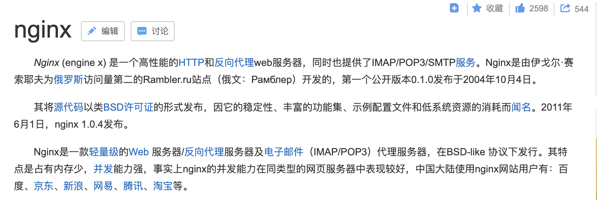
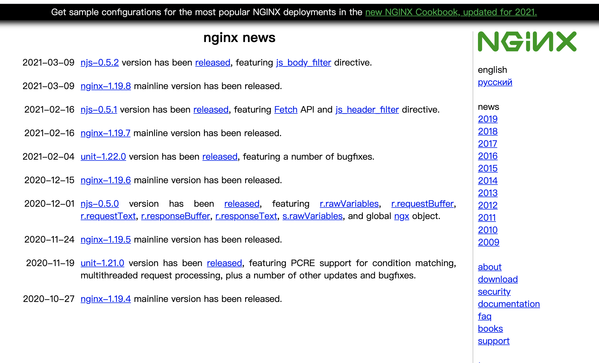
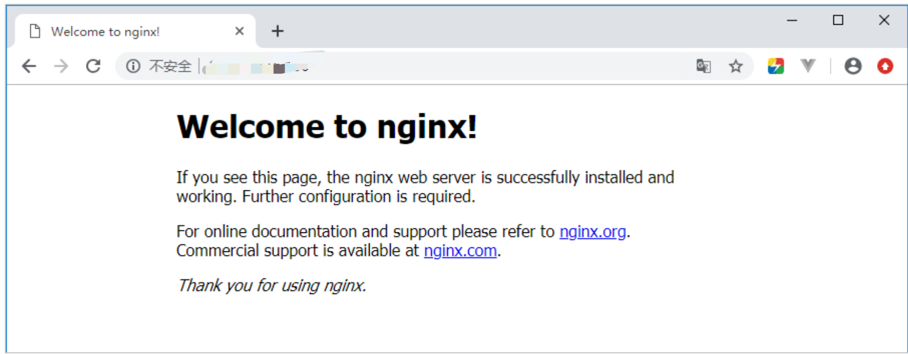
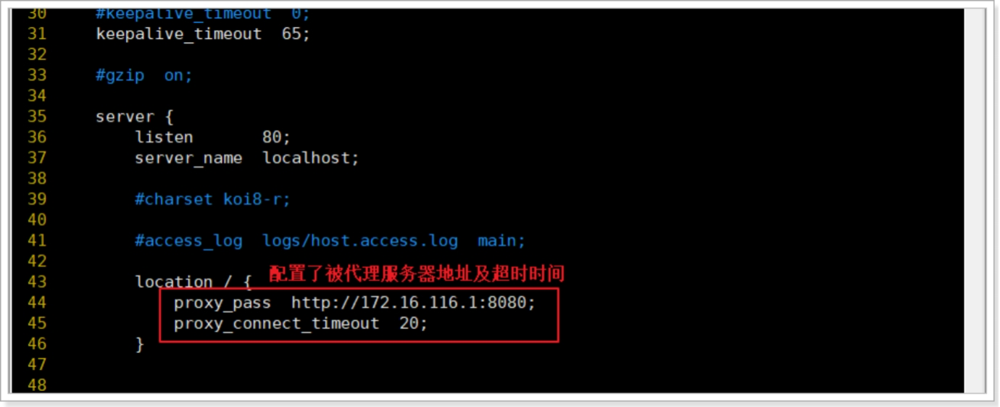
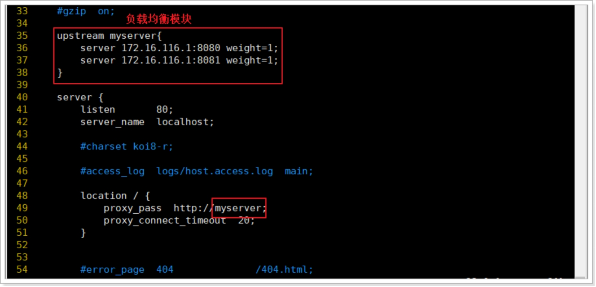
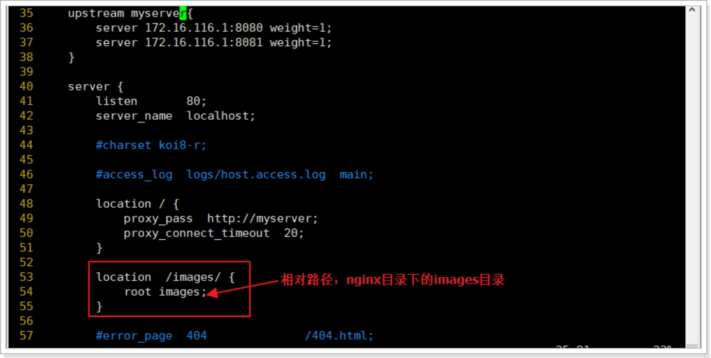

# 1.概述

## 1.1什么是Nginx



## .2web服务器

1. web应用服务器
   1. Tomcat
   2. weblogic
   3. jetty
2. web服务器
   1. Nginx
   2. Apache服务器
   3. IIS

> 区分：web服务器不能解析jsp等页面，只能处理js、css、html等静态资源。
>
> 并发：web服务器并发能力远高于web应用服务器。

## 1.3反向代理和正向代理

### 1.3.1正向代理

通过客户机的配置，实现让一台服务器代理客户机，客户的所有请求都交给代理服务器处理。

正向代理就是代理服务器替代访问方【用户A】去访问目标服务器【服务器B】


作用：

1. 访问本无法访问的服务器B
2. 加速访问服务器B
3. Cache作用
4. 客户端访问授权
5. 隐藏访问者的行踪

### 1.3.2反向代理

用一台服务器，代理真实服务器，用户访问时，不再是访问真实服务器，而是代理服务器。

反向代理就是反向代理服务器替代原始服务器【服务器B】让【用户A】去访问


作用：

1. 保护和隐藏原始资源服务器
2. 负载均衡

## 1.4Nginx特性和作用

Nginx是一个高性能的**Web反向代理服务器**，它具有很多非常优越的特性：

**作为Web服务器**：相比Apache，Nginx使用更少的资源，支持更多的并发连接，体现更高的效率，能够支持高达50,000个并发请求连接数的响应。

**作为负载均衡服务器**：Nginx既可以在内部直接支持Rails和PHP，也可以支持作为HTTP代理服务器对外进行服务。Nginx用C编写，不论是系统资源开销还是CPU使用效率都比Perlbal要好的多。

**作为邮件代理服务器**：Nginx同时也是一个非常优秀的邮件代理服务器（最早开发这个产品的目的之一也是作为邮件代理服务器）

**Nginx安装非常的简单，配置文件非常简洁（还能够支持perl语法），Bugs非常少的服务器**：Nginx启动特别容易，并且几乎可以做到7*24不间断运行，即使运行数个月也不需要重新启动。你还能够在不间断服务的情况下进行软件版本的升级 

Nginx三大作用：

1. **反向代理**
2. **负载均衡**
3. **动静分离**

# 2.安装

## 2.1官方http://nginx.org/



## 2.2安装文件

Nginx有自己的函数库，并且除了**zlib**、**PCRE**和**OpenSSL**之外，标准模块只使用**系统C库函数**。而且，如果不需要或者考虑到潜在的授权冲突，可以不使用这些第三方库。


> **也可以通过yum直接安装：yum -y install gcc pcre pcre-devel zlib zlib-devel openssl openssl-devel**

## 2.3安装PCRE

1. 解压缩pcre-xx.tar.gz包 tar -zxvf
2. 进入解压缩目录，执行：./configure
   1. 如果出现类似于这个错误：configure: error: You need a C++ compiler for C++ support.
   2. 执行：yum install -y gcc gcc-c++
   3. 然后再执行：./configure
3. 编译并安装：make && make install

## 2.4安装openssl

1． 解压缩openssl-xx.tar.gz包。

2． 进入解压缩目录，执行：./config

3． make && make install

## 2.5安装zlib

1. 解压缩zlib-xx.tar.gz包。
2. 进入解压缩目录，执行：./configure。
3. make && make install

## 2.6安装Nginx

1. 解压缩nginx-xx.tar.gz包。
2. 进入解压缩目录，执行：./configure。
3. make && make install

## 2.7启动Nginx

nginx的启动脚本在/usr/local/nginx/sbin目录下：


为了可以在任何地方可以执行，可以把该文件copy到/usr/local/bin目录下：**cp /usr/local/nginx/sbin/nginx  /usr/local/bin/**

1. 启动：nginx
2. 停止：nginx -s stop
3. 重新载入配置文件：nginx -s reload
4. 指定配置文件启动：nginx -c 配置文件路径/配置文件名

## 2.8Nginx无法启动

libpcre.so.1/libpcre.so.0: cannot open shared object file解决办法

64位系统：ln -s /usr/local/lib/libpcre.so.1 /lib64

32位系统：ln -s /usr/local/lib/libpcre.so.1 /lib

## 2.9访问测试

**Nginx默认是80端口**



## 2.10设置开机自启

创建一个开机启动脚本：vim /etc/init.d/nginx

添加以下内容：

```shell
#!/bin/sh
#
# nginx - this script starts and stops the nginx daemon
#
# chkconfig:   - 85 15
# description:  NGINX is an HTTP(S) server, HTTP(S) reverse \
#               proxy and IMAP/POP3 proxy server
# processname: nginx
# config:      /etc/nginx/nginx.conf
# config:      /etc/sysconfig/nginx
# pidfile:     /var/run/nginx.pid

# Source function library.
. /etc/rc.d/init.d/functions

# Source networking configuration.
. /etc/sysconfig/network

# Check that networking is up.
[ "$NETWORKING" = "no" ] && exit 0

nginx="/usr/local/bin/nginx"
prog=$(basename $nginx)

NGINX_CONF_FILE="/usr/local/nginx/conf/nginx.conf"

[ -f /etc/sysconfig/nginx ] && . /etc/sysconfig/nginx

lockfile=/var/lock/subsys/nginx

make_dirs() {
   # make required directories
   user=`$nginx -V 2>&1 | grep "configure arguments:.*--user=" | sed 's/[^*]*--user=\([^ ]*\).*/\1/g' -`
   if [ -n "$user" ]; then
      if [ -z "`grep $user /etc/passwd`" ]; then
         useradd -M -s /bin/nologin $user
      fi
      options=`$nginx -V 2>&1 | grep 'configure arguments:'`
      for opt in $options; do
          if [ `echo $opt | grep '.*-temp-path'` ]; then
              value=`echo $opt | cut -d "=" -f 2`
              if [ ! -d "$value" ]; then
                  # echo "creating" $value
                  mkdir -p $value && chown -R $user $value
              fi
          fi
       done
    fi
}

start() {
    [ -x $nginx ] || exit 5
    [ -f $NGINX_CONF_FILE ] || exit 6
    make_dirs
    echo -n $"Starting $prog: "
    daemon $nginx -c $NGINX_CONF_FILE
    retval=$?
    echo
    [ $retval -eq 0 ] && touch $lockfile
    return $retval
}

stop() {
    echo -n $"Stopping $prog: "
    killproc $prog -QUIT
    retval=$?
    echo
    [ $retval -eq 0 ] && rm -f $lockfile
    return $retval
}

restart() {
    configtest || return $?
    stop
    sleep 1
    start
}

reload() {
    configtest || return $?
    echo -n $"Reloading $prog: "
    killproc $nginx -HUP
    RETVAL=$?
    echo
}

force_reload() {
    restart
}

configtest() {
  $nginx -t -c $NGINX_CONF_FILE
}

rh_status() {
    status $prog
}

rh_status_q() {
    rh_status >/dev/null 2>&1
}

case "$1" in
    start)
        rh_status_q && exit 0
        $1
        ;;
    stop)
        rh_status_q || exit 0
        $1
        ;;
    restart|configtest)
        $1
        ;;
    reload)
        rh_status_q || exit 7
        $1
        ;;
    force-reload)
        force_reload
        ;;
    status)
        rh_status
        ;;
    condrestart|try-restart)
        rh_status_q || exit 0
            ;;
    *)
        echo $"Usage: $0 {start|stop|status|restart|condrestart|try-restart|reload|force-reload|configtest}"
        exit 2
esac
```

修改文件权限，并加入服务列表

修改权限：**chmod 777 /etc/init.d/nginx** 

添加到服务列表：**chkconfig --add /etc/init.d/nginx**

设置开机启动：**chkconfig nginx on**

# 3.Docker方式安装

## 3.1docker官网https://hub.docker.com/

## 3.2安装

1. 安装最新版：docker pull nginx
2. 简单启动：docker run -p 80:80 --name nginx  -d nginx

> 关于Docker版本的安装，配置相关文件可以选择挂载，具体方式参照官网或者网上教程。

# 4.Nginx配置

## 4.1配置文件位置

Nginx安装成功后切换到**/usr/local/nginx/conf**目录下，有nginx的配置文件

## 4.2配置反向代理

此时虚拟机服务器就是反向代理服务器，代理宿主机中的tomcat对外提供访问服务。

需要在nginx配置文件中配置代理信息：修改/usr/local/nginx/conf目录下的nginx.conf文件



配置完成后，重新加载配置文件：**nginx -s reload**

反向代理服务器代替tomcat服务器对外提供服务，用户只知道反向代理服务器地址，在浏览器中输入反向代理服务器地址访问服务

## 4.3Nginx配置负载均衡



**这里的location配置的地址是上面创建的myserver负载均衡块**

## 4.4负载均衡算法

1. 轮询（默认）：每个请求按时间顺序逐一分配到不同的后端服务器，如果后端服务器down掉，能自动剔除。
2. 指定权重：指定轮询几率，weight和访问比率成正比，用于后端服务器性能不均的情况。
3. IP绑定ip_hash：每个请求按访问的ip的hash结果分配，这样每个访客固定一个后端服务器，可以解决session问题。
4. 备机方式backup：正常情况下不访问设定为backup的备机，只有当所有非备机全部宕机的情况下，服务才会进入备机。
5. fair（第三方）：按后端服务器响应时间来分配请求，响应时间短的优先分配。
6. url_hash（第三方）：按访问url的hash结果来分配，使每个url定向到同一个后端服务器为缓存时比较有效。

## 4.5动静分离

动态资源如jsp通过tomcat服务响应，而静态资源（图片、css、js、html等）通过nginx直接访问服务器上的文件

现在要访问/usr/local/nginx/images根目录下的images/xbx.jpg图片



> 这里images文件路径在nginx安装路径中：/usr/local/nginx/，所以采用相对路径。

访问：ip/images/xbx.jpg

## 4.6其他配置说明

### 4.6.1master-workers机制的好处

首先，对于每个worker进程来说，独立的进程，不需要加锁，所以省掉了锁带来的开销，同时在编程以及问题查找时，也会方便很多。

其次，采用独立的进程，可以让互相之间不会影响，一个进程退出后，其它进程还在工作，服务不会中断，master进程则很快启动新的worker进程。当然，worker进程的异常退出，肯定是程序有bug了，异常退出，会导致当前worker上的所有请求失败，不过不会影响到所有请求，所以降低了风险。 

**需要设置多少个worker？**

Nginx 同redis类似都采用了io多路复用机制，每个worker都是一个独立的进程，但只有一个主线程，通过异步非阻塞的方式来处理请求，即使是千上万个请求也不在话下。每个worker的线程可以把一个cpu的性能发挥到极致。所以worker数和服务器的cpu数相等是最为适宜的。设少了会浪费cpu，设多了会造成cpu频繁切换上下文带来的损耗。

### 4.6.2连接数worker_connection

这个值是表示每个worker进程所能建立连接的最大值，所以，一个nginx能建立的最大连接数，应该是worker_connections ✖️ worker_processes。当然，这里说的是最大连接数，对于HTTP请求本地资源来说，能够支持的最大并发数量是worker_connections ✖️ worker_processes，如果是支持http1.1的浏览器每次访问要占两个连接，所以**普通的静态访问**最大并发数是：**worker_connections ✖️ worker_processes /2**，而如果是HTTP作为**反向代理**来说，最大并发数量应该是**worker_connections ✖️ worker_processes/4**。因为作为反向代理服务器，每个并发会建立与客户端的连接和与后端服务的连接，会占用两个连接。

